```{r setup, include=FALSE}
#setwd("~/GitHub/molecoltext/")
# note I worked so hard to make the path not an issue, but then WINDOWS :( 

# ***** IMPORTANT ****
# user must use install packages to add:

library(knitr)

#library(learnPopGen) #oh how funny this package that I already thought was frustrating
#is now already failing. Glad to catch this early!!

library(ggplot2)
library(tidyverse)
library(shiny)
library(wesanderson)
library(devtools)


knitr::opts_chunk$set(echo = TRUE)
#print(getwd())
today<-Sys.Date()

```


# 1. Introduction. What is this?

Written by **J.P. Wares**, Professor, University of Georgia, jpwares [at] uga.edu

This is shared *by-nc-sa/4.0*, I'm not writing it to be some polished final thing but something that shifts through new ideas and new people using or modifying parts of it. This text may be used following these guidelines: https://creativecommons.org/licenses/by-nc-sa/4.0/

This document is being updated for the GENE 8420 course at University of Georgia to improve the experiential nature of learning the methods necessary for the field of "*molecular ecology*". Maintaining it as an .Rmd allows direct analytical opportunities (and familiarity with basic statistical coding approaches) and the ability to incorporate some simple simulation tools using Shiny. It will also let me update as needed in a straightforward way.

## Why write this?

### For most of my career as a biologist, I've found myself wanting to know *why things are where they are*. That means I need to know **what** they are, and how they can move; rules like chess but far more complex and varied, and sometimes involving low probabilities. I need to know these things with varying degrees of precision given the questions being asked about those organisms. The 'molecular ecology' approaches we will learn and evaluate in here have helped a lot with this pursuit, but of course it all roots in knowing as much as you can about the organisms - life history, ecology, development and maturation - otherwise. 

<br>

```{r, out.width='90%', fig.align='center', fig.cap='...',echo=FALSE}
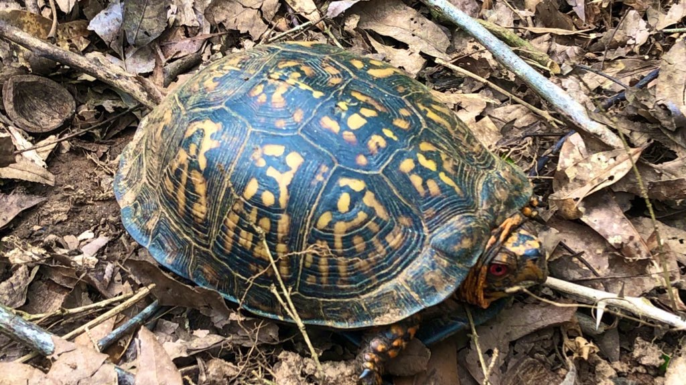
```

**Surely you already have some thoughts on how turtles move, and what that could mean for the spatial distribution of diverse phenotypes and molecular diversity within their range? (photo: J. Wares)** 

## Why would I use this?

I *think* I'm writing this in a way that more advanced students can skim the first few chapters and gain something from focusing on the latter ones; a more novice course might only get through the first several chapters and then just read appropriate-focused papers (e.g. in an undergrad/grad version of this class). I want to think about how to *teach* molecular ecology, not just about how to do it. It seems there has to be some coding expertise that comes into play at this point, and some experiential practice. So, I think this is what is going to work. I hope.

## Organization (Syllabus)

### Expectations for all students

Most elements of the class, including the schedule, are handled at the class website: sites.google.com/view/gene-8420-spr-2023/syllabus

Doing well requires your engagement in the class – which includes *preparation* for class, *focus* during our activities, *presence* and responsiveness, asking *questions* by whatever format, *listening* to others, referring to *specific* ideas from readings/discussion, and *synthesis* of all this information. 

You will be graded based on:

1. short-answer quizzes, which will count towards 50% of your grade. I don't love quizzes but they will individually be low-stakes and ensure your attention to the material stays current with the class. These will happen roughly every 2 weeks. 

2. 2-page "data reaction reports" will require you to do some analysis and make interpretations of that analysis, there will be fewer of these through the semester and they count towards 25% of your grade.

3. a data analysis project of your own design, using available data whether published or unpublished, is worth 25% of your grade. A proposal for this project is due in February, a draft of it in March, and the final report in April. 


## Topics we will cover

([**Chapter 1: **](#Ch1) Overview of text)

([**Chapter 2: **](#Ch2) Basics of genomic data)

([**Chapter 3: **](#Ch3) Mutational diversity)

([**Chapter 4: **](#Ch4) Types of spatial diversity)

([**Chapter 5: **](#Ch5) Population models)

([**Chapter 6: **](#Ch6) Adding in reality of landscapes)

([**Chapter 7: **](#Ch7) Getting into selection etc.)

([**Chapter 8: **](#Ch8) The phenotype and quantitative traits)

([**Chapter 9: **](#Ch9) Parentage)

([**Chapter 10: **](#Ch10) Intuition and surprises)


# Experiential learning

The first day of classes we will prep our computers for using R/RStudio for a major resource in this class. If at all possible, before the class begins you should install R:

https://www.r-project.org

and RStudio (free version):

https://rstudio.com/products/rstudio/

Please note the risk in all of this is that *packages* and *versions* of software are constantly changing, and sometimes code that has been working will stop (and vice-versa) because of these changes. Additionally, a key element of making this work - currently - is making sure that the *path* is set correctly so that this .Rmd file can find figures and code to interact with. I'm hoping I've set this up so that everything works from the directory you downloaded, but we will double-check today.

```{r setup2, include=FALSE}


# students should make these lines active to install packages that they may need.
#get package names
pckgs <- c("tidyverse", "shiny", "wesanderson","devtools","learnPopGen")

#determine if packages are installed already
miss <- pckgs[!pckgs %in% installed.packages()]

#install missing packages
if(length(miss)) install.packages(miss, dependencies = TRUE)
# going to try shiny_popgen but not sure how to include in Rmd yet...


```

## R Markdown and Shiny 

This is an R Markdown document, with Shiny apps built in. At this point in time, the Shiny apps are all written by the talented Dr. Silas Tittes and are available at https://github.com/silastittes/shiny_popgen. 

What does that mean? Markdown is a simple formatting syntax for authoring HTML, PDF, and Microsoft Word documents. For more details on using R Markdown see <http://rmarkdown.rstudio.com>. Adding the Shiny apps means that the document is *interactive*. The only downside is that it means that users must have **R** and **RStudio** installed, plus a few R packages, on their computer. 

(OK, another downside is it is going to be difficult to read in a hammock. Or, at least, you should read something else if you are in a hammock.) 

The upside is that it is more of a living document. It means that as data change, the output of analysis can change. It also means that R code can be built directly into the document so that you can see how some figures or modules are generated, and you can build on this knowledge. You can embed an R "code chunk" like this:

```{r driftsim}

library(learnPopGen)

drift.selection(p0=0.1,Ne=500,w=c(1,1,1),ngen=400,nrep=4)

```


I'm putting this text together using R Markdown in particular so that examples can be incorporated that students can then work with to try and understand how varying the input information affects our expectations about the molecular data used to answer ecological questions. For example, the code chunk above - and the figure it produces - not only illustrates *genetic drift* (here, an example where one of 2 alleles is initiated in a population at a frequency of 0.1, and the "effective population size" about which we will learn more, is 500; there are 4 replicate simulations - in fact you should notice that the figure is distinct every time you run this document!), but actually provides the code for the illustration that can be modified as knowledge of the process becomes more advanced (when looking at the R Markdown code document itself in *RStudio*, if you hit the green 'play' button in the upper right corner of the "code chunk" you can do the simulation over and over, and you can look at the code and probably figure out quickly how to change the parameters it runs under). 

By organizing this material the way I think it may come across to beginning students in the field, I hope to avoid the personal puzzle of when I initially shifted this class from 8000-level (intermediate grad course) to 4000-level (advanced undergrads with fewer prerequisites) by clarifying these probabilistic processes with illustrations based on simulations that the students can themselves repeat.

Because I'm using **Shiny** code for many of the documents in this class, you cannot "Knit" this document into a static form, but instead will hit "Run Document" (up near the top of the RStudio screen) once it is loaded into R and that will generate a browser text that is dynamic in some places to let *you* run the simulations. It is a work in progress, but for now it does mean that to work with this you must have access to a computer that will run R and RStudio, at a minimum.

This will be less a textbook that you read for complete comprehension, and more something you read to generate questions that we discuss; I am trying to "flip the classroom" and organize for future classes at the same time. Some aspects will need to be explained in class or using diverse media to make sense. When I was a sophomore learning cell biology, I know that I tested well on the subject but in the end, had zero clue what gel electrophoresis meant until I did it on a daily basis. (super basic intro to "electrophoresis": https://www.youtube.com/watch?v=ZDZUAleWX78) So, **your job is to ask questions!** That way, we learn more completely not just from me, but from each other and from our inquiry.

<style>
div.blue { background-color:#e6f0ff; border-radius: 5px; padding: 20px;}
</style>
<div class = "blue">

For other users of this document, please note: I use a lot of examples I am familiar with, meaning they are often projects I'm an author on, or was on that person's committee, or whatever. There is so much other *fantastic* science out there, this isn't about ego though: it's just my ability to immediately dig deeper with those as examples not just of how the science *can* be done, but also about when it *could have been done better*. Also, I'm a marine ecologist; when I talk about plants, it is basically because of great colleagues who have entranced me with their weird and important terrestrial photosynthetic life, and mammals and fish similarly: I credit cool colleagues who have brought me into the fold. If you end up using this as an instructor, I encourage you to think about including your own, even better, examples.

Plus, I can imagine now I can just look in here for some of the papers I want others to refer to, you know - what was that paper I cited about *XXXXXX*? Oh yeah it was in chapter 4...

</div>

## 1.1 What is Molecular Ecology?

The phrase 'molecular ecology' is nothing new; it is in many ways synonymous with 'ecological genetics' as first applied by pioneers like Dobzhansky, Ford, and others (en.wikipedia.org/wiki/Molecular_ecology). Maybe the question of terminology comes down to people *who identify as geneticists but want to solve ecological concerns* (Phil Hedrick and his work on Florida panthers in 1995? I've not met him to verify how he identifies as a scientist), or people *who identify as ecologists but recognize how to use genomic data as a means to greater understanding* (can't help my bias, I think of Rick Grosberg doing a number of deep explorations into behavioral ecology via understanding genome-wide kinship, see Fig 1.1). The journal ***Molecular Ecology*** (https://onlinelibrary.wiley.com/journal/1365294x) began in 1991; the field is not new, but the attention given to it from a broader spectrum of scientists seems to be. Before giving an overview of what may be included in this topic, it is probably first important to acknowledge that there are "molecular" approaches to addressing ecological questions that are often *not* included in this field.


Ecosystem ecologists ask about elemental and nutrient cycles in the environment, and such work routinely screens for the abundance, provenance, and isotopic ratios of Carbon, Nitrogen, Phosphorus, and other key elements to life (https://en.wikipedia.org/wiki/Ecosystem_ecology). A good example might be the work of Dr. Krista Capps on invasive suckermouth catfish (family Loricariidae) in Mexico; these catfish have bony plates on their body that absorb tremendous amounts of phosphorus from the rivers they are in - limiting algal growth and thus indirectly harming the resources for native fishes. Certainly, a molecular component to ecology! Also, the chemical analysis of otoliths and gastropod shells (e.g. https://www.pnas.org/content/116/14/6878), or assessment of paleoenvironments via analysis of gas composition in ice cores or otherwise (https://www.wm.edu/news/stories/2019/for-chesapeake-oysters,-the-way-forward-leads-backback-through-the-fossil-record.php), are 'molecular' approaches to answering ecological questions.

However, this is where we return to that phrase 'ecological genetics', which puts our field squarely in connection with how heritable information - DNA, RNA, and proteins - can be studied to evaluate the relationships of organisms as a means of considering migration, isolation, population demography, mating and kinship analysis, and more. These questions can only be addressed because of evolution of the molecules in question. **Mutations** occur and may be passed on through reproduction; as mutations become common in a population, they become the basis of the markers we track to address such questions using population genetic understanding of evolutionary mechanisms such as **drift**, **non-random mating**, **selection**, and **migration**.

In particular, we may need to know this information to bridge the gap between studies of quantitative trait diversity and how traits affect an organismal response to a changing environment. Molecular data will not, as we will examine, tend to replace detailed studies of quantitative genetics, reaction norms, or similar evaluations of how particular genotypes perform in particular environments. Instead, these molecular data - all derived from the genomes carried around by the organisms we study - give us insight into all of the evolutionary mechanisms that allow inference of how the organisms move naturally, and how genes within their genomes respond distinctly across environmental gradients. It will also give us some ideas to improve the design of quantitative or comparative studies of natural biodiversity.

Thus, this text will follow some basic outlines that you may find in other books like Joanna Freeland's *Molecular Ecology* 3rd ed (2020) or Matt Hahn's *Molecular Population Genetics* (2019), excellent resources in distinct ways - however, since I often work across many resources in an attempt to save students some money, and each of these texts is aimed at a slightly distinct target audience, this is going to give us the basic framework for exploring heritable molecular diversity in a way that keeps the focus primarily on the ecological questions and contemporary ways to make inference from DNA, RNA, or comparable data. Also, I am going to deviate from typical texts in this field in one way in particular - I won't be delving as much into the historical development of the field, which has often served as the organizing framework for many such books, e.g. as markers advance our analyses have advanced. I'm going to argue *that is not true*; we are actually using fairly traditional population genetic analyses these days with more data, and better data; the periods of using other methods (e.g. the heyday of "phylogeography") were actually being used as *proxies* for population genetic theory (Templeton, Avise).

Finally, I'll note something I'm trying out in terms of verbiage. For a long time, people have talked about population *genetics* and conservation *genetics* and ecological *genetics.* However, with part of my appointment being in a Department of *Genetics*, I can see that for the most part we are not asking questions about how diversity is inherited or the cellular processes that interact as much as we are about how the diversity across a genome (or portions of it), and how it is distributed, indicate the evolutionary and ecological processes acting on it. This applies to early work in *Drosophila pseudoobscura* and chromosome rearrangements straight through to modern RAD-seq approaches and whole-genome resequencing. The distinction between "genetics" and "genomics" is not, to me, about the precise number of markers you are studying but in the intent of analysis. I may not want to know anything about the *identity* of a gene that is an outlier in terms of cytonuclear disequilibria, because I don't want to resolve how a nuclear gene and a mitochondrial gene are interacting. That is for somebody else to do! The fact that they interact gives each of them special identity in helping us see patterns that are driven by the environment and interactions with the environment, and so **the patterns are for us**. It's a distinction that is open for discussion of course.

## 1.2 Overall structure, a work in progress...

**Chapter 2** will deal with how molecular markers are generated (What are molecular markers - extending to diploid and to cost-effective ways to explore genomes, what do they cost in time and money, and what sampling guidelines should we consider? Some elements of sampling won't make sense until we get into the types of inference and analysis used with particular questions, so in some places these will be left as questions for us to return to), and how they can be applied using barcoding, environmental DNA, and community ordination to understand distribution and abundance. 

**Chapter 3** will provide additional grounding in how mutations and diversity are generated - pretty key, especially for students with less exposure to introductory genetics coursework.

**Chapter 4** is about the basic elements of alpha and beta diversity -- that is, the diversity at a single location and the difference in diversity across locations. As ecology is often focused on the distribution and abundance, these approaches let us more accurately define the prevalence of certain subsets of biodiversity so we can more accurately assign locations to distinct communities or systems. The 'space for time' argument applies both ecologically and genetically through the process of drift *at a minimum* (Hubbell, Vellend) so that we expect different locations to have different diversity in part because they are demographically independent; of course migration (and gene flow) will affect this and that is one of our major goals to understand in this field.

**Chapter 5 and 6** deal with basic evolutionary mechanisms and what they can do to molecular diversity; Generalizable population models and how to tell when the data indicate a more complex model, e.g. ***HWE and the coalescent***; an overview on finite population size: Ne and all the distinct ways it is measured, WHY IT AFFECTS DIVERGENCE RATE, and all the distinct ways it is only kind-of useful, from Hare et al 2011 (and Waples before him) to human evolution and even taking a swing at Turner et al 2002 and Alo et al 2004 (which is more likely correct given the distinctions). We will talk about population models, mutation accumulation and biogeography to get at $\mu$, basic info on movement in the sea based on genomic diversity and so on, what we know of recombination, and this all lets us get to ...

**Chapter 7** where we deal somewhat with how knowing this baseline information helps us think about what selection does across distinct environments. This is often a target for research, but it takes so much baseline information to really understand outlier molecular diversity. 

That sets us up for **Chapter 8** which gets into quantitative genetics and the association with genomic data, because what we know of selection is that many traits are super polygenic. We will discuss and work with RNA expression data, learn a bit about epigenomic markers as well, and discuss 'keystone loci' that have effects on the 'extended phenotype' of populations.

**Chapter 9** will give us time to explore mating and behavior - collective as well as individual. 

**Chapter 10** deals with where the field is going and spends some time focusing on the 'natural history awareness' of the analyses we have learned; often key insights come from seeing how data behave or misbehave given your preconceptions.

*N.B.* I am aiming this at upper-level undergrads in ecology or evolutionary biology who may have had some introductory genetics or evolution; but, I am going to do my best to not assume you remember everything from those classes. And effectively, that works about the same for incoming graduate students who are looking for a primer to begin their research trajectory or just understand evolutionary dynamics in ecosystems better.

Also, with this being written in the work-at-home era of **COVID**, some references will be scant pointers to the actual resource and I hope you will forgive me when I know who I'm pulling from but can't find it right away. Someday this will be full of hyperlinks and DOIs but for now it is a dog looking at a finger pointing at the moon, so to speak.

**Week 1 suggested readings:**

Travis (2020): https://www.journals.uchicago.edu/doi/pdfplus/10.1086/708765

Marmeisse et al. 2013 https://nph.onlinelibrary.wiley.com/doi/epdf/10.1111/nph.12205 to think about what molecular tools can tell us about diversity and ecosystem function

Govindarajan et al. 2015 https://peerj.com/articles/926/# to consider how divergence of populations (tree thinking) illuminates divergence of function, tolerances, or interactions; distribution and dispersal; and first look at summary statistics in molecular ecology in terms of barcode gaps/distinctions


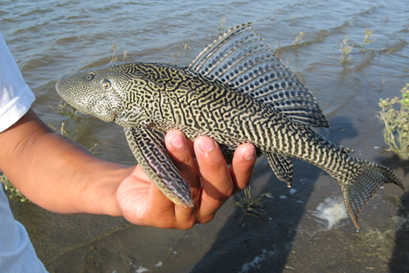

*To wrap this up, a photo of one of the invasive Loricariid catfish mentioned earlier. More info on the system can be found at https://news.cornell.edu/stories/2013/08/freeing-pet-catfish-can-devastate-ecosystems . Can you think of how studying genomic diversity of these catfish - as well as the source populations from which they come - could be useful?*

*Resources cited in this section - I will typically cite in-line actually*

Avise 2000

Ayres & Grosberg (2005, doi:10.1016/j.anbehav.2004.08.022)

Freeland, J. 2020.

Hahn, M.W. 2019.

Hedrick, P.W. 1995.

Templeton, A.R. (NCA era)

____________________________________________________________________________________________________

\newpage

(note the 'newpage' command doesn't work for html output, only for printed docs)

# 2. Sampling the 'simplest' genomic data {#Ch2}

I'm going to start this text in a very different place than I've started teaching this class before; I have tended to start at the beginning (temporally) and work through the history to reach the present. My efforts at re-organizing my class in 2020 led me to see this as a funny choice. For one, it means we may spend some time talking about methods that are currently D.O.A., even if we learned a lot from them at the time. At this point, there is simply no reason for me to re-hash AFLP markers (I won't even define the acronym). Even the most in-vogue methods of `r format(today, format="%Y")` will not be as exciting in 5 years. But our efforts to learn this material should be generic to the specific means of obtaining data, anyway. 

Additionally, I've recognized that some applications of molecular data have been treated as distinct, and separated in other texts or in previous versions of my class, even though their basic methodology aligns pretty clearly with understanding some simple basics about DNA sequence data and how it evolves within and among populations of biodiversity. I hope that is clear from this first data-focused chapter, which itself raises some questions about how we observe and quantify patterns of diversity in nature. 

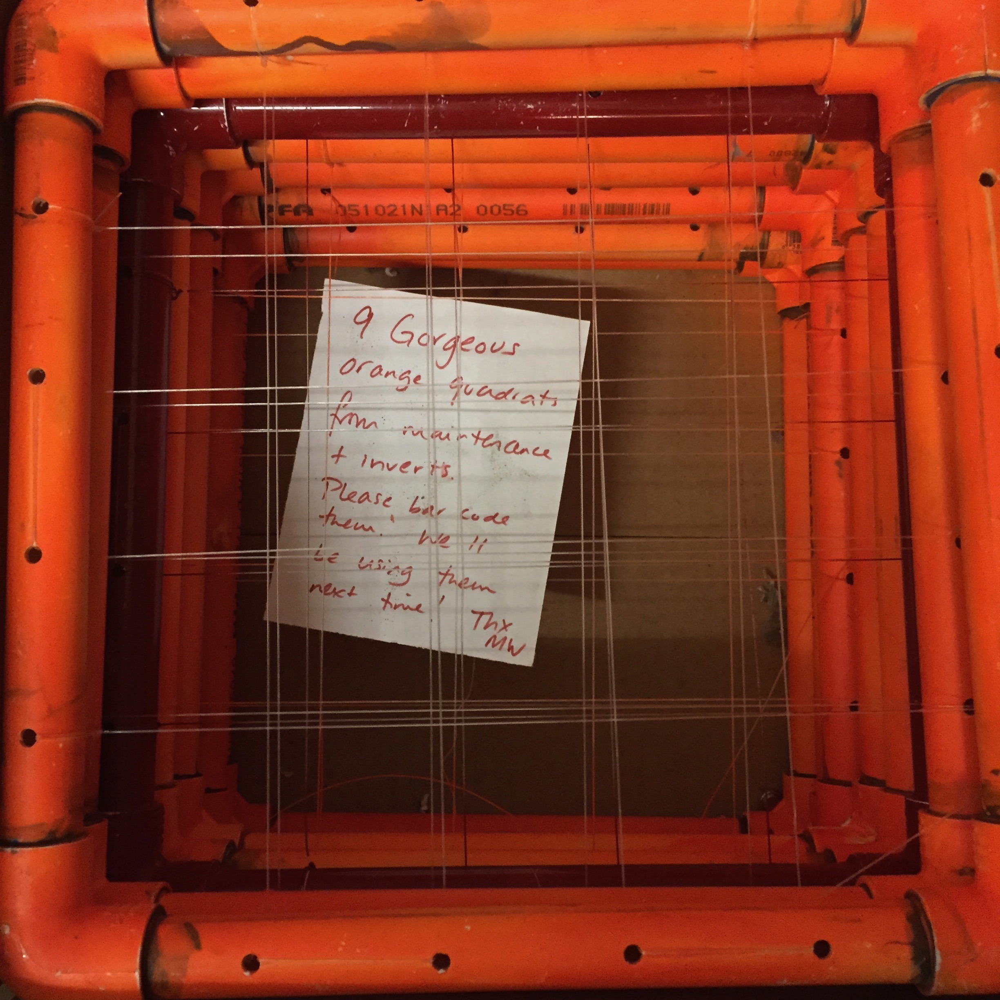

## 2.1. Our sampling effort

If you aren't familiar with a *quadrat*, the photo above (Figure 2.1) includes "9 gorgeous orange quadrats" and you may quickly deduce that these are nothing more than PVC squares with grids installed using heavy fishing line, and the whole thing spray painted orange so they can be easily found in an intertidal marine habitat with sprawling macroalgae and dark rock coves studded with limpets. A *quadrat* is a means to sample spatial diversity that is commonly used by ecologists to estimate the diversity of a larger spatial domain, with the scale varying depending on the system one is looking at, the evenness in that system, and the type of diversity to be counted (and thus extrapolated to say something about the whole ecosystem). 

So, what I often tell my students is that if you wanted to characterize the vegetation of your college campus, and you randomly tossed down a single quadrat of this size (~25cm across), what would you find? Maybe manicured lawn, maybe some flowering plants, maybe the root system of a single tree. You know that wouldn't say much about the vegetation on your campus, so you would want to think about how to gain data from multiple quadrats before you made any characterization - and you would want to think about how randomly they are used (Anne Magurran's *Measuring Biological Diversity* has some great insights into this problem). 

Similarly, a single random anonymous DNA sequence from your species of interest may or may not represent well the genome as a whole, and may or may not be appropriate to answer your question. But first, to keep things simple, lets do exactly that. If you take a small sample of a genome - perhaps a single gene, or locus, that can be easily captured using modern molecular approaches like PCR or metabarcoding ([**BOX B:**](#BoxB) How molecular data are obtained). That means that it is on the order of 100s of nucleotides in length (long enough to capture variation in many instances), and we can *mostly* ignore biological recombination of this fragment (though PCR itself can promote the formation of chimeric, recombinant sequences - Katz et al. 2009)

(*so now you can imagine having some DNA sequences from several individuals - and we are thinking about the variation among those sequences*)

We are assuming that the same *homologous* sequence(s) can be obtained from other individual organisms or samples. In other words, whenever we make comparisons of two DNA sequences, we assume that they have a single common origin and the variation between them represents the mutation events that have happened since that point of common ancestry, whether we are comparing members of the same population or individuals from divergent species. This itself can be difficult; the more we know about genome structure, the more we know that many gene regions are duplicated and lost through time, so that some gene regions will have multiple, *paralogous* copies in the same genome, and counting the mutational events will be wrong if the contrast between molecules is specified incorrectly. 

![**Fig.2.2 - The same PCR primers amplify allelic (homologous) and distinct gene copy variation (paralogous) in fluorescent proteins of the coral *Agaricia*. Determining how to separate this diversity for the typical analytical approaches in the field of molecular ecology is not trivial in such cases. Note the distinct amino acid sequences resulting from the sequence diversity; one copy appears to be non-functional with a 'stop' codon in the middle of the domain. From Meyers, MK 2013 *J. Heredity* doi:10.1093/jhered/est028.**](MEImages/AgarFP.jpg)

The problem of gene duplication can include whole genomes (polyploidy is common in plants, and has even generated new species in frogs) or just parts of a genome, and depending on how recent the evolutionary event was, it may be impossible to isolate parental-contributed diversity from the diversity found across copies. However, there are ways to analyze such data and we will discuss further as these instances come up. *For now we are only focusing on the gene sequences we can recover to represent natural diversity, and how to compare those sequences (not worrying about the combinations of copies within an individual).*

In addition, we assume that the individual nucleotides (A,C,T,G) in these DNA sequences being compared are homologous. This means *aligning* the sequences so that the variation we see in a single position - some sequences have a C, others have a T, for example - represent a single mutational event (more on this assumption later) rather than inadvertently comparing haphazard parts of that gene region. In Figure 2.3, a DNA sequence for a protein-coding region provides an example where it is clear that despite some nucleotide variation, each DNA sequence is coding for the same amino acid sequence. It would be unusual for so much similarity to exist among distinct genomic regions (though biology can throw plenty of improbable curveballs, some of them noted above), and we can evaluate this probabilistically (Altschul et al 1990).

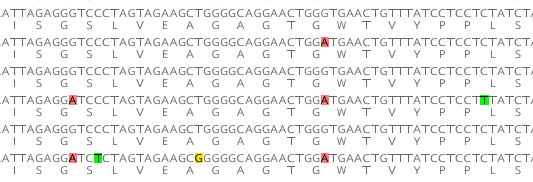 

Once these steps are complete - DNA sequences obtained from comparable parts of the genome, and aligned so that the mutational events are clear - we can start to make some simple assumptions about what the diversity among sequences means. It may seem bizarre or overwhelming to include this example above, but the more elements from the genome you are using to study your system, the more likely you have to understand that genomic diversity has an incredibly complex hierarchy of inheritance.

## 2.2 Genetic Distances and 'Barcode Gaps'

From the DNA sequences in Figure 2.3, we can start making one of the first and most basic assessments of genetic distance between sequences or between collections of sequences. For example, the comparison between sequence 1 and sequence 2 (counting from the top) shows a single nucleotide difference between them (an A/G transition), out of 63 such site comparisons. If you are unfamiliar with how these data are shown, the nucleotide sequence includes only (A/C/T/G), and below each amino-acid-coding triplet the amino acid single-letter code is shown; in many cases we would compare sequences that are not protein coding (or for which we don't care about the product) and so the amino acid sequence would not be shown. 

From these data, we can estimate the distance *d* based on this proportion of differences between sequences, e.g. *d* = 1/63 = 0.0159. Then, comparing sequence 1 to sequence 3 there are no differences, so *d* = 0; and sequence 1 to sequence 4 represents *d* = 3/63 or 0.0476. You should be able to make similar calculations for all pairs of sequences in Figure 2.3. The R code below shows how to turn those genetic distances into a very basic histogram.

```{r bargap1}
dist1<-c(0.0159,0,0.0476,0,0.0635,0.0159,0.0317,0.0159,0.0476,0.0476,0,0.0635,0.0476,0.0476,0.063)
hist(dist1,breaks=4,col="darkred")
```

Now all of these pairwise distances are shown in a histogram, above, and in this case all of those sequences come from organisms sharing the same Latin binomial, *Chthamalus fragilis* (though later in this unit you will see it is more complicated than that). Imagine comparing these sequences with the sister species, *C. proteus*, by adding just a single additional set of comparisons between the 6 sequences above and a single one from *C. proteus*. The contrast can further be identified in our R histogram by coloring the bars in order; note the change in scale on the x-axis as we add more distantly related sequences. Yes, **R** friends, I know it can be done more efficiently. Bear with me, this section is barely edited since I wrote in April 2020 as my class flipped to online during the beginning of **COVID**, but I want it to be clear where the outputs come from!

```{r bargap2}
dist2<-c(0.0159,0,0.0476,0,0.0635,0.0159,0.0317,0.0159,0.0476,0.0476,0,0.0635,0.0476,0.0476,0.063,0.16,0.17,0.16,0.17,0.17,0.18)
hiscols<-c("darkred","darkred","darkred","darkred","lightblue","lightblue","lightblue","lightblue","lightblue")
hist(dist2,breaks=8,col=hiscols)
#yes I will provide much better code for barcode gap insights very soon - I know better than this
```

Now, we have recapitulated what is called the 'barcode gap', a classic figure below (2.4) from Meyer & Paulay (2005, https://doi.org/10.1371/journal.pbio.0030422). What this is suggesting is that though there is variation within species (in phenotype as well as sequence divergence), in many cases that variation is considerably less than the distinctions from other **species** (*a.k.a.*, distinct populations that are demographically isolated in some significant and usually trait-based way).

 

Why are we exploring this kind of diversity among DNA sequences? Well, our first goal as molecular ecologists may be simply to evaluate the distribution and abundance of diversity in and among sampled habitats. We can use the sequence data itself to identify *what* is found in a habitat, when this is a more effective approach than other forms of identification. For reasons that will become clearer as we learn more about the different modes of inheritance (*natural history!*) of gene regions, the "barcode gap" is most effectively evaluated with genes that (1) exhibit high mutational diversity, (2) are haploid, and (3) are uniparentally inherited; but it will work for any gene that provides sufficient resolution. For this reason, mitochondrial and chloroplast loci are often the first tools used for such surveys.

(note to consider: analysis of data describing the "barcode" variation between species or the metagenetic studies of microbial diversity in different samples of habitats both tend to rely on *haploid*, *low recombination* regions of inherited genomic diversity. All of the same rules apply when we are dealing with *diploid*, whole-genome scaffolds that may have important elements of recombinatory diversity, but we are starting with these simplest genomic elements to get the ground rules set.)

Now, an interesting part of this that we are going to explore in more detail in class: the distinction between species shown above, where there is divergence between the species greater than you find within a species, is entirely driven by *time.* Divergence (*d*) is equal to some factor of the mutation rate $\mu$ multiplied by time, *t*. This is true no matter what kind of divergence between homologous genomic fragments! So, the data in Figure 2.2 includes both *alleles* within a gene copy which vary within a species (and that variation relates to the time since their most recent common ancestor); *species* that carry that gene copy (listed in italics next to each of the tips of the tree, which themselves reflect genomic variation - the species have diverged over time, of course); and gene copies (*paralogs*) that appear to have diverged **before the species did**.

In all cases, time and isolation leads to that genomic variation -- and we won't always know which component of isolation is the cause of two DNA fragments being distinct. Again, we will discuss this more in class, because it is a real brain-twister.

Next, some examples of how this variation among *homologous* genome fragments can be used:

**Example 1. Some aspects of the focal diversity are well characterized.**

If we assume that the species are identifiable (at one life stage or another), and there is clearly greater genomic divergence between different species than between different individuals of the same species (the "barcode gap"), then with a reference library of representative individuals for each species we can use DNA sequencing to identify remaining unknown or hard-to-identify specimens. A great example comes from Katie Bockrath's dissertation work on freshwater mussels (Unionidae, Fig 2.4.5).

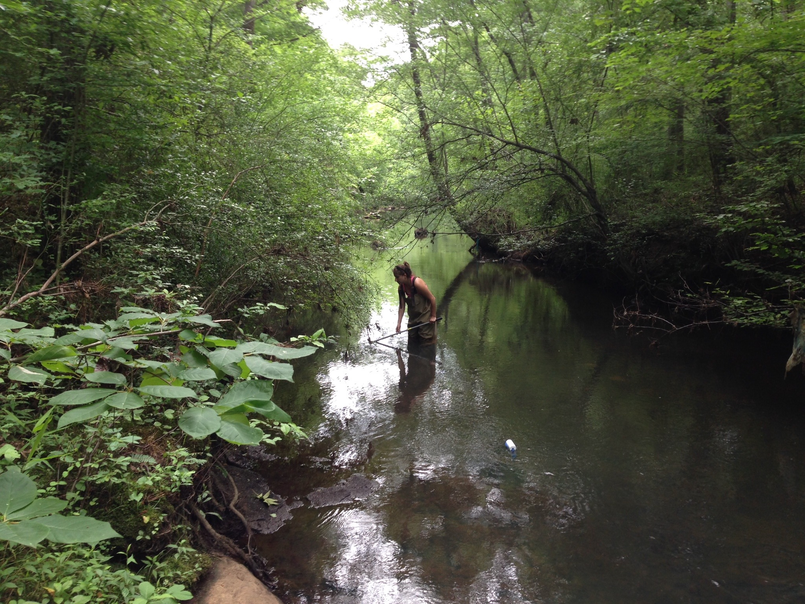 

Though many freshwater biologists will laugh to read this sentence: lets assume that the adult mussels can be clearly identified, sorted into species, and DNA can be sequenced from those individuals. Our real challenge lies with the larvae and the juveniles, which are themselves miniscule (hundreds of $\mu$m). Unionid mussels produce larvae (*glochidia*) that are obligate parasites on fish gills; they must developmentally transform on a fish to mature to the juvenile stage, when they are still quite small but drop off into the sediment to continue maturation.

There are a lot of complexities involved in this life cycle, and knowledge of which species are host-generalists versus specialists, that are beyond the question addressed here. However, Katie wanted to know *which* mussel species are using *which* fish species as hosts, which itself can influence how well individuals move via their host and how sustainable a population may be. In order to do this, fish gills were sampled for glochidia and the tiny (5-10mg) tissue samples collected. To ensure that PCR reactions are specific to the mussel and not the fish, she used her knowledge of the quirky life history of Unionids to target a relatively unique coding region in the mitochondrial control region (FORF; Breton et al.); this means that her PCR would not amplify fish DNA, only mussel DNA.

Because of the 'barcode gap' between the diversity found within a species, e.g. *Toxolasma pullus* and the diversity found in other species (or other genera) like *Elliptio icterina*, Katie was able to assign each tissue sample - as minute as it was, and intermingled with fish gill tissue - to the species that is able to use that particular fish species as a host. In this way, molecular techniques can be used to identify species interactions and the specificity of those interactions - and very similar approaches are used when there is a need to identify parasites or pathogens throughout nature. **It does, however, require that a reference library of data are available and easily searched for a likely match and high sequence similarity with the 'query' sequence.** In some cases, a researcher must collect and generate such a database for local diversity themselves; in other cases, representative diversity is already available at the NCBI sequence/genome database called "GenBank".

### A SHORT MODULE ON THE MATHEMATICS OF BLAST AND AVAILABLE DATA, WHEN IS THE E-VALUE USEFUL AND WHEN YOU NEED OTHER INFORMATION

https://www.ccg.unam.mx/~vinuesa/tlem/pdfs/Bioinformatics_explained_BLAST.pdf

Read the above link; it is very good, but also full of jargon that you may be unfamiliar with. We can unpack this in class. The basic idea is that we are trying to find unbiased ways to pair sequences that we recover from organisms or the environment with reference material in a database. You might think of this as being similar to categorizing a specimen relative to the traits of known species. We are going to use this concept as a starting point for our exploration using the program **Geneious** (see class Resources page).

A major shift in recent years in how environmental samples are analyzed for the presence of particular diversity revolves around the cost of data acquisition. Particularly when dilute resources like river water are being evaluated, it has been cost-effective to design *very* specific PCR primers for a target organism (and target gene region) such as a rare or threatened fish, and use *quantitative PCR* to localize where samples come from that contain positive responses to these assays. A great example would be the 2022 M.S. work by OSE student Jared Bennett (don't have library link yet) focusing on the ability to detect the threatened "robust redhorse" *Moxostoma robustum*; the ability to identify a PCR assay that was highly specific for this species required not only bioinformatic skills but also understanding the dynamics of PCR conditions!

As the cost of sequencing continues to decrease, more and more studies are asking about the presence of focal species' DNA amidst the noise of the DNA from many other organisms in the environment. Though the source of this DNA is still "environmental", *i.e.* derived from water samples or other environmental partitions, it is in most ways no different from microbial 16S analysis in that you have to have a solid reference library (see next section) to compare the sequences generated from a study. Another active area of study is how to minimize false positives (and false negatives) in qPCR approaches as well (BOX A: ENVIRONMENTAL DNA).

So, in the case of the eDNA study above, this is an example of a 'closed reference' library. We know what we want to find, and if we have a good enough match, we consider it *found*. In more complex scenarios, diversity that was not **a priori** known will be missed in such instances, so we must have a more complete reference library. Our search for diversity depends on how we ask the question! The question of "how different is allowable" in such cases becomes very interesting; some studies will use pre-set divergence cutoffs to define species (or, "operational taxonomic units", known as OTUs) and some will include all of the exact sequence variants for analysis.

<style>
div.blue { background-color:#e6f0ff; border-radius: 10px; padding: 40px;}
</style>
<div class = "blue">

## Box A. Environmental DNA {#BoxA}

The exploration of "environmental DNA" in the past decade or so has seen remarkable growth (Cristescu & Hebert 2018, doi.org/10.1146/annurev- ecolsys- 110617-
062306). Essentially, there are two significant components to such work. First, how to effectively collect, concentrate, and isolate DNA from diverse environmental samples including ocean water, soil, rivers, or points of organismal contact. This often means taking highly dilute samples that may include tissue or cells, fecal matter, saliva, blood or gametes that represent the (recent) presence of an organism.

Second, the effort towards collecting, concentrating, and isolating that DNA so that it can be identified has to meticulously avoid the potential for contamination from other point sources, including the equipment that has been used previously, the investigators themselves, etc. The genomic target, regardless of focal species, is often the mitochondrial genome (or another plastid like the chloroplast) because it is present in so many copies per cell, relative to the typical two copies for nuclear loci.

Third, consideration must be given as to whether it is more cost-effective for a particular question to use a 'metabarcode' approach or other high-throughput method for evaluating the diversity of a sample, or a targeted approach that must be effective not only in identifying the presence of a particular species but also in excluding amplification of taxa with similar DNA sequences in the target region. Congeneric or confamilial species are a good example, because the primers used in PCR or qPCR do not have to be perfect matches to have the potential to amplify. Remember that tens of thousands of different metazoans have been amplified and sequenced using one particular pair of primers for the mitochondrial COI region! (Folmer et al. 1994)

One study (Wilcox et al 2013, doi:10.1371/journal.pone.0059520) developed primer/probe sets for qPCR to detect non-native *Salvelinus* amidst congeneric and confamilial species; their work showed a greater effect of finding divergent regions for primer design than for the fluorescent probe, and the mismatches being near the 3' end of the primers tending to add to the specificity. Putting thought and experimentation into early testing of eDNA methods is absolutely critical for avoiding misinterpretation of results. This attention to detail can be quite critical and involves understanding the rate processes and thermodynamics of PCR as well; Odum School student Jared Bennett (MS 2022) was able to develop species-specific primers only by carefully considering both the primer sequence for PCR as well as the temperatures and times for the PCR reaction itself!

Fourth, a sampling strategy has to take into account the life history of the organism as well as other features of its biology. Are there spawning aggregations that affect how the environment would be sampled? Is it a hard-shelled crustacean that may only leave traces in the environment during molting or defecation (Anderson et al 2020)? The shedding of DNA, as well as its persistence in the environment (the 'decay rate') are active fields of study with respect to how temperature, UV exposure, and flow of the environment are all critical to answering such questions. There has also been intriguing work done to ensure the specificity of some eDNA/metabarcoding work to the association with a target organism. In some cases, nearby environments must be sampled to 'subtract out' baseline environmental diversity; in others, targeted swabbing of tissues can be used to avoid that environmental diversity. van Zinnicq Bergmann et al (2021,  https://doi.org/10.1111/1755-0998.13315) were able to assess the diets of juvenile bull sharks by quickly swabbing the fecal residues from inside a shark's cloaca without contamination of surrounding seawater diversity. 

[This paper spends less time talking about how one *actually* manages to swab the cloaca of a shark, likely presenting distinct challenges.]

Finally, the field of 'environmental DNA' is of course about getting those answers in robust ways. What diversity is present - does it match the diversity found using other types of collection protocols or gear? Does it save effort over those other methods, is it more specific? Does the diversity respond to shifts in the environment? Can the rare species be found, or the symbiont diversity identified? These are remarkable times for studying diverse ecological questions, and they (mostly) involve the exact same methods of matching observed DNA sequence data from a sample with prior understanding from known organismal diversity.

**For our reading group this week, we will consider how metabarcoding methods are used to identify the pollen gathered by bees in Bell et al. (2017) doi:10.3732/apps.1600124. This example does not involve the concerns of 'concentrating' target DNA from the environment as it does with inferring the presence of organisms that remain unseen, but is still a useful example.**

</div>


**Example 2. Diversity is (partly) well characterized, and must be sorted from sequence data.**

As the cost of sequencing has dropped, an equally common type of environmental study using molecular data are what may be referred to as 'metabarcoding' studies (distinguishing from 'metagenomic' in which shotgun sequencing of - for example, microbes - is intended to tell us about the functional gene representation in a sample rather than the identities of the microbes, an approach sometimes referred to as *reverse ecology*). This means that environmental samples are stabilized for genomic analysis, and then the sequence region to be compared is amplified from the environmental sample - amplifying much of the diversity found within. This might be a soil sample, a liter of ocean water, or the homogenized tissues fouling a dock. The genomic region chosen has to be considered relative to the diversity being studied, whether microbes or fungi or root hairs or metazoans. Remember: **the natural history of the gene region, as well as the natural history of the organism!**

The distinction with the mussel example is that rather than sequence tissues one at a time (the Sanger sequencing method, see [**BOX 1:**](#Box1)), they are typically not able to be separated and so must instead by sorted out after sequencing many PCR amplicons either using old-fashioned cloning (labor-intensive and expensive, plus requires Sanger sequencing) or high-throughput sequencing (expensive but efficient; requires bioinformatic expertise and effective design of identifying oligonucleotides that can be built into the primers or adapters, see Bayona-Vasquez et al 2019, Hamady et al 2008). Some questions require more conserved parts of the genome - as with using ribosomal regions to barcode life - and some will require much more variable regions to distinguish diversity. The trade-off between regions of the genome that are constrained from varying (for example, do you use the nearly-universal 18S ribosomal region that varies rarely within species? Or the 16S ribosomal region that may pick up cryptic diversity?) and this resolution of diversity (to the species level or to unrecognized diversity, as with many uses of protein-coding genes on metazoan mitochondria) is a good reminder that molecular techniques are analogous to fishing gear. *Different gear (rod and reel, how fine is the net, is an electroshocker backpack being used, are you kick-seining or casting a net) will influence what diversity you capture, as will your skill with that gear.*

Once again, these approaches are most useful for when diversity is very difficult to characterize because of size, abundance, or ability to capture. Bacteria have been a frequent target for this kind of approach because the vast majority of bacteria cannot be easily cultured, but deep sequencing (these days, through PCR amplification and multiplexed sequencing on a high-throughput sequencing machine like an Illumina) of the ribosomal 16S region (or one of the variable short sections within it) will tend to generate a large number of comparable (homologous) sequences that can be categorized based on their *similarity* to a reference library of bacterial species or genera. In this case, of course we may find diversity that has not been previously catalogued, and new diversity is identified in nearly every such study.

 

The questions we may then ask include: how many distinct species in a sample? Is it higher diversity in one treatment or location than the other? Are the relative abundances of species the same in each of my samples, or do they vary in interpretable ways? (Mind you, if you aren't a microbiologist you may have a hard time knowing *why* different OTUs (operational taxonomic units, the sort-of-equivalence to species in bacteria and Archaea) are ecologically relevant, or how they are distinct metabolically or phenotypically. Overall, these questions require numeric or quantifiable measurements and will be addressed in the next unit.

**Example 3. Further partitioning diversity, beyond taxonomy.**

Where we eventually will become fluent in this class is in recognizing that our taxonomy - no matter what group of life you study - often does not reflect the true diversity of life very completely. It is extremely common to find that there are genomic distinctions among different spatial samples of the same species, and that these distinct populations represent variation in physiology, function, or other types of ecological interaction. As we begin to consider how organismal diversity responds to a warming planet, it has been tempting to think that *species* are gradually shifting to more poleward latitudes, for example. However, in many cases it is far more accurate to recognize how distinct *populations* vary in environmental tolerance and their ability to either move, adapt, or acclimate (Kelly et al. 2012). It is these *populations* that are moving, effectively.

The sequence data shown earlier from the barnacle *C. fragilis* are a good example of this. The overall divergence of sequences *within* this species are somewhat larger than typical for a metazoan, though still very distinct from the sister species *C. proteus*. However, if we collect enough DNA sequence data - in this case a common mitochondrial barcode region used in many metazoan studies, the Folmer COI fragment noted in Box 1 - we may see that the genetic distances among those DNA sequences easily group the individuals into 3 evolutionarily distinct lineages (Figure 2.5; Govindarajan et al 2015). In many ways this is only different in the sampling strategy from the microbial work mentioned earlier; we are asking "what is where" through sequencing (in this case, Sanger - individuals sequenced for a single gene are still done most effectively this way), and the sequences may identify new groups that are ecologically relevant or indicate intrinsic diversity in ecophysiology that are not reflected by the name of the species. Microbes on a coral, fungi in the forest, barnacles along a coastline - we know where they are in a general sense, but the specifics can tell us about functional and taxonomic diversity at a finer resolution.

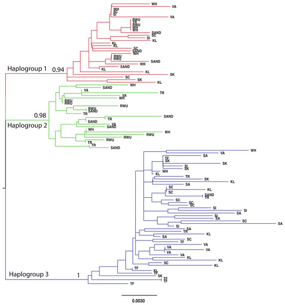 

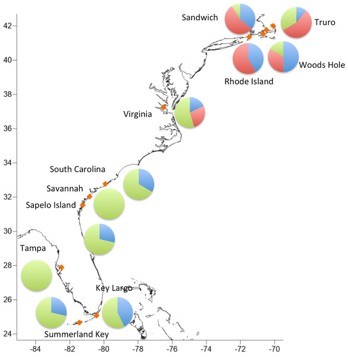  


This gene tree pattern reflects the overall similarity of sequence, though the models for inferring these relationships can be mathematically complex in trying to estimate actual mutational difference among sequences. The gene tree raises many questions, many of which will be addressed further as we gain skills in exploring the variation among sequences under expectations of single, randomly-mating populations in later chapters. However, by plotting WHERE each sequence was found you can start to assess that the diversity is not randomly distributed - the 'red' type of diversity is only found in the northern part of the range (Fig 2.5b). This appears to be an example where some diversity is more likely to be found in certain parts of the distributional (environmental) range of this species - suggesting variation in environmental tolerances or performance. To quantify this variation requires additional approaches, and to explore this hypothesis of local adaptation will require additional experiments.

By the way, if you were really paying attention as we plotted the barcode distances within *Chthamalus* above, you may have noted there was already a barcode gap - it just corresponds to a finer scale than recognized "species"! In the next unit, we will start to explore how ecologists and geneticists have somewhat independently identified similar approaches to measuring and distinguishing the diversity from distinct spatial or environmental samples, and will note where specialized metrics are necessary. 

<style>
div.green { background-color:#99ff99; border-radius: 10px; padding: 40px;}
</style>
<div class = "green">

*For your exercise this week*, we will (a) learn how to use the free software Geneious at a basic level; (b) download DNA sequence data for a group of organisms of your choosing (roughly 8-10 sequences per species for 4-5 related species is a good size); (c) align the sequence data (we will do this in class); (d) we will evaluate the distance matrix in Geneious, and you should be sure that it provides *distances* not *similarities*. These distances can be used to plot a "barcode gap" however you want...

The above code is one way to do it, but you can tell it is clunky and written for a very specific instance of data. A slightly better version of R code (but use Excel, or watercolor, or whatever) is in the Github directory with this 'book' as barcode_basics.Rmd, it will guide you a bit further down the path. 

Anyway, plot your own "barcode gap" histogram and ask how well this model of inter-individual and inter-specific divergence applies to the *taxonomic* diversity of your chosen group of organisms - what are the reasons it might not, and how could this understanding be applied to a question of distribution, abundance, or interactions?

</div>

In class, we will also take some class time to discuss the 'reverse ecology' approach mentioned in e.g. Marmeisse et al (2013), the overall consideration of how molecular ecology fits into natural history as discussed in the Travis 2020 essay, and discuss what spatial variation in genomic diversity means for the function, eco-physiology, and other types of variation in a species that may respond to a change in the environment. 

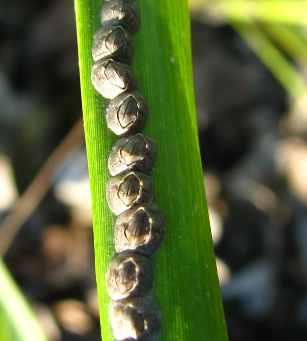


*Resources cited in this section*
Brown, A. et al (2019).

Hamady M, Walker JJ, Harris JK, Gold NJ, Knight R (2008) Error-correcting barcoded primers for pyrosequencing hundreds of samples in multiplex. Nature Methods 5: 235–237. 10.1038/nmeth.1184

Katz et al (2009)


<style>
div.blue { background-color:#e6f0ff; border-radius: 10px; padding: 40px;}
</style>
<div class = "blue">


## Box B. An aside to explain these data better and how we obtain them. {#BoxB}

This resource could be organized by electrophoresis (mobility, size and charge and cost) versus sequencing (method, informatics, cost). Here I will be brief and I'm working to use online OA resources to clarify. We will note that later it will make sense that the information we can glean from sequencing, even models of thinking about rate and type of mutation, are useful even for electrophoretic markers and vice-versa.

In order to make any inference such as typical in molecular ecology, you have to have information. You have to have *variable* information, in fact. So, the history of this field is in finding ways to recognize that there is so much diversity in every single sample of life, and do it efficiently with available technology. As my colleague Jim Hamrick puts it, it is "high-tech natural history" so we often don't have a lot of funding but we still have big questions!

The trick has been two-fold in our field. At first, we were technology-limited; it was difficult to obtain information on variable markers until the advent of protein electrophoresis in the 1960s, but those offer only a limited view into mutational diversity (and *may* be frequent targets of selection, see Skibinski & Ward 2004, Marden 2013). Our second problem has often been just as significant, which is that improvements in technology are often expensive and lets face it: we are asking questions that don't merit multi-million dollar NIH grants, in general (though the same methods of course have been appropriate for asking questions about **COVID-19**, see work by Trevor Bedford, UGA's Erin Lipp, and others).

What this means is that the questions you want to ask are often influenced by how creatively you can use the available funding to do so. Though in 2022 it is becoming more common to see studies that involve whole-genome resequencing data - thus, there is a complete view of the genome, though some may want additional samples, or would still wish for methylation data, and so on - this is only possible when a well-scaffolded, complete genome is available. For many of us, that is simply not true and will not be true for quite some time (or until you get the $15-20,000 necessary to buy the data to do it yourself, but this can easily take a couple of years; Ruiz-Ramos et al 2020).

To save money, there are methods that focus on *anonymous* regions of the genome, those that focus on *targeted* regions of the genome, and there are distinctions in how the *targeted* data are obtained that tend to vary categorically with the number of regions being evaluated. The "anonymous" methods include what is currently known as genotype-by-sequencing (GBS, and the many flavors of "RAD" protocols that are collected to do this) and other methods that involve shearing the genome into fragments using microbe-derived restriction enzymes that recognize certain "words" in the genome and cleave the DNA in predictable ways. The extremely common enzyme *Eco*RI comes from the bacterium *Eschericia coli* and whenever it encounters a region in double-stranded DNA that has a **GAATTC** motif, it cuts the DNA in a way that leaves the **AATT* as a single-stranded overhanging bit of DNA, for example. What is nice is not only that the genome has been cut, but an easy way to bind adapter sequences is left behind for PCR-based methods.

The *targeted* data rely on prior knowledge about a gene region and its utility for your purposes. For example, probably the most frequently analyzed single gene region in metazoans is the mitochondrial cytochrome oxidase I gene region, for the simple fact that Folmer et al. (1994) published primers that tend to be able to isolate and amplify that gene region reliably in metazoans. We have subsequently figured out ways in which this gene region is particularly useful for molecular ecology, as well as particular drawbacks it has (Wares 2010) in terms of reliably transmitting information about mutational events. As scientists have wanted larger numbers of targeted fragments, the costs of PCR and sequencing either scale up linearly with the number of targets when doing traditional PCR and Sanger sequencing (roughly $1-4 in cost per ~1kb sequence per individual), or larger outlay of cash for enrichment protocols that allow next-generation sequencing to provide sufficient sequencing coverage of all the targeted regions. The cost of the sequencing is one part of the equation (e.g. in 2020 approximately 110,000,000,000 nucleotides can be returned from an Illumina sequencer for a cost of less than 1500 dollars), but how cleverly the underlying experiment is designed strongly affects the cost-efficiency of this approach. 

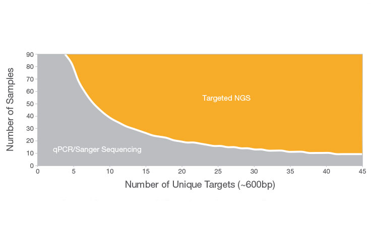


One type of *targeted* loci that can be analyzed efficiently with electrophoresis, separating fragments by their *size* rather than their actual sequence, include microsatellite markers or "simple sequence repeats" (SSRs). These loci vary based on short DNA repeats (e.g. ATC**ATC**ATC**ATC**...or GT**GT**GT**GT**GT**GT**GT...) that are highly mutable, and thus these loci tend to harbor higher diversity than other types of markers but also come along with distinct challenges, both practical and analytical. The fact that they only require electrophoresis to genotype an individual would seem to save money, but the effort to score these loci *and* the overall cost of multiple PCR reactions and submissions to a genomics center to be run on a capillary electrophoresis sequencer (often at a cost approaching $1 per sample, once costs of cleanup and electrophoresis are included) makes this of marginal benefit (K. Bobier, pers. comm.), and the cost to develop these relatively taxon-specific markers (doing enough sequencing to find the repeat regions whether via enrichment or filtering, primer design and basic testing - often on the order of thousands of dollars for a new series) has probably put them into the historical dustbin except for cases where they already work on your organism.

So, suffice to say there are *so* many ways to collect data representing genomic variation and you have a few variables to work with. *How much money is available for this work? How many individuals should be genotyped, at how many loci, to satisfy your question?* At this point in the book, you maybe don't know. *How many individuals do you genotype to figure out whether broods of barnacle larvae (or seed pods of tropical trees) are fathered by a single individual, or multiple? How many locations do you need to assay to understand your overall system - and how many individuals from each location?* (not to mention the cost and effort of *finding* those individuals, often a considerable effort itself)

This is the challenge in teaching about the markers. They change constantly via technology and the availability of resources; the questions and the statistics used to answer those questions change far less over time, thus we are going to move forward moving with the simplest types of data (and simplest types of analysis) first. The exceptions necessary for dealing with certain types of data - are the data haploid? Or uniparentally inherited? Are the data dominant or codominant? In other words, you will also need to understand the **natural history** of the markers you are studying, as noted by famed paleontologist Geerat Vermeij (2003).

A few other notes as we talk about the 'natural history' of our markers. It has been common to talk about loci that are neutral versus those that are not. Usually, in the context of declaring the data to be neutral because they are mitochondrial (e.g. Avise et al. 1987) or microsatellites, or simply because they have no known relationship to functional or quantitative diversity. What we are really saying is that the data have very little known about this relationship, but that the assumption of neutrality is often a very *very* big assumption (Hahn 2008; Rand, Wares 2010, and so on). The extent to which this type of work is "genetics" means that you have to know how it is inherited (only from maternal? Or is it a freshwater mussel, and the mitochondrion will reflect paternal diversity *when in males*), and you have to know how your technique for capturing it will reflect that diversity - is there potential for null alleles that do not amplify because of variation in primer sites? Will you only capture the presence of an allele, and can not distinguish between homozygotes and heterozygotes? Would you expect the relative abundance of particular genomic sequences to reliably indicate the relative abundance of the organisms they come from in an environmental sample? Why or why not?

So we are going to treat the natural history of loci, and the methods to obtain the data, as opportunities to consider exceptions to the rule rather than a basis to build upon. The best data means that you have sequence data, and a lot of it - and you know what to do with it. Here we go!


</div>


# 3 A bit more biological reality, and how diversity is generated {#Ch3}

One last key set of details is going to be important for us knowing how to ask the right questions using molecular data. So far we have talked about using molecular assays to find genomic variation in individuals and samples of individuals. We haven't really talked about where that variation comes from, and the reason that is important is that almost all of our questions rely on this variation telling us something about *rates of change per unit time*.

## 3.1 How diversity is generated by mutation

Mutations are er*r*rors. Simple as that. When we teach introductory biology, there is a single equation for how photosynthesis converts light and water into glucose and oxygen; but there are any number of ways in which that metabolic pathway sometimes misses a step or hiccups, and that becomes more frequent as the environment changes away from the conditions that a photosynthetic organism is adapted for. So, we recognize that as ocean temperatures increase, photosynthetic dinoflagellates living in corals are more likely to produce tissue-damaging oxygen radicals, and they are ejected by the coral hosts - causing bleaching. https://www.youtube.com/watch?v=_ZfGIKiSwwQ

Similarly, mutations happen when DNA replication has an error, as with 'strand slippage' changing the number of repeats in a microsatellite or adding a G instead of a C as nucleotides are incorporated; or when ultraviolet light or a chemical toxin damages the DNA and cellular repair mechanisms don't catch the change. 

We should recognize that mutations are happening all the time, though not always with evolutionary significance. Many cancers are caused by *somatic* mutations that only affect the diversity in the cell(s) descended from the initial mutation, for example. However, when mutations appear in a cell or tissue that has the capacity to reproduce and make new organisms ("germ line"), those new organisms will carry the mutation that occurred in the previous generation.

How do we know that mutations happen all the time? First of all, a rather famous experiment by Luria and Delbrück showed that bacteria grown from a single cell in a culture medium until there are many millions of cells have a non-zero probability of a mutation affecting their tolerance to antibiotics. If the mutations only appeared *because* of the change in the environment, we would expect a fairly constant rate of response across replicate experiments; the high variance in outcomes mathematically showed that mutations were sometimes happening early in the growth of the culture (so more cells are resistant when plated on antibiotic medium), sometimes late (very few cells are resistant), or not at all. That tells us that mutations are independent from any *response* to the environment; some environments may promote mutagenicity, but the location of mutations that arise are not specific to that environment.

Intriguingly, we can also track mutations happening in long-lived and clonal organisms. A great example would be aspen trees (*Populus tremula*), which grow in massive clones with shared root systems. Distinct clones may be noted during autumn, as leaves turn from green to brilliant gold, because large patches of trees will all turn at the same time - but not synchronously with patches next to them. Sequencing portions of the genome from one edge of a clonal individual and then from a tree at the opposite edge assumes that the clone is expanding outwards from its original propagule (seed), and thus many years have passed since those two sequences came from the same cell. It is typical to find that these trees on opposite sides of the colony are genomically distinct (though still clonal!), and because each tree has its own reproductive tissues the gametes they produce will carry those distinct mutations. Similar approaches have been used to look at mutational diversity in other tree species (https://doi.org/10.1098/rspb.2019.2364 for *Eucalyptus*, Fig 3.1), and have even been able to use the growth form of trees to identify the actual rate per amount of tissue growth or per generation!
<br>


```{r, out.width='90%', fig.align='center', fig.cap='...',echo=FALSE}
knitr::include_graphics('MEImages/eucalyptus.jpg')
```
**Fig.3.1 - From https://royalsocietypublishing.org/doi/10.1098/rspb.2019.2364, showing how the 'phylogenetic' growth of *Eucalyptus* can be taken advantage of for studying somatic mutation rates in these trees and comparing with simpler 'model' organisms like *Arabidopsis*.**


A fascinating recent paper by Olsen, Levitan, and others (https://www.ncbi.nlm.nih.gov/pubmed/30707605 ) looked at this same question in corals in the Caribbean. Corals tend to start their life as either a tiny planula larva, created by the formation of a zygote from spawned eggs and sperm, or as a small chunk of coral that has broken off from a nearby colony. As the colony grows from either starting point, again mutations may happen in individual polyps (each polyp eats, photosynthesizes, and can reproduce, but all share a common gastrovascular connection), and mutational diversity can be found between polyps on either side of the colony. What was really cool about this work (Olsen et al 2018, *Biological Bulletin*) was that they evaluated many coral colonies from 2 species, at different depths *and* different sizes. The two species have different growth forms and rates, so the genetic distance between polyps from the same colony depended on both size and species identity; even more interesting, the mutation rate was higher for shallow-water colonies, suggesting increased exposure to ultraviolet radiation from the sun.

<style>
div.rose { background-color:#ffc4ef; border-radius: 10px; padding: 40px;}
</style>
<div class = "rose">
*The data in the Olsen et al paper came from microsatellite loci. As noted in Box B (Chapter 2), this is a method that depends on isolating and identifying regions in the genome with simple short repeat (SSR) sequences and then targeting them using PCR. The products are scored by their relative migration under electrophoresis, using a size standard that fluoresces a distinct color from the PCR amplicons so that the products can be scored to size. Though a particular allele may have 14 repeats of "AGT" (14 x 3 = 42nt), the PCR amplicon will include flanking regions that extend the fragment length so that there is a space for primers to match for PCR; thus that same allele may actually be a PCR amplicon that is (for example) 120 base pairs in length. The fragment length is generally what is scored, and in the best cases each allele is scored at length intervals that match the repeat element length (so for the example locus, we might see other alleles at 117, 123, 126 and so on). Later in this chapter we will see more about how mutational differences are counted among these fragments, but they offer a highly variable (good) but imperfect view of genome diversity that requires special consideration.*

</div>
<br>

These examples from bacteria, trees, and corals are natural examples of "mutation accumulation" (MA) studies, which can easily be done (with time!) in lab organisms with short generation times, such as *Arabidopsis*, yeasts, phytoplankton, and so on. Often of course in order to do such work you not only need a short-generation organism that is amenable to culturing in the lab, but also the resources to sequence large amounts of the genome since the *location* of the mutations will also be, for the most part, random. To understand how mutation happens in the rest of diversity, biologists have looked at well-known geographic features that separated ancestral populations into two or more descendant populations (my favorite example being the Isthmus of Panama separating the Pacific and Caribbean basins), and can ask similar questions about how many mutations distinguish those populations.

Estimating the mutation rate, $\mu$ , from these long-term isolated populations requires that we make one additional assumption. Since we are only looking at the end-point of many hundreds or thousands of generations of isolation, many mutations will have arisen - and some will disappear quickly, some will stay in the population as segregating diversity, and some will go to 'fixation' (the novel mutation is now present in all members of the population). If we assume that the mutation has absolutely no good or bad qualities with respect to the survival or reproduction of individuals ("fitness"), then whether it increases in frequency each generation or decreases is pure stochastic luck. It depends on the fact that populations are finite in size, and that for unpredictable reasons not all individuals will have the same number of offspring - some zero, some one, some many. Because of this simple fact of variation in reproduction, the frequency of a mutation changes randomly each generation as shown in this simulation of **genetic drift**:

```{r driftsim2,eval=TRUE}
library(learnPopGen)
driftplot<-drift.selection(p0=0.2,Ne=500,w=c(1,1,1),ngen=500,nrep=10)

#this is terrible slow code

```

The plot shown is based on simulating drift, as we have seen before in this class. In this case, the starting frequency was low (0.2) -- but not as low as a new mutation -- and the population size *N* is 500. So that we refresh in our minds how this works, there is also a Shiny app that lets you control these parameters (nb unless otherwise noted, the Shiny popgen apps are by Silas Tittes https://github.com/silastittes/shiny_popgen).

```{r driftshiny}

library(ggplot2)

shinyAppFile("shiny_popgen-master/Drift/drift_app.R",options=list(width="100%",height=700))

```

<style>
div.green { background-color:#99ff99; border-radius: 10px; padding: 40px;}
</style>
<div class = "green">

**I want you to gain intuition about how *genetic drift* works. It is a key mechanism - based on variation in reproductive success in any real population - that informs us about how long diversity can be maintained in a population. **

Your task with this simulation exercise is to learn about a key understanding about random genetic drift. Remember, at this point in time all diversity we have talked about has no *known* effect on **fitness**. You can see from the app above that you can change population size (*N*), the initial allele frequency (from 0 to 1), how long to run the simulation (in generations); as well as "bottleneck time" and "bottleneck pop. size". Don't worry about these last two, but DO set "bottleneck time" to be greater or equal to "generations" when you change that value.

Test it out by clicking 'GO'. You'll see that it is a simple simulation based on the values you give it. Click 'GO' a few more times, just to see that each time it is producing a different results based on how genetic drift would affect allele frequencies through time.

Now, varying *N*, starting allele frequency, generations, and number of replicates - I'd like for you to set up some simple observational experiments to *quantify* the probability that the allele we are tracking goes to fixation (frequency 100%). Remember, you set the starting frequency *x* of the allele being tracked. Assuming this is a 2-allele situation, the other allele is of course at a frequency of (1-*x*). 

I suggest starting with small population sizes and adjusting the frequency of the allele. Then, see what changes as you increase *N*. Remember that for some conditions you may need to track the simulation through more generations.

Now that you have run those experiments and described your approach and results, write what you predict as the conditions that allow an allele starting at frequency 0.05 (rare) to go to fixation (frequency 1). If you increase *N* to 1000, does the likelihood of fixation change? Or does the time required for fixation change? **Exploring these questions will start to help you see that the frequency of an allele in a population can also tell you about how long it has been in the population**.

I'd like you to try this before you read further. You don't have to turn it in, but if you send a short report to me I can help evaluate how you are thinking and grasping these concepts - same applies throughout the semester. If you think you need help with this, please see the ([**section added by a previous student**](#ShinyEx1)).


</div>
<br>

OK, now close your eyes, imagine a simulation starting at a frequency *f* for 2 alleles (that is, one allele at frequency *f*, the other at frequency (1-*f*)). This is an ancestral population. If that population is, by whatever environmental mechanism, separated into two distinct populations, how often do you think the two locations being sampled will have a different allele present in 100% of individuals?

As you can now recognize, given enough time relative to *N*, there will be plenty of instances in which a polymorphism goes to fixation in one location/replicate, and, relative to the "other" location/replicate would be a **substitution**.This small simulation is not truly realistic in terms of the starting frequency of a new mutation of course. If there are *N* individuals in a population, then a brand new mutation would appear at a frequency of 1/*N* (or really 1/2*N* for a diploid locus); but there would also be many more such opportunities across a whole genome, across many generations. Kimura's "neutral theory" predicts that the probability of a mutation going to fixation is equal to its frequency when observed, so with the simulation above in the figure - given enough time - we would expect 20% of the simulations to go to fixation and become a substitution. With a new mutation, that would be a much lower probability of 1/*N*. However, in each generation you have an opportunity for mutations to happen on all sequences* in the population, in other words *N* times the mutation rate $\mu$. Long story short: **if the mutations are neither advantageous nor disadvantageous** (neutral, not selected for or against), *the rate of substitutions is equal to the rate of mutations*.

<div class = "blue">
*a quick aside on nomenclature: a mutation happens at a particular SINGLE location in a genome, but tracking the pattern of mutations typically involves a region of the genome which has been sequenced or is otherwise being analyzed. to distinguish from ALLELES which are the copies inherited generationally, and the entire CHROMOSOMES that these regions are small portions of, Hahn's (2019) textbook refers to simply "SEQUENCES". at all times, think carefully and communicate carefully about what level of diversity you are trying to describe! (locus, allele, paralog, ortholog, scaffold, and many other technical terms have sometimes overlapping meaning...)
</div>


This means that if we go back to our genetic distances from Chapter 2 - the mean number of mutational differences between sequences from populations that have been separated for a long period of time (*t*) can tell us what $\mu$ is if we have a good idea of what *t* is. This, too, is the simplest model for how we approach this problem and later in the semester we can identify ways to increase the accuracy of this inference.

## 3.1.1 Examples where we think we know *t* for this purpose

Abundant geologic evidence and radiometric dating have shown that volcanic activity formed the narrow land bridge between South America and Central America where now Panama and parts of other nations are found. Prior to this happening, there was relatively free exchange of marine organisms between the Pacific Ocean and the Caribbean Sea. The geologic dating estimates that the land bridge had closed off this passageway around 3 million years ago (mya), sundering those marine populations into demographically distinct Pacific and Caribbean populations [ https://www.science.org/doi/10.1126/sciadv.1600883 ]. At this point in time, each population was likely genomically indistinguishable from the other; but in 3 million years, many new mutations have arisen and gone to fixation in each population, and we assume those mutations and probabilities to be completely independent from one another. 

Mutation is treated as a Poisson-distributed random process, meaning that we treat mutations as independent events in a genome, that the rate is very low but constant for a given time step, and we assume that the rate is low per time step so that only one event happens at a time. https://towardsdatascience.com/the-poisson-distribution-and-poisson-process-explained-4e2cb17d459 This probabilistic assumption can be used to consider how many lightbulbs must be purchased to keep all lights functional on a University campus - and the likely number needed to be replaced in any particular building or room. Importantly, even though the events are stochastic our estimates of the rate $\mu$ still relate the number of events to time.

So, we can look at these separate populations and calculate their overall divergence $d_{xy}$ based on the proportional difference of sequences from the two populations, as in Chapter 2 - and because the mutation rate $\mu$ has applied in **BOTH** populations over the same stretch of time *t*, that genetic distance is equal to 2$\mu$*t*, or $\mu$=$d_{xy}$/2*t*. In this case, a famous early study by Nancy Knowlton looked at populations of snapping shrimp in either basin, assuming *t*=3,000,000 and they estimated $\mu$ for typical mitochondrial protein coding loci to be around 2-3% divergence per million years. This is called "calibrating the molecular clock" and of course is still a very simplistic way of thinking about how mutations will arise and be retained in very different parts of the genome, under different evolutionary mechanisms, but it is a common starting point for these analyses - and tends to fit well when other organisms are evaluated, as long as the same gene region is evaluated.

Similar approaches have been taken in instances where we have good geologic data for the temporary submergence of a land bridge such as the northern portion of Baja California, allowing new movement across that land bridge; when erosion allows the headwaters of one river to "capture" the diversity of another river, effectively moving the fauna and flora of the second river into the first and isolating the two populations afterwards ("river piracy", J. Waters and others); or when knowledge of climatic change through time allows us to know when populations of mice that are now only found on the tops of mountains in the Rockies used to be connected through gene flow in the valleys during cooler climates.


## 3.1.2 How we infer the number of mutations, thinking of whole genomes


```{r, out.width='90%', fig.align='center', fig.cap='...',echo=FALSE}
knitr::include_graphics('MEImages/Pisgenome.jpg')
```
**Fig.3-2. A 'circos' plot of the 22 chromosomes of the *Pisaster* genome, a number validated by old chromosome squash data. More internal circles include aligned data of single-nucleotide polymorphisms from Schiebelhut et al 2018, and differential RNA expression data from several other studies as summarized in Ruiz-Ramos et al. 2020.**


A genome is tremendously complex. Figure 3-2 illustrates the complete genome of the sea star *Pisaster ochraceus*; there are 22 chromosomes (chromosome pairs in a diploid individual), comprising about 400 million DNA nucleotides. Although it is now possible to 're-sequence' the genome to find polymorphic sites, the complications of looking for potential gene rearrangements or inversions; dealing with recombination among sites; and the cost of doing so can be prohibitive and beyond the needs of a study. A lot of the data used in the field of molecular ecology are used because they allow a more efficient or inexpensive analysis that is sufficient for the purposes of the question. 

For example, the circles plotted in the first ring inside the chromosomes represent 100 SNPS (single nucleotide polymorphisms) that exhibited strong frequency shifts after sea star wasting disease killed ~90% of all individuals of this species (Schiebelhut et al 2018 PNAS). The pink radiating bars represent overlap between these markers and RNA-based expression data that suggest similar responses across data sets, even across other species influenced by wasting disease (Ruiz-Ramos et al 2020 Molecular Ecology, where this figure comes from). *How much data, what kind of data, and what sampling strategy is needed to answer your questions?*

Essentially the history of population genetics and molecular ecology follows the history of technical advances allowing us to see genomic diversity with greater breadth and resolution. Each technical advance allows greater consideration of the detail of these data, and so various models are used essentially to link the identity of any two sequences (using the term now *sensu* Hahn 2019 to disambiguate from the two alleles that each individual carries at a locus, whether identical or not) with the time since they shared a common ancestor. As with Hardy-Weinberg equilibrium and the 'match' of different ways of evaluating diversity, when these distinct models generate different estimates of diversity, we can assume that some evolutionary mechanism is involved, as we will soon see through examples.

In an ideal world, we know how many mutational events distinguish two sequences. In this way, we can recognize that mutations may even happen at the same location in a genome if enough time passes, and so people studying molecular evolution or phylogenetics of a group of distantly related organisms will make assumptions about the frequencies of transitions (a pyrimidine changing to another pyrimidine, or purine to purine, as with C->T or A->G mutations), the frequency of nucleotides in the data, constraints on the molecule such as codon models, and more in what are called **finite-sites models**. Having a tremendous amount of data and complex substitution models does not guarantee a lack of rancorous debate over the outcome of such analyses, of course, as with recent discussion of whether ctenophores (https://en.wikipedia.org/wiki/Ctenophora) are the most basal metazoan or not. Those methods are kind of out of the scope of this class and are often called "molecular evolution" or "phylogenetics/phylogenomics" or "molecular systematics", depending on the goal of the analysis.

On more recent time scales however, we can make some simplifying assumptions that work for most of the types of questions we are interested in as ecologists. A widely-used model is the **infinite-sites model**, which assumes that every mutational event occurs at a new location (site, nucleotide) in the genome and thus the number of distinctions between any pair of sequences is an indication of the number of mutations, and that leads us back to inferences of time. This model applies to cases where we are directly observing at least a portion of the actual nucleotide data, whether via traditional Sanger sequencing (a separate reaction for each sequence, individual specimens are handled distinctly, a total cost of perhaps $0.005 per nucleotide per individual per sequence) or high-throughput massively parallel sequencing with bioinformatic approaches to sort out the data after sequencing, where many individuals and loci are obtained at once - with a much higher *minimum* cost to a project, but orders of magnitude improvement on the cost per nucleotide/individual/locus.

 

```{r, out.width='90%', fig.align='center', fig.cap='...',echo=FALSE}
knitr::include_graphics('MEImages/BayonaPicture2.png')
```
**Fig.3-3. Cost per base pair on different DNA sequencing platforms; figure by N. Bayona-Vasquez, 2018 - things changing SO fast though, can now (2020) get 110gigabases of data for <$1500 (e.g. HiSeqX at novogene.com :)  but Sanger sequencing costs have not improved :( ) **

However, until only about 10 years ago, to study multiple loci via actual DNA sequencing (per locus, per individual) was increasingly prohibitive in time and money because of the cost of Sanger sequencing and the effort to get reliable PCR amplicons for highly variable genome regions (Fig 3-3, see **Box 1**, e.g. Wares et al 2009 put a great deal of effort into having data from 5 loci across roughly 50 individual chthamalid barnacles). So, an alternative for finding highly polymorphic loci might be simple-seqeunce repeat (SSR) or "microsatellite" markers, where mutations caused by *in vivo* polymerase error lead to heritable fragment length polymorphisms that are codominant - both alleles can be known for a locus from a single PCR and electrophoretic analysis - and could even be multiplexed for reasonable costs per locus per individual (many studies having 10-20 distinct loci for 10s or 100s of individual organisms). The drawback to microsatellite markers was often in their specificity to a particular species, so great effort went into developing them - and by not evaluating the actual DNA sequence (and length homoplasy being a common problem), mutational differences among alleles have to be estimated with something like a **stepwise mutation model** (SMM; where fragments of similar length are assumed to have a more recent common ancestor than with a fragment of very distinct length) or they are treated as having *unknown* relationships under an **infinite alleles model**.

By the way, if you look up **stepwise mutation model** on Wikipedia [https://en.wikipedia.org/wiki/Stepwise_mutation_model], that article was first created by students in the 2016 version of this class! Students in that year also updated the pages for the ISM and IAM. 

The infinite alleles model (IAM) simply says "these fragments are different" but without knowing whether 1 or 2 or 10 mutational events happened since they descended from a common ancestral fragment of DNA. In other words you either have, or are using, far less information in this case (but it is also a simple model, and not likely to be misled by big deviations in your assumptions). This model works for protein electrophoretic variants (allozymes) and some types of dominant markers as well, and can be used to simplify assessment of sequence variation as well. For example, in Figure 2.2, 6 sequences are shown and there are 4 distinct alleles represented by that diversity. Without counting the number of nucleotide differences, we can still represent the number of distinct alleles under this model; each polymorphic site represents a mutation that has happened in the history of the sample.

So looking back in time, older data *required* simpler models wtih less resolution, but those simpler models can still be used to assess the diversity among a collection of DNA sequence data. As noted above, the mutational diversity in a sample depends on two things: the mutation rate, and the number of individuals reproducing. So, we talk about a population mutation rate $\theta$ that is the product of these two. For example, one estimator of $\theta$ operates under the IAM; Watterson's $\theta$, hereafter (W), is just a count of the number of polymorphic/segregating sites (K) divided by a factor that accounts for the sample size (larger samples will recover more diversity, typically). 

(W) = $\frac{K}{a_n}$ 

where ${a_n}$ is the sum of 1/*i* from *i*=1 to *n*-1 in a sample of *n* sequences. (W) is an estimator of the population mutation rate $\theta$ and a value is obtained from the observed data. But in our barcode data (Fig 2.2), we already talked about another way to estimate diversity among sequences; the average pairwise proportional distance between all sequences in a sample, used at that time to characterize the distribution of how different sequences might be, is equivalent to another estimator of the population mutation rate called **nucleotide diversity**, or $\pi$. 

**remember we are still talking about sequence or marker variation, and not accounting for how it is combined in diploid/polyploid individuals**

The fact we are currently reading about sequence data, or estimating mutations between markers that are *proxies* of sequence data (the length of a microsatellite fragment approximates the knowledge of the actual sequence, for example), means right now we are not actually talking about allele frequencies in the same way as in the drift simulation above. We'll get to that - it turns out that there are reasons why diploid genomes are more complicated, even though you were all taught Hardy-Weinberg in high school probably!

The cool thing about (W) and $\pi$ is simply that they are two related but distinct ways to estimate how mutational diversity should be distributed in a population if we assume a single, **randomly mating** population with no **immigration** from other populations, no **selection** acting on the diversity, and the **mutations** happened before we sampled the diversity. You will see by Chapter 4 that these are pretty interesting constraints for when those two estimators should generate the same estimate of $\theta$. 

First, lets revisit what population size *N* does. Because not every single individual has the same number of offspring - think about the many acorns an oak tree drops, yet on average *all oak trees* only replace themselves at best; some will live a lifetime with no offspring that succeed, others will have many, the average is one in a stable population. 

```{r, out.width='90%', fig.align='center', fig.cap='...',echo=FALSE}
knitr::include_graphics('MEImages/Cyprinodon_diabolis,_males-2.jpg')
```
**Fig.3-n. A pair of devils hole pupfishes, public domain, georef info etc available at https://en.wikipedia.org/wiki/Devils_Hole_pupfish#/media/File:Cyprinodon_diabolis,_males.jpg **

The same could be said for the very few Devils Hole pupfish; they have a small population size that is absolutely constrained by the extent of their environment and food resources. If we start with an assumption of allele frequency - 2 alleles at equal frequency - how quickly does that allele frequency change? 

```{r oakdevildrift,eval=TRUE} 
#library(learnPopGen)
#oh god I don't see the cache file this takes a LONG time because of first sim; get the cache working
#oakdrift<-drift.selection(p0=0.5,Ne=5000,w=c(1,1,1),ngen=400,nrep=5) #for now not compiling
#devildrift<-drift.selection(p0=0.5,Ne=100,w=c(1,1,1),ngen=400,nrep=5)

#shinyAppFile("/shiny_popgen-master/Drift/drift_app.R",options=list(width="100%",height=600))
# set this for specific params, read back in and plot for them

popoak<-read.csv("drift-simOak.csv",header=T)
#names(popoak)<-c('V1')
ggplot(data = popoak, aes(x=generation, y=freq)) + geom_line(aes(group=sim,col=sim)) + ylim(0,1) 

#ggplot(data = popoak, aes(x=generation, y=freq)) + geom_path(aes(colour=sim) + scale_y_continuous(limits=c(0,1),breaks=seq(0,1,0.2)))

#ggplot(data = popoak, aes(x=generation, y=freq)) + geom_path(aes(colour=sim) + ylim(c(0,1)))

#popoak2<-read.csv("drift-simOak2.csv",header=T)
#ggplot(data = popoak2, aes(x=generation, y=freq)) + geom_line(aes(colour=sim))

popdev<-read.csv("drift-simDev.csv",header=T)
ggplot(data = popdev, aes(x=generation, y=freq)) + geom_line(aes(group=sim,col=sim)) + ylim(0,1)

```

You'll note a very different amount of change in the oak tree (top) versus the pupfish (bottom). The point is, the top one has a very large (effective) population size, the bottom one has a very small one. How we get to the (effective) part comes later. But do you see the clear distinction? In a large population, random change happens slowly and doesn't lose diversity quickly; in a small population, change happens fast and diversity is lost. We will eventually be able to use this relationship to look at turnover in allele frequency between distinct temporal samples from a population and try to estimate what the (effective) population size actually is; the parentheses are there because this is hard for all sorts of reasons, but I hope you can already see it is of ecological interest. One thing you will come across later is that  because the rate of fixation is faster in small populations, we can see that the overall rate that heterozygosity is lost at a locus is ~1/*N* per generation, which is why small inbred populations are of management concern.

So, in finite populations, you will see changes in allele frequency from generation to generation, and likely it will not - on its own - create more change than you'd expect from your modest sampling effort of genotypes to be able to predict allele frequencies. Again, this will come into play as we try to work backwards from allele frequency shifts to (effective) population size.

## 3.1.3 Now looking backwards

Anyway, that is what happens as time moves forward from a set of *assumptions* (the allele frequency, the effective population size). Typically, what we want to do is take **observed** data and ask *how they came to be that way* - though predicting the future is ultimately our goal (Bay et al 2018), we have to first figure out what we can learn from our reconstruction of the past.

Kingman (1982) is a definitive starting point for understanding the equivalent model to drift, but moving back in time from the data we can currently observe. What are those data? In this case, we are assuming sequence data from a fragment that is large enough to have multiple sites of mutation (of different ages, thus leading to interesting patterns) and it is *at least mostly* not recombining within the history of the sample, which is why there are useful patterns in the data. We can deal, and will deal, with recombination as well. This is the problem with models, all of them are wrong because there are always more complexities in a natural system - but some are useful (https://en.wikipedia.org/wiki/All_models_are_wrong). 

This "coalescent" model works with a similar but more explicit assumption of how each generation is related to the previous. What is known as the **Wright-Fisher** model applies to discrete generations; things can be dealt with, but are somewhat more complex, with overlapping generations (Charlesworth; Turner et al 2002; Hahn 2019). It is pretty much drift in reverse: if effective population size is small, it doesnt' take long for the diversity to *coalesce*, to be descended from a single common ancestral allele or lineage.

So, lets talk about the Wright-Fisher model. This means that you have a population size *N* and in the previous generation each of those *N* individuals were descended from *randomly* chosen ancestors of population size *N*. The "random" means that with probability 1/*N*, 2 individuals have a common ancestor for each generation back in time (and a probability 1-that, that any 2 do not). There are fewer good R simulations for this process but this one I like:


```{r minicoalescent} 
shinyAppFile("shiny_popgen-master/Coalescence/discrete_time_app.R",options=list(width="100%",height=600))
```
## Fig 3.n+1. above simulation is a bit like the mark-recapture evaluation of population size using multilocus genotypes discussed in the Luikart et al paper we read (see end of chapter for ref): you are making estimations about the population based on the proportion of that population you sample. The more of the population you sample -- in this case, all in the current generation --  of course many siblings and cousins and so on.

A more useful/realistic version of this Shiny app has been recently coded/updated, all of these so far come from Dr. Silas Tittes by the way. This next one recognizes that we don't sample *n* individuals from a population of size *N* where *n*=*N*, we are assuming that our sample is a relatively tiny proportion of all diversity that is out there. 

```{r minicoal2}
shinyAppFile("13023_shiny_popgen-master/Coalescence/discrete_time_app.R",options=list(width="100%",height=600))

```
## Fig 3.n+2. so, our Wright-Fisher model then extends to ask about how n relates to N, effectively. We are sampling n things, but Nc (census size) is likely much larger and so the question is about how that “choosing the parent” process described above works when the parental generation is so much larger than what we sample. It means that the expected time to coalescent events is telling us about effective population size (Ne) in the same way that drift simulations tell us about that same weird parameter.


The simulations are most useful if you mess around and see how they behave. If you set n=10 and generations =20 on the first panel, you can run this simulation several times and will see very different outcomes. This is a dramatically oversimplified version of looking at how coalescent theory works, because in this case the sample size *n* is identical to the population size *N*, so there are many rapid coalescent events - but of course as you increase *n* to its maximum (in this visualization) of 100, you cannot see the events as clearly. It is true that in very small populations (for example the Florida panthers in the late 1980s) all individuals sampled will have very recent common ancestors (both the biological and casual use of term "inbreeding"). But the dynamics of coalescent theory have broad implications for studying genomic diversity in populations of any magnitude. 

Then, if you look at the next panel down, you are seeing the dynamics of coalescence among the *n* samples you choose from a site/location/population relative to a larger population size, which of course extends the familial relationship much farther back in time. That's all the coalescent theory is doing, is modeling this temporal and probabilistic relationship of all individuals relative to *Ne*.

```{r bettercoalescent} 
#install.packages("coalesceR", repos="http://R-Forge.R-project.org") did not work right, try again
#library(coalesceR)
#coalescent.plot(n=10,ngen=20)
#get package names
#pckgs <- c("tidyverse", "shiny", "wesanderson")

#determine if packages are installed already
#miss <- pckgs[!pckgs %in% installed.packages()]

#install missing packages
#if(length(miss)) install.packages(miss, dependencies = TRUE)
# going to try shiny_popgen but not sure how to include in Rmd yet...

shinyAppFile("13023_shiny_popgen-master/Coalescence/SilasFeb4.R",options=list(width="100%",height=600))


```
## Then this 3rd simulation is telling us about expected diversity on these genealogies given mutational diversity that scales with effective population size - so time is in units of Ne in a much deeper and continuous recognition of how these sampled lineages COULD be related to one another.

The Shiny app for coalescent simulation in the above panel is more technically useful, because you can set the number of sequences sampled *n* as well as $\theta$, which you will remember is the product of the population size *N* and $\mu$ (and a scalar related to the number of gene copies). You see that because *N* is much larger than *n*, the *coalescence* of two sequences happens a much longer time in the past (and time itself is measured relative to $\theta$, so it is not absolute in units of generations or years). *Again, set up the parameters so that you can see that a large number of highly variable genealogies are consistent with this process, and mutations are randomly (Poisson distributed by time) placed on the tree*. Together, these generate the patterns of mutational polynmorphism that we expect when we use (W) and $\pi$ to estimate $\theta$. Where this will get far more interesting, again, is when the basic assumptions of that single population model are incorrect (Chapter 4).

## 3.2 How diversity is generated by recombination and sexual reproduction

So why have we been working our way through short fragments of haploid DNA, and talking about quadrats, and now we are talking about whole genomes? Why isn't a single sample from the genome enough -- isn't that distinct from sampling the plant diversity of campus or the zooplankton from a single 1 liter jar taken from a wetland at Savannah River Site?


```{r, out.width='50%', fig.align='center', fig.cap='...',echo=FALSE}
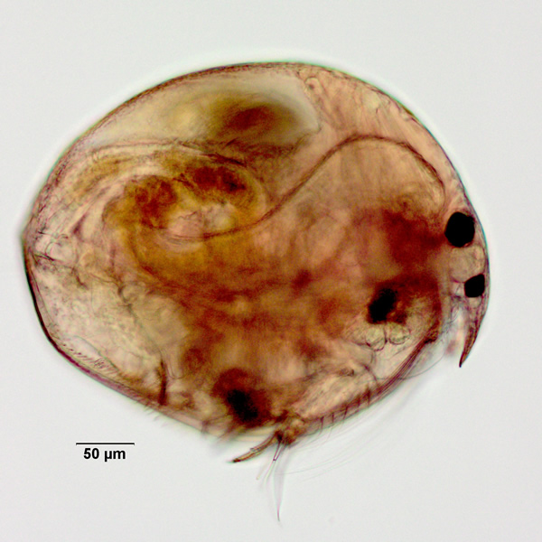
```
**Fig.3-4. A tiny "microcrustacean" zooplankton *Chydorus sphaericus* that is found in freshwater wetlands in the Americas, photo from http://cfb.unh.edu/cfbkey/html/Organisms/CCladocera/FChydoridae/GChydorus/Chydorus_sphaericus/chydorussphaericus.html **

**Recombination** is the key here. This is when, during sexual production of gametes and formation of a zygote, portions of the two homologous (parental) chromosomes are swapped so that variation from those two chromosomes can end up next to each other (or linked variation on one chromosome may get separated). It can be fairly complicated, and can lead to very interesting patterns, but a basic representation of it is shown below along with a useful link if you want to learn more.


```{r, out.width='90%', fig.align='center', fig.cap='...',echo=FALSE}
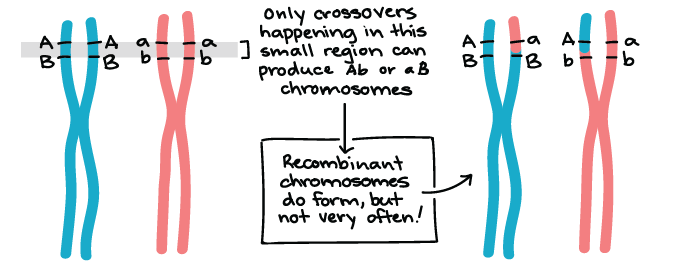
```
**Fig.3-5. A simple view of recombination between homologous chromosomes, not only is this a mechanism that adds overall diversity to genomes but it means that parts of a chromosome will have a distinct evolutionary/coalescent/mutational history than other parts of a chromosome, as shown at right. https://www.khanacademy.org/science/biology/classical-genetics/chromosomal-basis-of-genetics/a/linkage-mapping **


I'm leaving this section short because you didn't sign up for a genetics class :) Recombination complicates things in some ways, but it also helps us narrow the possible explanations for the data we see. Mathematically, it is complicated because it changes our bifurcating 'trees' expressing the coalescent history of a sample of whole chromosomes into a graph, where different portions of the DNA sequence *actually have different histories*. To the extent we recognize this, however, it means that distinct loci - whether SNPs obtained by RADseq (**BOX 1**), or allozymes (protein electrophoretic alleles), or sequences derived from targeted PCR fragments - are statistically independent views of the process of evolution in a population or set of populations, some of them influenced by effects on fitness or mate choice but most of them acting as independent observations of the process of genealogical descent and mutation (drift, coalescence). We can home in on a more accurate understanding of the history of a population when we have multiple loci.


## 3.3 The what-is-a-species problem

The fact I've brought up recombination means we have to recognize that most of the diversity we study is diploid (there are mechanisms by which haploid microbes and mitochondria, etc. also recombine diversity, however). It's a fascinating transition because having two copies of each gene can tend to mask the negative consequences of an allele on one copy, or they can interact in evolutionarily interesting ways (Grosberg and Strathmann, "One Cell Two Cell Red Cell Blue Cell", *TREE* 1998 doi: 10.1016/S0169-5347(97)01313-X.) This is where the fuzzy side of molecular ecology lies, because sometimes the diversity we are mapping across space and time will itself interact in interesting ways.

Earlier we mentioned "inbreeding", which refers to closely related alleles (from closely related individuals) and may cause *inbreeding depression*, when those alleles combine to create a low-fitness phenotype. Remember, fitness is measured by survival and fecundity. Later in the book we will talk about conservation and management approaches based in molecular ecology methods and how they focus on adding diversity to populations and avoiding mating among related individuals. 

There are plenty of reasons to categorize organisms and groups of organisms as 'distinct' (Chapter 4), and we now see that as more time *t* passes, portions of the genome become more distinct through mutation - this is what we are seeing in the barcode analyses of divergence, which is often also called *reciprocal monophyly*. This refers to all individuals in one group/population/species being 'fixed' for an allele that is distinct from the one in the other group/population/species. When we study these divergent alleles using the models we have discussed, we will see eventually (in Chapter 5) just how they show that they *cannot* come from a single interbreeding population, and eventually we start talking about those populations being something entirely different: species.

When divergent chromosomes interact, the distinct mutations that have arisen may no longer interact well - they may code for proteins that don't fit right, or change the timing of flowering or spawning (*phenology*) such that the combination creates offspring that have trouble surviving or reproducing. These interactions among very distant genomes are called *outbreeding depression*, again with a decrease in fitness. In fact, the greater the divergence between two genomes, or two populations, at this point it becomes more and more likely that such interactions will happen (Fig 3-6, from Hudson & Coyne 2002; Louis Plough's work I may bring up again...)


```{r, out.width='90%', fig.align='center', fig.cap='...',echo=FALSE}
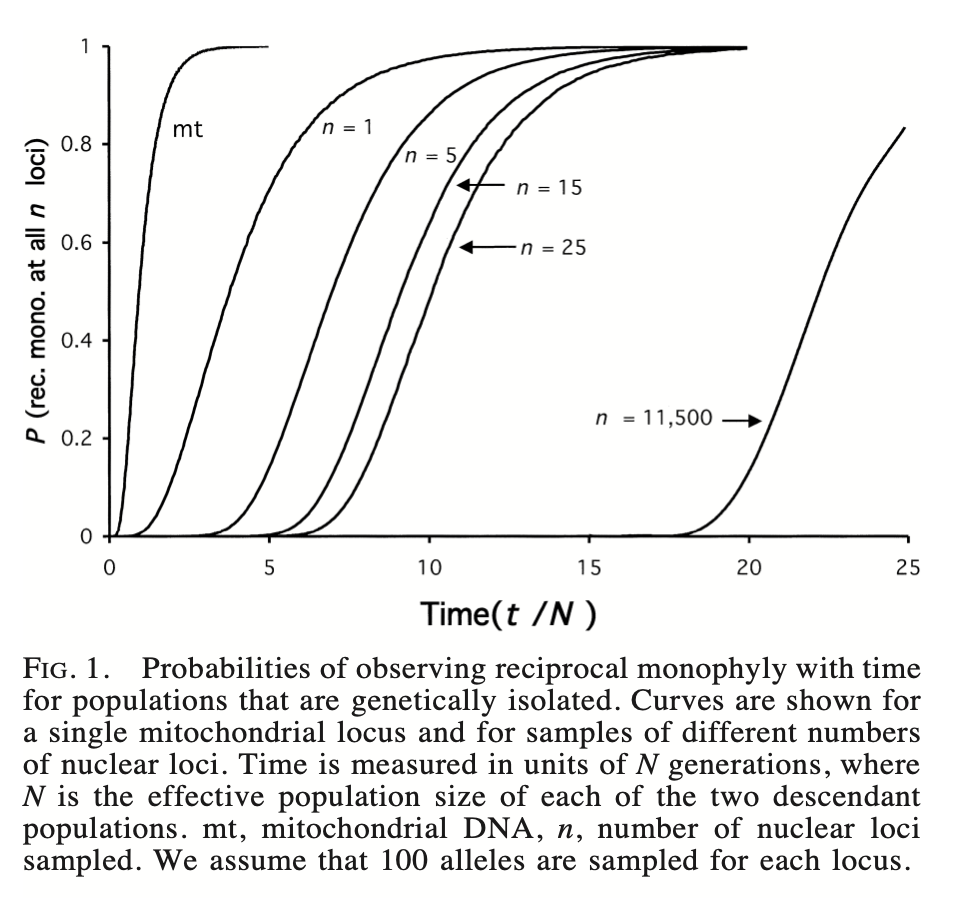
```
**Fig.3-6. The variable nature of how long it takes for gene regions in 2 populations to have completely distinct diversity. The more loci being evaluated, the longer it takes for all of them to reach this status (in phylogenetic terms known as "reciprocal monophyly"). A mitochondrial locus is haploid and maternally inherited, so it has an effective *N* that is 1/4 that of a nuclear locus**


The figure above shows that with enough time, larger and larger portions of the genome will be distinct and that adds to the likelihood of outbreeding depression. The fact that crosses between two such populations have lower fitness is associated with speciation under what is known as the "biological species concept" (Mayr), but in our field we are more often diagnosing likely species based on genealogical or phylogenetic criteria, which are just as valid (de Queiroz 2007). The trick with drawing any hard and fast rule about "species" is that often there are counterpredictions, as when alleles that cause outbreeding depression (lower survival or reproduction) vary among populations of the same apparent species and can even move between different apparent species when they do successfully hybridize (Sweigart et al 2007,  https://doi.org/10.1111/j.1558-5646.2007.00011.x). Divergence can also be significant simply because of differences in phenology (flowering, spawning, etc) times among populations, regardless of the fitness consequences of occasional crosses, or simple isolation - for many species we just don't know what happens when they re-encounter one another.

A really fantastic example of this comes from Battey et al 2018, with one of the most gorgeous figures you will ever see in the field (Fig 3-7). This shows us how genomic diversity varies significantly among isolated populations of painted buntings on the east coast of North America versus those in central North America, with distinct migratory pathways and reproductive isolation based on where they return each year (note from UGA colleague Richard Chandler: many neotropical migrants return each year within 50m of where they were the previous year). 


```{r, out.width='90%', fig.align='center', fig.cap='...',echo=FALSE}
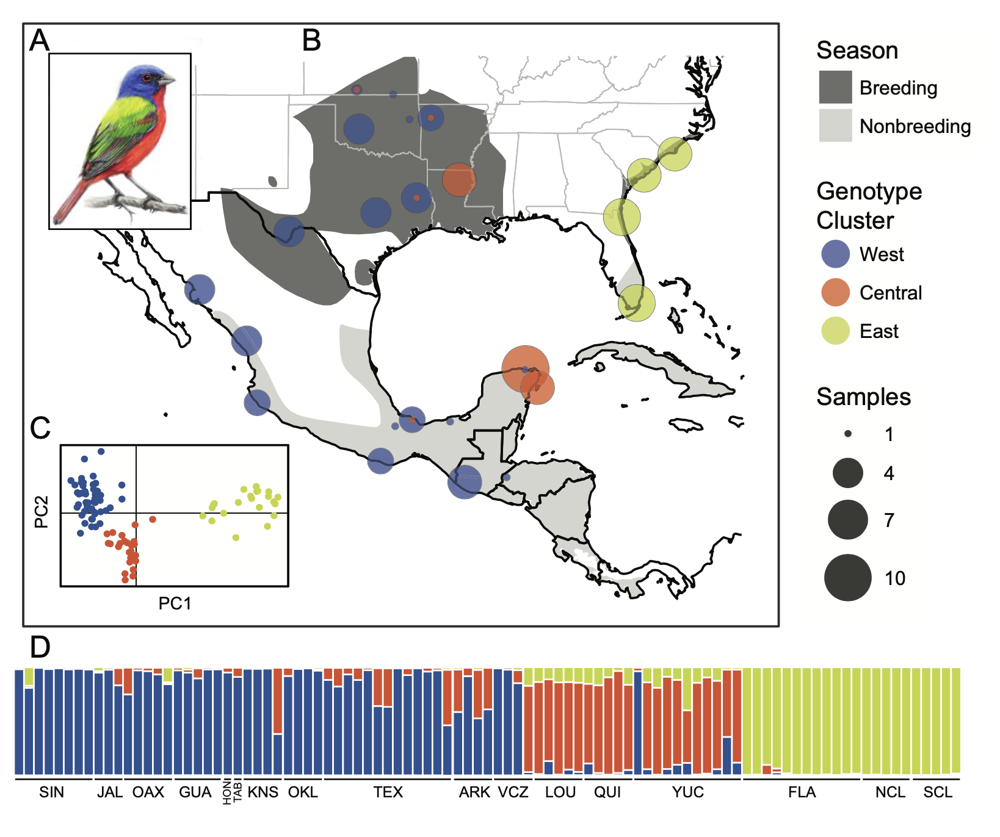
```
**Fig.3-7. Using single nucleotide polymorphisms (over 3600 of them!) Battey et al 2018 showed that the diversity separates the painted bunting *Passerina ciris* into 2 very distinct lineages and 3 evolutionarily distinct lineages based on the diversity among the sites shown. In later chapters we will talka bout the genetic as well as Euclidean models that let us separate samples of diversity this way. This is important because it not only highlights where there may be additional "species" within a single Latin binomial, but that there are ecological and management decisions to be made about how these distinct lineages migrate and overwinter. **

<style>
div.rose { background-color:#ffc4ef; border-radius: 10px; padding: 40px;}
</style>
<div class = "rose">
These data come from "genotype by sequencing" approaches, e.g RADseq or other methods (**BOX 1**). This means that individual single nucleotide polymorphisms (SNPs), analytically determined to be unlinked thanks to recombination, contribute to these patterns. However, as noted earlier *each individual SNP is only bi-allelic* and so contributes VERY little information about how these data fit a demographic or historical model that could be investigated with coalescent methods. The panel at the bottom (the bar graph) is actually generated by diploid genotype models discussed in the next chapter. The data involved are currently state-of-the-art and are beneficial in being so numerous (remember the advantage of independent views of evolutionary history thanks to recombination) but for many tests that we will consider later do not have sufficient information. The way that we will start to look at these unlinked SNPs will involve a more sophisticated set of summary statistics (site frequency spectra, genetic inheritance models, etc.) of DNA polymorphisms - more on this later (**Chapter 5**).
</div>


This is our big overview of how genomic data are used to explore the diversity of populations, and as you will soon see - mostly, the deviations from the *null models* that we assume. The next chapter will discuss how diversity within and among samples is evaluated and how using genomic data gives us an opportunity to establish these models so that we can see how mutational diversity can tell us about isolation among demes, changes in population size, selection, and nonrandom mating. 

The diversity we are looking at starts to 'feed back' into generating functionally distinct things, in different habitats and environments, as it interacts with both environment and other alleles in the same organism - fitness consequences are a significant part of what sets the distribution and abundance of organisms. We will explore how small amounts of data are used to *predict* the isolation and status of distinct samples, but more data and experiments are often needed to identify outbreeding depression or other evolutionary effects (Hickerson et al 2006). As in Chapter 2, we are often starting from a question of whether or not it is *important* to characterize populations or locations as being distinct enough to merit further consideration.
<br>

**As an aside: it seems like I keep pointing the reader to information that is yet to come. I'm not sure if that is a weakness in the organization, or if it is recognizing that sometimes you need to be shown *why* you will want to know those details, and to set up a little bit of hunger for more. In the end, this may be the deciding factor in whether this text is useful for future classes or not, and I will appreciate your input. Personally, I like repetition and building-on-ideas; nothing in biology seems to be separate from other elements.**
<br>
<br>

<br>

Your reading for next week is to help us start to think about why some populations carry more mutational diversity than others - and it is often not described well by how many individuals there are. The "effective" population size I've alluded to describes how the population diversity *behaves* based on life history traits like male:female mating ratios, variation in reproductive success, and the history of a population, and becomes an important consideration in management and conservation as well as understanding the behavior of mutational diversity in a sample. So for next week read: Luikart et al (2010) *Conservation Genetics* **11**:355-373, linked on our class website. 
<br>


# 4. Alpha diversity, beta diversity, and dozens of competing statistics and variations. {#Ch4}

Here we won't try to exhaustively work our way through metrics, but try to establish the *reasons they exist* and lay the groundwork for refinements to be included as the data we are evaluating get more complicated.

## Box C.1. Additional advances with R

For now, your job is to read and follow directions in Part I of the "population genetics and genomics in R" tutorial written by the developers of the R package 'poppr': https://grunwaldlab.github.io/Population_Genetics_in_R/Getting_ready_to_use_R.html [ref] This will help you install several other useful packages that we will be using more and more as the semester progresses. *This won't be a graded assignment, but by doing this it prepares you for later assignments that will be.*

# 4.05 Diversity in and among individuals

I'm adding this late - thus the odd numbering - because I realized I hadn't addressed one peculiarity of sampling diversity. **It is harder to compare individuals than it is to compare samples of individuals.** One of the key reasons for this is that the diversity we are dealing with is often diploid (or worse). That means that a heterozygous variant in one individual can be difficult to categorize in terms of how distinct it is from the genotype of another individual, especially another heterozygous individual. Which pairs of haplotypes are contrasted? Methods like Bowcock's (1994) "proportion of shared alleles" and other methods have been attempted to obtain *genetic distances* among individuals when codominant markers are used, but they involve abstractions of the data that aren't very satisfactory (Robinson et al 2013). Recent approaches have tried using Hill numbers (more on them in this chapter) [ https://www.nature.com/articles/s41598-020-62362-8 ] to make hierarchical contrasts between individuals with respect to the patterns and frequency of polymorphism variation among them; I'll leave it for now to say it gets complicated and this is often why we characterize diversity for samples or populations as our primary tool. 

## 4.1 Diversity in a single sample.

First of all, lets try to be clear with how we use language about diversity. There are many words that get used and abused persistently, most notable being **'population'** used to refer to a *location* or *sample* that is being evaluated. Sometimes you may hear a population referred to as "individuals of the same species that are in the same place" but you can immediately see that the scale of "same place" is not defined, and we've already discussed that the definition of a species is not trivial either! A problem with that casual usage of the word 'population' is that two locations may end up showing no difference in diversity, which - without other data to the contrary - may suggest they are both part of the same population in an evolutionary (or even ecological) sense. 

So, for now lets consider that we are sampling the environment for the diversity we find. This **sample** may be spatial - are there distinct algae, or algal genomic diversity, across a transect of the California coast from north to south? (yes: the feather boa kelp *Egregia* exhibits a significant shift in morphology, and likely in the animals living among its fronds) Or, the sample may compare different times: is there a distinct set of molecular markers associated with pink salmon running in odd years and even years? (yes, again; Fig 4-1) Finally of course, we may look at samples before and after some experimental treatment, as with the SSWD-based selection event that changed the genotypic diversity of sea stars on the California coast (Schiebelhut et al 2018).

```{r, out.width='90%', fig.align='center', fig.cap='...',echo=FALSE}
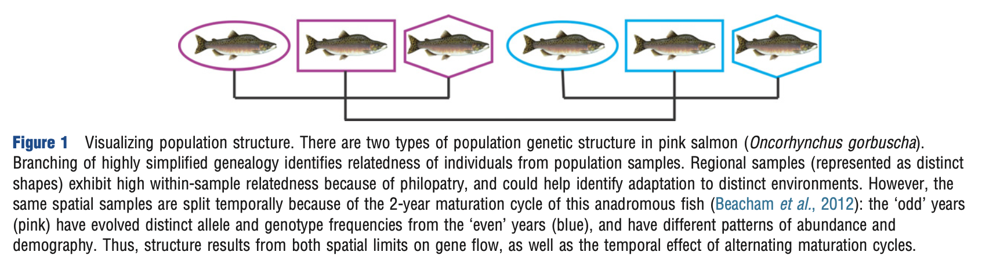
```
**Fig.4-1. Molecular data are used to provide evidence that salmon from different rivers, and from different annual runs (odd years and even years), represent distinct populations of the same species. The phylogeny shown represents the divergence among populations, but populations are defined both by time and location. Figure from Wares (2016). **


Your sample may be a set of *quadrats*, or a belt transect (following a set line through the ecosystem with a set width, e.g. Barry et al. 1994 *Science*), or a catch-per-unit-effort approach; it may involve a haphazard collection of tissues from barnacles on a dock and the molecular diversity they harbor. It may be 10cc of soil, or the gut lining of a bird of interest. In each case, we can think about how to categorize this sample of diversity: how many different categories of things, and what is their relative abundance?

### 4.1.1 How many things and their relative abundances when there is not a model

What do I mean by 'model'? Remember a *model* is just a way in which we can make predictions about some parameter of a natural system; for example, how many species of cladocerans should you be able to find in a particular wetland in the Savannah River Site? Marcus Zokan, while at the Odum School of Ecology getting his PhD, individually identified over 480,000 cladocerans, copepods, and arthropod zooplankton in many of the wetlands in this site to see how periodicity, tree cover, pollution history, and other factors influenced levels and patterns of diversity in this hyperdiverse region (there are dozens of species found in any single wetland!). However, the context dependency of this kind of work makes it difficult to know how to predict the diversity of a distinct taxon, in a distinct ecosystem. 

Nevertheless, we need ways to compare such systems - and many of these metrics will apply in some way even when we have equilibrium models to work with. For example, any given quantity of a particular species in a community can be used to indicate its *relative abundance* or proportion in that community, with all such proportions of *counted* species adding up to 1 (see Fig. 2-5 for an example of microbial diversity, identified using 16S molecular barcoding). So, observed frequencies must add to 1, but we recognize that we may have missed counting some species as well (e.g. Chao estimators that rely on the frequency of 'singleton' observations to predict how many species were present but not observed; Maurer & McGill). Once we have these relative abundances, we can ask how evenly distributed they are. 'Evenness' refers to how similar their abundances are.

Simpson's (1949) *D*= $\sum_{i} p_{i}^{2}$ is a measure of species diversity that describes the 'dominance' of certain species by measuring the likelihood that two random individuals from a sample belong to the same species. More commonly used would be the index of diversity estimated as 1-*D* which is instead the probability that two random individuals are distinct from one another; thus the greater the number 1-*D*, the more diversity and evenness there is.


```{r, out.width='50%', fig.align='center', fig.cap='...',echo=FALSE}
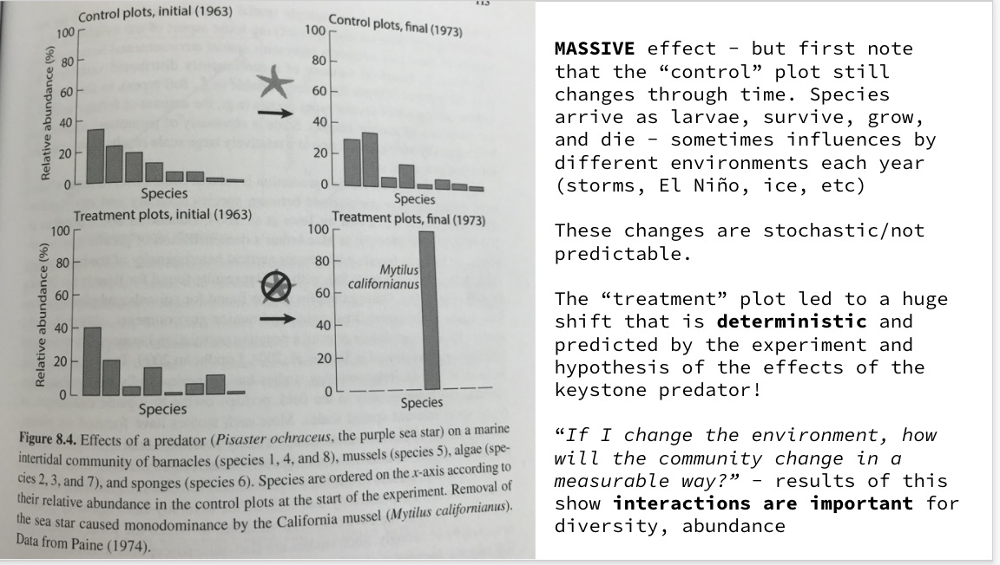

```
**Fig.4-1.5. Part of my BIOL 1104 teaching, figure from Vellend (2016). When we talk about dominance patterns in a community, a great example is the dominance of blue mussels (Mytilus) following predator removal in this Pacific Northwest rocky intertidal ecosystem. The number of species present (rather, being counted) has not changed but the evenness is much lower, which leads to a lower "inverse Simpson" value.**


I emphasize this here because as we move forward you will see this latter quantity 1-*D* represented again as the amount of genomic heterozygosity observed or expected in a system. Certainly the evenness (lack of 'dominance') in the system influences our ability to detect diversity and is another major component of variation among observed systems. 

Simpson's *D* is just one measure in a family of statistics known as Hill numbers (and lets not get into how many times *D* is used as a statistic in both ecology and population genomic fields!!), where the exponent of *ln*-summed frequencies increases the emphasis on common diversity over rare diversity in metrics as the exponent increases. We will return to these later as we discuss the 'effective' number of alleles, or fathers, or other elements of an ecological or evolutionary system. Of note, however, is that the definition above for the variance attributable to within-species variability, 1-*D*, is identical to "gene diversity" or heterozygosity as we evaluate genomic markers (Nei 1987).

Additionally, many of the approaches used to look at evenness relative to richness (like Fisher's $\alpha$) will return as we look at the *frequency spectrum for polymorphic sites* in genomic data relative to an underlying model of expected *lack* of evenness; these are also a big part of Hubbell's (2001) neutral theory of biodiversity, which also borrowed from population genetics the compound parameter $\theta$, a variable and interesting character who will make their appearance frequently in this book as we continue into genomic diversity. *See, this paragraph alone merits an hour or many more of discussion but there just isn't the time to get into how cool this association between community ecology and population genetics can be!* The point being, there is a long and rich history in both ecology and genetic studies of evaluating patterns of diversity to better understand the underlying processes - and in many cases, they intentionally (or not) borrowed the mathematics from the other field.

### 4.1.2 With molecular markers, what kind of a model can we include?

We have already noted two basic models for describing the diversity found in a sample: (W) and $\pi$ are *estimators* that rely on distinct sets of assumptions (the "*infinite alleles model*" which assumes that every mutation generates a novel allelic variant underlies **W** and the "*infinite sites model*" assumes every mutation happens at a different part of the gene region, so that there are not multiple events at the same location - the assumption underlying $\pi$) to represent the population mutation rate, $\theta$. In a single randomly mating population, when the diversity represents no fitness advantage or disadvantage, these estimators *should be* equivalent. When they are not, it suggests a deviation from our set of assumptions - we will return to this as a means of testing hypotheses.

Another focus can be considered now that we are more comfortable with diploid genomes and looking at distinct markers - whether those are variable nucleotide positions in a sequence, the aggregation of variation among sequences, or simplified markers that summarize genomic variation as variation in fragment length (microsatellites or restriction-digest based markers) or pattern of electrophoretic migration (allozymes). 

Now, we are dealing with an *equilibrium model*, where we can make predictions about future generations to the extent that our assumptions are not violated. That's the bonus we get with studying heritable data. In the purely ecological case, the diversity at a site is governed by the environment alone and what diversity can either arise or arrive in that location. In the evolutionary instance, the diversity at a site is driven by both environmental variation and the genomic diversity that *has been there* and *can persist there*. And that lets us set up some simple predictions about what the most basic model of persistence of diversity would look like. 

1. The diversity you start with persists into the next time step (generation); you don't gain anything new and nothing changes into a different type of diversity (assumption: **no mutations**). 
2. The diversity you are studying isn't augmented by diversity coming in from somewhere else, which would have similar effects to new mutations (assumption: **no migration**).
3. The diversity you are studying, each example, has no special advantage in the environment other than the fact that the species you sample it from happens to be able to live there (**no selective advantage to the diversity *at the locus or level of diversity being considered****).
4. The choices that organisms make in terms of sexual reproduction are unrelated to the diversity *at the locus or level of diversity being considered*.

#### please note I've just listed the assumptions for Hardy-Weinberg equilibrium :)

Often, you'll see one additional evolutionary assumption, that the population is practically infinite in size. Since that is never true, and genetic drift alone will effectively never lead to deviations from predictions of this model, I'm going to jettison that right here. As noted before and in class, we will actually rely on drift in some cases as a means of estimating effective population sizes.

That's it. You know already that some or most of those assumptions won't be true, and that is why we know that evolution happens. Every single generation in every single organism on the planet, whether they photosynthesize or excrete or absorb - these are the mechanisms of evolution. Mutation, the movement of biodiversity, fitness advantages that are heritable, variation in reproductive success that cannot otherwise be predicted, and non-random mating. That's it. It will always happen. So how do we detect that it is happening?


```{r, out.width='50%', fig.align='center', fig.cap='...',echo=FALSE}
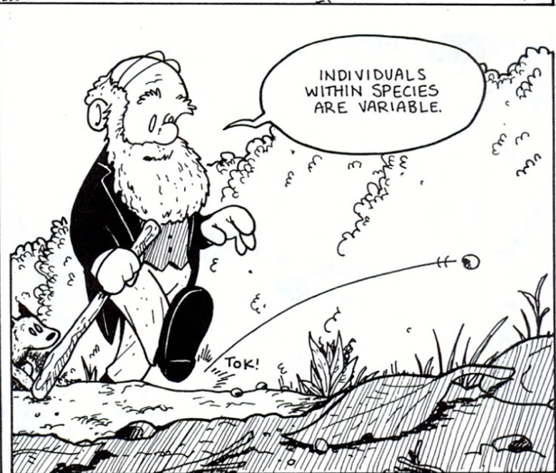
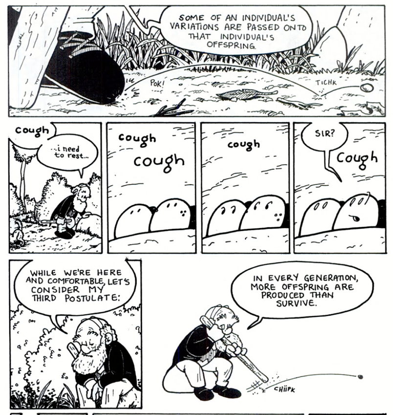
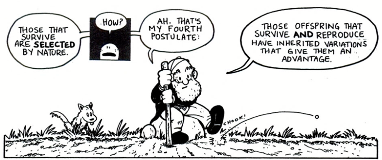
```
**Fig.4-2. Frames from Jay Hosler's *Sandwalk Adventures* about the testable assumptions of natural selection. In later chapters we will talk about how to infer the action of selection from molecular data, but in many cases separate experiments or other types of data are needed to confirm this mechanism.**


Answer: **A null hypothesis**. We simply assume that we have multiple ways that we can evaluate the diversity in a sample, and those *multiple ways should agree* or else one of the underlying assumptions is wrong. To figure out those assumptions, we have to remind each other about how genetic diversity is inherited via DNA and cellular mechanisms associated with persistence and replication of that DNA. For now, lets just focus on two things: how many copies of each homologous gene region, and how are they inherited? 

*how about we now note that it would be weird if a single nucleotide tended to be homozygous within individuals despite segregating in the population - so move FROM THE SEQ DATA TO THE ALLELE DATA*

1. Most gene regions (nuclear genes in sexually reproducing eukaryotes; most autosomal regions; in general single copy loci fit this ideal the best) are diploid; an individual inherits one copy of the region from mom, one from dad.

2. Some are haploid, meaning there is only one copy inherited; this is often but not always true with animal mitochondria inherited maternally, similarly with chloroplasts in photosynthesizing organisms. Some 'nuclear' exceptions include the heterogametic chromosome in organisms with clear chromosomal sexual dimorphism, but not all organisms (or even most) have genomically determined sex - many are environmentally determined or heavily modified by the environment. All we really care about here is copy number and who it descends from!

Knowing this, we can start from the point of knowing that there is variation in almost any natural population. For every individual genomic fragment, the amount of variation that gets *introduced* to that locus is the copy number of chromosomes that can be involved in reproduction times twice the mutation rate $\mu$. Constraints on the function of a genomic region may quickly eliminate some new mutations (or quickly allow them to evolve to higher frequency), but this gives us an estimator $\theta$ that reflects these inputs as sequence diversity, as we saw in the previous chapter.

<style>
div.rose { background-color:#ffc4ef; border-radius: 10px; padding: 40px;}
</style>
<div class = "rose">

*Dr. Wares, what you just said is super confusing. Explain it better.*

OK, what it means is that for most of the genome, which is diploid/autosomal, then $\theta$=4*N*$\mu$, because there are two copies of each gene potentially contributing mutational diversity, and the expectation for divergence between those copies is twice the mutation rate for the same reason as estimating $\mu$ from time of divergence and the genetic distance between them.

If you are looking at a haploid, maternally-inherited marker (generally, mitochondrial data), then $\theta$=2*N*$\mu$ **except** now *N* is only the (effective) population size of females in the population, so it tends to work out to $\theta$=2*N(f)*$\mu$ or for a species with equal sex ratio =*N*$\mu$. This becomes more important when we are trying later to back-calculate what *N* is given our estimates of diversity and mutation rate.

That may not help, but it will make more sense as we see more examples. Oh, or:

## just remember that the effective population size of a mitochondrial gene is 1/4 that of a diploid nuclear (autosomal) gene 

</div>


So, each of these distinct sequences (distinct in actual sequence, or size, or electrophoresis pattern, right?) that gets sampled is an *allele* with frequency $\ p_{i}$, with all frequencies summing to 1. At diploid, biparentally-inherited gene regions, we thus have a simple expectation for how these alleles are recombined through random sexual reproduction to generate *genotypes*. We expect a proportion of individuals $\sum_{i} p_{i}^{2}$ to be homozygous, meaning both alleles have the same identity, and 1-($\sum_{i} p_{i}^{2}$) to be the proportion of individuals that carry two distinguishable alleles. We can directly observe allele frequencies by collecting genomic data, and these frequencies lead to a prediction of how they will be observed in genotypes. That's it. That's the model. It will hold as long as our 5 assumptions are true.

```{r, out.width='90%', fig.align='center', fig.cap='...',echo=FALSE}
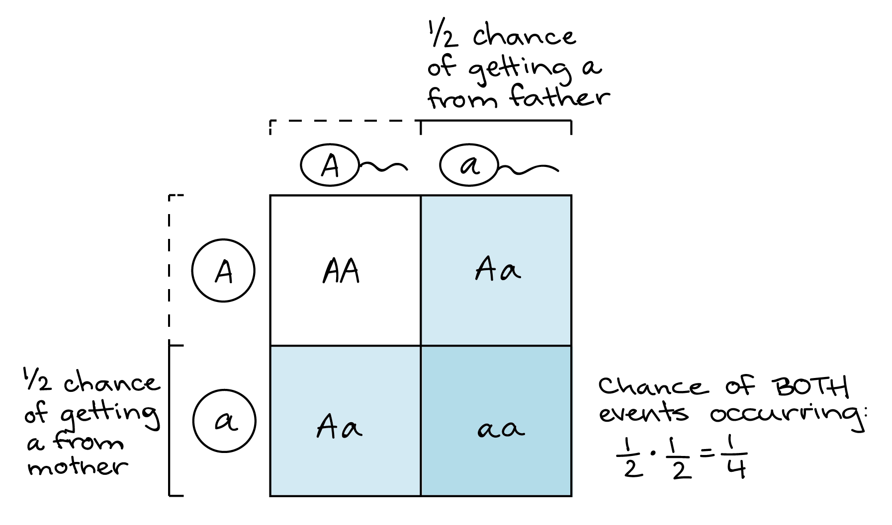
```
**Fig.4-3. The standard 'Punnett square' illustrates how the random generation of haploid gametes by both mother and father should give equal probability of including either of the two alleles from these parents. This is an example where there are only 2 distinct alleles in the population among the 4 parental contribution possibilities. For more information on this visualization, https://www.khanacademy.org/science/high-school-biology/hs-classical-genetics/hs-introduction-to-heredity/a/probabilities-in-genetics**

For example, no population is infinite in size, but our sample from a population is also quite finite (and much smaller than the total population size), so our sampling error is accounted for in statistical tests of whether the *observed* and *expected* heterozygosity (or the frequencies of any particular genotype) are the same. However, non-random mating, selection, and migration (or isolation) will influence this diversity in ways that our tests can indicate, and then we have to figure out why this basic model -- often called Hardy-Weinberg equilibrium for the co-describers of this relationship -- has been violated.

*This is why knowing (W) and $\pi$ come as distinct measurements of $\theta$ that also rely on that mutational diversity being not selection, not migration, random mating - because this also gives us a chance to look at those types of data to see when one of those have been violated (tests of selection, variation in Ne, multiple populations).*

*Though we aren't talking about allele frequencies in the same way as we were previously in assessing Hardy-Weinberg dynamics, it is the same in that we have an underlying model for how mutational diversity should be distributed in a population if we assume a single, randomly mating population with no immigrants from other populations, no selection acting on the diversity, and the mutations happened before we sampled the diversity. Do those sound like familiar constraints?*

There are all sorts of direct parallels between understanding the diversity of an ecosystem and the genomic diversity of the same system, beyond the similar mathematics (Vellend 2006, *Ecology*). Vellend (2016) has actually collapsed all community models of species abundance distributions and types of interactions in the language of evolutionary genetics, with plenty of interesting precedent studies. Randall Hughes (2004, PNAS) showed that the genotypic diversity of experimental *Zostera* patches positively predicted patch resilience to grazing, likely because of complementary ecosystem effects among genotypic clones. **So, our ability to think simultaneously as an ecologist and a population geneticist will serve us well in this field.**

## 4.2 Diversity compared across samples. 

### Finally. I know, it has been a lot of time talking about only one sample of diversity.

When there are multiple samples, we often want to know if they are statistically distinguishable. Do they have the same types of diversity, in the same relative abundance? If so, then it is likely that the environment does not vary between the two, and that movement and reproduction between individuals from the multiple regions prevents random changes in diversity from leading to different frequencies - whether we are talking about species (Hubbell 2001) or genomic data.

Some very basic methods to evaluate compositional differences among sites are reviewed in Anne Magurran's book ("Measuring Biological Diversity", ISBN 9780632056330) and include the Bray-Curtis (1957) measure of compositional similarity, scaling from 0 when samples have no diversity in common to 100 (or 1.0) when identical in composition. You'll see in Figure 4-4 an example of this, and note that the similarities are portrayed using a tree clustering algorithm *that is actually showing you how DIFFERENT the samples are*. There are many other community composition metrics with strengths for particular types of data and studies, again more on those can be found in Magurran (2003). 

```{r, out.width='90%', fig.align='center', fig.cap='...',echo=FALSE}
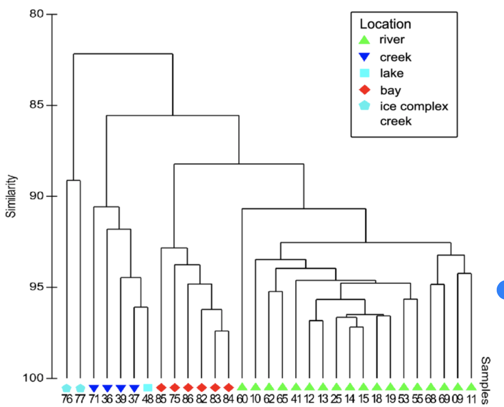
```
**Fig.4-4. An example of isotopic similarity in waters sampled from diverse glacial regions, illustrated with a Bray-Curtis distance plot. from Dubinenkov, Ivan & Flerus, R. & Schmitt-Kopplin, Ph & Kattner, G. & Koch, Boris. (2014). Origin-specific molecular signatures of dissolved organic matter in the Lena Delta. Biogeochemistry. 123. 1-14. 10.1007/s10533-014-0049-0.*

The fact that these compositional differences can be shown using a *distance tree* indicates one way in which we can evaluate the compositional similarity of distinct samples when we have molecular data as well. Phylogenetic diversity can be calculated simply when you have aligned sequence data and can estimate the genetic distances between sequences, as in Chapter 2. Again, these genetic distances involve different ways of estimating the number of mutations between individual samples, and so depending on the type of data the models (finite sites models, and so on) can reflect complex problems of mutations happening in the same site, or being biased towards certain types of mutations. For now however we can simply think of the metrics we used in Chapter 3, the proportion of *dis*similar nucleotides among our sequences. These dissimilarities can be used to generate gene trees or phylogenies summarizing the diversity within and across samples, and this represents the *phylogenetic diversity* of our samples.


```{r, out.width='90%', fig.align='center', fig.cap='...',echo=FALSE}
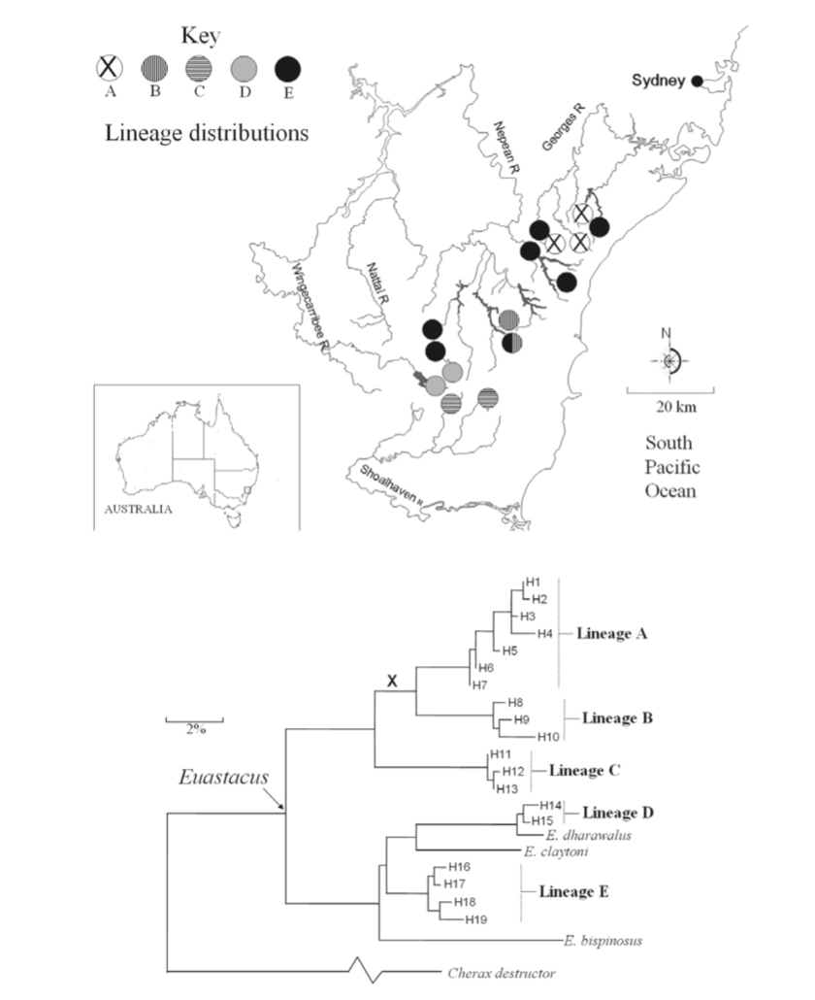
```
**Fig.4-5. From Faith and Baker (2006) Evolutionary Bioinformatics Online. The phylogenetic relationship of crayfish found in different rivers of New South Wales, Australia. The phylogenetic pattern from Baker et al derived using the gene sequence, cytochrome c oxidase I gene (COI). Lineage A is a phylogenetic “sister” to lineage B. Given expected loss of biodiversity at localities containing lineage B, PD analysis assigns the localities containing lineage A higher priority, because the overall PD losses if both lineages were to be lost now would be high in reflecting also the loss of a shared, deeper, branch (marked X).**


One simple example of why phylogenetic diversity may matter for making conservation or management decisions is shown in Fig 4-5. Knowing that locations carry distinct diversity is robust and visually determined in this example, but often it will be more complicated to tell the diversity apart from different sites, as with the microbial 16S diversity shown in **Figure 2.5**. However, the *branch lengths* in a phylogeny (the proportion of mutations inferred to be on a single branch of the gene tree) can be used to tell us about how much shared diversity there is between two or more samples. The metric 'phylogenetic diversity' or PD is actually measured by summing the branch lengths of a sample. If distinct samples have very distinct diversity - as in the Bray-Curtis plot above - then the PD of the combined "total" samples is much higher than the PD of each individual sample. This is statistically tested using permutation.

As with many of the metrics used in molecular ecology, there are not standard parametric statistical tests that allow us to evaluate the variation in diversity among sites. So permutational tests randomize the relationship of observed data with the identity of the samples, for example randomizing the order of labels at the tips of the tree. In this way, the PD of each individual sample relative to the combined samples can be assessed again, and in a "random" or "null" hypothesis we would expect there to not be very much difference between the samples. In this way we can ask if the PD of two samples is significantly different from one another. 

Because there are often many sequences that are identical or binned together under a single identity in large sequence samples such as microbial ecology data, the PD will be different if we consider only the presence/absence of a particular sequence in a sample, or if we consider the relative abundance. These two ways of looking at phylogenetic diversity are calculated under what are called "Unifrac" distances between samples, either unweighted (only presence/absence) or weighted (considers relative abundance). [ https://en.wikipedia.org/wiki/UniFrac ]

## 4.2.1 reciprocal monophyly and "unifrac"

When we discussed the 'what-is-a-species' problem in the last chapter we were dealing with *reciprocal monophyly*. Simply put, this is when the phylogenetic inference of data from two populations indicates that each has a *most recent common ancestor* that is distinct from the *most recent common ancestor* of the other. So, if we have a set of data from two species and there is no cross-over of species identity and there are two clear groupings, that means that at least one nucleotide position is a diagnostic trait for one species versus the other - often more, and we typically require more than one to define species of course.

When we are dealing with phylogenetic diversity but there are many species involved, we may want to know about community composition and how it varies from one ecosystem or treatment to another. In this case, similar logic is used; how much of each grouping shares the same branch lengths versus *unique fractions* of the branches in that phylogenetic inference? The "uni-frac" methods https://en.wikipedia.org/wiki/UniFrac were thus derived to generate a quantitative estimate of how distinct two sampled communities are -- and again, derive simply from these methods of genomic *distance* and our ability to measure those distances through sequence data.

(for a more comprehensive exploration of microbial ecology or any form of metabarcode approach to explore communities using Unifrac measures, here is another great tutorial that we may choose to work through to gain experience: https://mibwurrepo.github.io/Microbial-bioinformatics-introductory-course-Material-2018/beta-diversity-metrics.html)

I'll also note here that these methods differ if you use an approach that is guided by a reference library of available sequence data for that taxon (e.g. 16S for bacteria, or 28S for dinoflagellates, etc.) than if your study focuses on "allele specific variants" (ASVs) which allows for the fact that many such studies are capturing diversity that has never been sequenced before; ASV methods do not bin sequences based on their proximal distance to a known type, but retain all variation - recognizing that we don't know how *functionally, ecologically, or taxonomically* distinct alleles may represent.

So, based on the sequence data alone - representing distinct samples in time and space - we can evaluate how distinct those samples are using genomic distances as in Chapter 2. Now that we have evaluated the complexity of genomes and how genomic diversity is recombined into each new individual (Chapter 3), we can also think about how that diversity is contained within individuals as well as within and among samples. 

### A 1st Primer on Fst

Almost all measures of differentiation of populations in a hierarchical framework are based on asking about the difference between overall diversity and mean diversity at a lower hierarchical scale (*individuals* are in a *sample* or *site*, there may be multiple *samples* in a *region* that may be defined by environment or governance or whatever, and all samples together are the *total* diversity observed), normalized by the overall diversity to produce a metric ranging (typically) from 0 to 1 (Wares 2016). Commonly (but often inaccurately) referred to as 'F-statistics' and derived from Wright's inbreeding coefficient *F* (1-($H_o$/$H_e$), 

<style>
div.rose { background-color:#ffc4ef; border-radius: 10px; padding: 40px;}
</style>
<div class = "rose">
1. what is $H_o$? This is the observed heterozygosity of the sample. For now, its OK to just think in the A / a world, what frequency are individuals heterozygous?

2. What is $H_e$? 

Well, what did you *expect*? Based on the standard assumptions of Hardy-Weinberg, we may expect higher or lower heterozygosity than we see **based on the allele frequencies** and their combinations into genotypes (remember for allele frequency *p* we expect a homozygous genotype for that allele at frequency $$p^2$$); either can trigger interesting hypotheses.
</div>
</br>

*itself* is a contrast between observed and expected heterozygosity. The variations in how this is calculated, and how it is referred to, depend on the type of genomic data and the underlying model of how we assess the relationships among alleles, partly summarized here: https://www.molecularecologist.com/2011/03/should-i-use-fst-gst-or-d-2/ and partly in the Wares (2016) reference that you'll read right about now.

The basic idea of these F-statistics is that the diversity is described in hierarchical levels: again, individuals in a sampled location, samples in a region, regions in the overall (total) distribution, for example. And, in one way or another they are asking about the proportional amount of genetic variation in a lower level of the hierarchy relative to a higher level. For example, if allele frequencies are exactly the same in two locations, then the amount and type of diversity in both locations are the same, and the diversity can all be found in the site/sample level as much as in the overall (total) sample. 

We will get more involved with these statistics soon and the appropriate usage, for now you should try seeing how distinct allele frequencies (at a single, bi-allelic marker) in two locations lead to different $F_{ST}$ for the samples (here, F is appropriate for evaluating a single, bi-allelic marker; 'S' is for sample, and 'T' is for the total diversity; the metric $F_{ST}$ therefore tells us about the extent to which the diversity in each sample is only a subset of the total diversity, or *relatively more inbred*).

```{r firstlookfst} 


shinyAppFile("shiny_popgen-master/FST/fst_app.R",options=list(width="130%",height=500))

```


<style>
div.blue { background-color:#e6f0ff; border-radius: 10px; padding: 40px;}
</style>
<div class = "blue">
**Take a quick note that if you repeat this simulation 10 times, for example, which would be the "truth" based on sampling *n* individuals across 10 loci that *actually* carry those distinct allele frequencies, you will see a lot of variance in results especially when *n* is small. Which value: $H_S$, $H_T$, or $F_{ST}$, is most stable, and how does it change as the allele frequencies vary? Which value tends to be most stochastic? If you were writing a research proposal, what sample of individuals would be best given the cost of collecting specimens and obtaining genomic markers?**

We are also going to get some hands-on experience with this class of divergence metric using this exercise developed by brilliant colleague Dr. Katie Lotterhos: https://docs.google.com/document/d/1u0tSy5OgepJoFeZ_cHUEemCfQC79dAMIOZsJExDYGEo/edit#heading=h.clt2mf5prpxl 

</div>

In this example, Fst is calculated directly using the ratio of $H_S$ (the observed heterozygosity in each sample, averaged) to $H_T$ (the observed heterozygosity in all samples combined). Other metrics for $"X"_{ST}$ as noted above depend on the marker used and the model used to summarize that mutational diversity, but to briefly think again about coalescent theory, it effectively comes back to the mean coalescent diversity $\theta$ within each sample relative to the overall $\theta$, which if you squinch your eyes closed and think really hard, you will see is highly related to the phylogenetic diversity we talkeed about earlier in this chapter. It's all related, and all basically boils down to what proportion of genomic variation is partitioned within and among different samples and groups of samples!

A fairly important element of these metrics, as mentioned previously, is that none of them are based on a standard distribution in probability theory; they rely on contingencies of how long a species or allele has been in a population which can influence its frequency, as well as the stochastic effects of generational variance in reproductive success and other evolutionary effects. As well as the variation caused by sampling - repeat that simulation in the last panel a few times without changing the actual frequencies of alleles, and see what happens with small samples and the consistency of estimates on Fst! 

So while there are many attempts to standardize these diversity metrics as something to compare across distinct studies (e.g. Jost 2008), our ultimate question relies on how the diversity compared across locations deviates from a null distribution generated by permutation; as such, almost all tests are nonparametric and consideration must be given to the distinction between statistical effect (e.g. p-values) and the biological effect of different diversity. Readers are strongly urged to read e.g. https://franklin.uga.edu/news/stories/2019/statistical-significance-reaches-its-limits, and Gerrodette (2011), to clarify the distinction between these effect sizes and how to evaluate the true significance of patterns that we see in nature.

**Example**

One distinct type of "F-statistic" involves utilizing the sequence diversity itself and the number of differences between sequences. These DNA sequences *may* be analyzed as alleles with their own distinct frequencies, but a problem with that approach is that sequence diversity can be very high in large datasets, and so many haplotypes or alleles will have very low frequencies - and thus sampling error is a problem. In addition, doing so throws away the information we have about how those sequenced alleles are related to one another via mutational history. So, it is common to analyze them using these sequence differences as a component of variation within and among samples.

This is at some level not dissimilar from "PD" approaches, but it uses the same hierarchical framework of thinking about spatial *samples* from different *regions* among the *total* diversity in the study that we see in F-st type approaches. Going back to Figure 2.5 that shows the statistically robust sequence variation in the barnacle *Chthamalus fragilis* and the distinct spatial distribution of these mitochondrial sequence groups, Govindarajan et al (2015, doi 10.7717/peerj.926) calculated $\phi$ST among samples on the coast (they mistakenly labeled Table 2 as "population pairwise Fst values", these are NOT Fst -- but the correlation among these different measures is quite high and for ease of communicating you will often see people call the different measures "Fst" when another measure was used). As expected from the strong spatial variation in the relative abundance of distinct mitochondrial types, there are relatively high (0.15-0.50) values of $\phi$ST between samples from New England and samples from the southeastern US. The framework for these statistics is called "Analysis of Molecular Variance" (Excoffier et al 1992) and provides the percentage of variation attributed to "within populations" (86.4%) and "among populations" (13.6%) which gives us another sense of how much the regional samples vary.

## 4.3 Sampling diversity

Back when Dr. Wares was barely out of graduate school, he overheard a debate among more senior colleagues about how to sample for the patterns and analyses we have been learning about. Imagine you can only afford to sample 100 individuals, in terms of the cost of obtaining marker data of whatever type. Lets imagine a simple 1-dimensional array where the organism is distributed, like a coastal marine organism. Would you be better off sampling 2 locations with 50 individuals? 5 locations with 20 individuals? 10 with 10? 20 with 5? 100 with ONE individual??

Naturally, it depends on the question you are addressing. 

1. for coalescent stuff, there are diminishing returns with sample sizes above 10-20 individuals to represent a *population*. Wakeley. There are also diminishing returns on sequence data to sample more than about 10-20 loci (Hickerson). Expand on this.

2. if you think about methods that rely on the variation in allele frequencies, of course your estimate of frequency improves with a higher sample size. For a long time, a rule of thumb was to sample 20-30 individuals from a site because the estimated frequency could then be resolved to the nearest 1/*n*; a small sample would mean imprecise frequency estimates. However, in recent years with methods that enable genotyping at very large numbers of loci, it has been considered that having so many loci enables a certain precision in estimating divergence metrics even if each individual locus has lower precision with a smaller sample size. 

3. of course, the question may require a sufficient number of *locations* or *samples* to understand how diversity is hierarchically or continuously distributed. Clearly sampling 2 locations only lets you ask if those 2 locations are distinct, with little understanding of how that genomic diversity is distributed elsewhere across the spatial distribution of an organism. In recent years there has been work done on asking *how few individuals* from a single site are useful for balancing an interpretation of variation from sample to sample with an interpretation of variation across a complex landscape.

At some point we will likely read Prunier et al 2013 "Optimizing the trade-off between spatial and genetic sampling efforts in patchy populations: towards a better assessment of functional connectivity using an individual-based sampling scheme" ***Molecular Ecology doi: 10.1111/mec.12499*** what do you think - can we think of why there are advantages to lean towards one type of sampling or another for a particular project?


## Box C.2 Additional work with R

***Experiential*** lets take a look at POPPR tutorial PartII.1-5, through "genotypic evenness, richness, and diversity" and the information on particular loci and types of data will be explored in this next chapter. Use the practice data they provide so that you have the ability to run such data, as we start discussing what they mean for our ability to infer demography, movement, and evolution in natural populations. **Totally voluntary for 2020 students!**

## 4.4 Summary

Now we have the basic building blocks for analysis of genomic data in molecular ecology: how much diversity is there in a sample, and how distinct is one sample from another? A key element of how to use these metrics, however, lies in the questions we ask about movement, mating, and variation in fitness - the realities of biology that will affect the fit of genomic data to our 'null' expectations. In this chapter we will talk about the scale at which individuals move among sampling locations, and how that leads to distinctions that can be quantified as "populations" that have some demographic and evolutionary independence from one another - and perhaps distinct interactions with the environment or with other organisms in their ecosystems.


# 5 We call them populations as a way to simplify 'where things are' {#Ch5}

## 5.1 Population models and movement basics

The figure below (5.1) shows some very basic schemes for how individuals might be thought to move from location to location in a regional study. Very few natural systems will fit these schemes well, but they can be a starting point for thinking about overall movement of organisms, their offspring, or their propagules between generations. They capture these basics of movement in several ways. First, a "mainland-island" model was developed in the field of biogeography (Macarthur & Wilson) to consider the probabilities of diversity from a large mainland ecosystem moving to or invading a smaller offshore habitat, with probabilities of movement being dependent on distance from the mainland, size of the island, and so on. This model is useful for considering source-sink dynamics in population genetics (Robinson et al 2013 *Molecular Ecology*). An "island" model assumes all the habitats are of similar size with similar or equal probabilities of individuals moving among each site, while "stepping-stone" models assume migration only happens between neighboring sites. So, early studies assuming the "island" model might only report a single $F_ST$ value for the entire collection of samples; clearly we learned that this rarely matches the understanding we get when each pair of samples is evaluated for their pattern of isolation.


```{r, out.width='90%', fig.align='center', fig.cap='...',echo=FALSE}
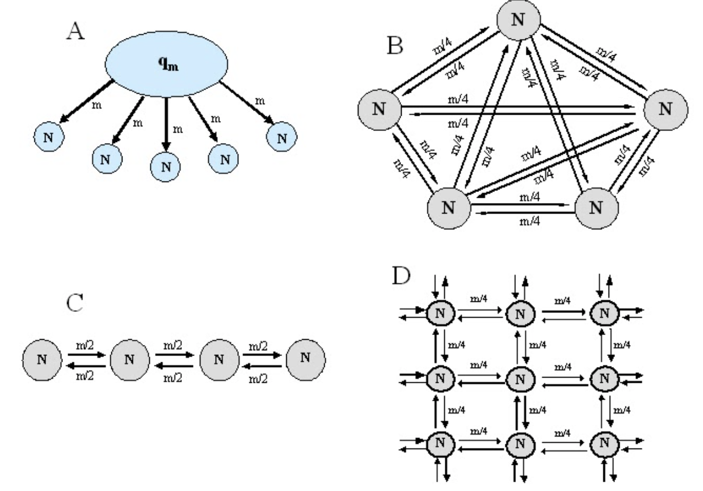
```
**Fig.5-1. Basic - and mostly oversimplified - models of movement among 'demes' or presumed demographically distinct samples. A) Mainland-island model, also related to source-sink diversity questions. B) Infinite island, allowing for equal probabilities of migration to any site in the region. C and D) stepping-stone models, allowing for a particular rate of migration to the nearest location on the grid. Figure from apsnet.org/edcenter/disimpactmngmnt/topc/PopGenetics/Pages/GeneGenotypeFlow.aspx**
 
Each of these cases are simplified versions of 'real' dispersal of offspring or juveniles because it is rarely biologically plausible that offspring are prevented from moving more than one 'step' in a habitat matrix, however it may become less probable the further they go. This is called a 'dispersal kernel' and reflects the probability that offspring land and mature ("recruit") very close to their parent (perhaps gravity-dispersed seeds), or further away with typically diminishing probability with distance. Often these distributions are *leptokurtic* meaning most of the probability is closer to 0 dispersal distance than you would expect from a *normal* distribution, however there is a non-zero probability of dispersal to great distances. For example, dandelions have a wind-dispersed seed that is thought to have high dispersal potential; however roughly 99% of all seeds land within 10m of their parental flower. The remaining 1% convince many, many people to spray their lawns with herbicides for fear of little flowers emerging.

In a way, this reflects one of the concerns that can happen with analysis of microsatellite data using a stepwise-mutation model (SMM), which might assume that the number of short sequence repeats increases or decreases by a single repeat to reflect the mutation process distinguishing alleles. Yet, polymerase error also has a probability of skipping (or adding) two repeats, or three or more, in a single mutational event. Thus more complex models allow for this probabilistic distribution of changes as well, but makes interpretation of temporal separation between allele sequences more challenging. In the limit of not knowing how mutations arise in such markers, the IAM may be a more robust way to analyse microsatellites.

We may also find that dispersal is not equally likely in all directions in a habitat matrix. In the next chapter we will talk about this in terms of landscapes and variation in dispersal potential, but a simpler way to think about is just biased dispersal in one direction. This might be caused by wind moving seeds or pollen (Kling & Ackerly 2021, doi:10.1073/pnas.2017317118); water flow moving fish eggs downstream before they hatch (Aló & Turner 2004, *Hybognathus amarus*), or ocean currents tending to displace the larvae of an oyster 'downstream' along a coast (Fig 5-2).

```{r, out.width='90%', fig.align='center', fig.cap='...',echo=FALSE}
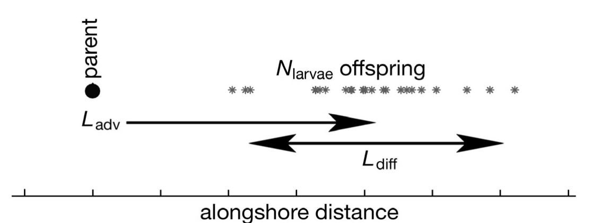
```
**Fig.5-2 from Pringle & Wares 2007, MEPS. One can imagine that offspring disperse in ways that lead to a high variance in where they mature (whether a seed, a larva, a juvenile) and how far that is from their parent. This figure shows what that pattern looks like if there is also a bias in the direction of dispersal caused by wind or downstream flow in rivers or ocean currents.**

Importantly, when there is dispersal from one location to another, this is one of the components of ecology that can change gene or allele frequencies away from our equilibrium or null assumptions discussed in previous chapters. As a very simple example, Hardy-Weinberg expectations for genotypes are based on allele frequencies in the previous generation. If an immigrant arrives from a distinct location, it may change those allele frequencies or even add novel genomic diversity to the sample being analyzed. Broadly speaking, the higher the movement of individuals from site to site, the more similar their allele frequencies and genomic diversity will be (Fig 5-3). This can also be viewed across space and time in a different way (Fig 5-4A) where distinct diversity (by whatever marker type or sequencing) is viewed at different locations across a region, and through time there is low dispersal among sites and drift otherwise maintaining the dominant genomic diversity within that region. In (5-4B) you see an example where asymmetric movement across the ecosystem can quickly homogenize genomic diversity.

```{r, out.width='90%', fig.align='center', fig.cap='...',echo=FALSE}
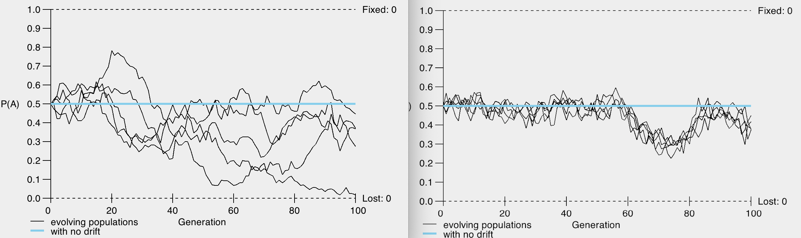
```
**Fig.5-3. On the left, simulation of 5 distinct locations starting at the same allele frequency and each being fully independent, with only drift operating (population size 100). On the right, the same 5 distinct locations with the same population size, but with high dispersal from site to site, homogenizing the allele frequencies among locations.**


```{r, out.width='90%', fig.align='center', fig.cap='...',echo=FALSE}
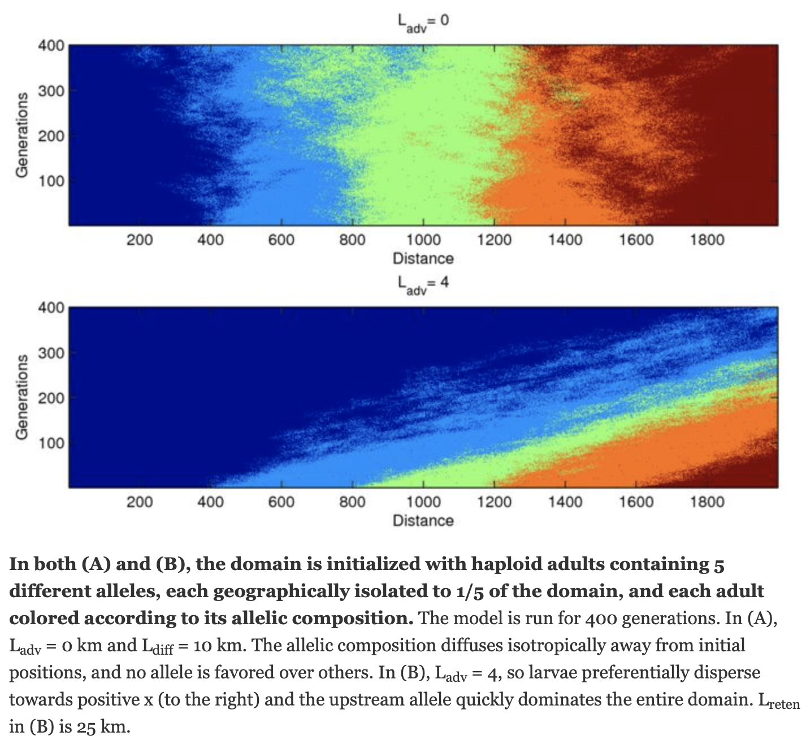
```
**Fig.5-4 from Wares & Pringle 2008. (A) if there is no bias in dispersal, and different diversity is found in different parts of the organismal range, then through time drift and random dispersal from site to site will change the pattern somewhat but movement is relatively slow relative to drift. (B) if there is a bias in dispersal, then many migrants will arrive from upstream habitats and that diversity will begin to dominate a larger portion of the organismal range.**

What this all means gets very complicated with respect to how we estimate and evaluate *effective* population size (Caballero & Wang, Whitlock, others). The relationship of different *demes* (used as an ecological proxy for "population", suggesting that they are demographically independent... but that is a hypothesis we are testing with molecular data!) can lead to much higher genomic diversity in a species if there is low migration among sites (because each site will have different mutational diversity 'fixed' by drift and other mechanisms) than if they are linked by high dispersal among locations, and diversity may be substantially lower than you expect if there is asymmetric or source-sink dispersal among sites, e.g. one subregion provides almost all the persistent diversity for the entire distribution (Fig 5-5).


```{r, out.width='90%', fig.align='center', fig.cap='...',echo=FALSE}
knitr::include_graphics('MEImages/wp08_2c.jpg')
```
**Fig.5-5. from Wares & Pringle 2008. Asymmetric dispersal actually means that new mutational diversity only persists according to neutral drift expectations at the upstream edge of an asymmetric migration scenario; new diversity that originates downstream is lost faster than we would expect because of immigrants arriving from upstream to change the diversity.**

Ultimately our goal in using molecular data to understand *how organisms move* will help us better understand how life history variation has consequences for evolution and adaptation. As noted above, how organisms move affects how genomic diversity is distributed through a species' range, and even how much genomic diversity there is to respond to environmental challenges. Within the context of this set of questions then, we first may want to ask about whether diversity is distributed *continuously* or *hierarchically* across this spatial range.

## 5.2 dispersal as an equilibrium model, limits to dispersal as violations of that model

When Dr. Wares was in graduate school, a brilliant but intimidating faculty mentor once pointed out to him that the genomic diversity captured through sequencing or genotyping at different locations may show that each location is distinct from one another, but we can ask whether or not that difference in diversity is consistent with an *equilibrium* between mutation, drift, and migration capability alone. This is related to the stepping-stone models of movement noted above, and is often called *isolation by distance* or IBD (Wright, 1943). This is for now distinct from a *hierarchical* model where there are distinct 'sets' of populations dependent on their spatial arrangement.

First of all, if movement among sites (I hate to use migration, which technically refers to the cyclic movement of birds and insects and fish etc. seasonally or following resources - we are really talking about dispersal and gene flow here) is very high, then as noted above all of the sites will have similar genomic diversity and allele frequencies, and our measures of differentiation such as $F_{ST}$ will be close to zero - effectively they all operate as a single *population* across that scale.

If, however, movement is not sufficient to homogenize the genomic diversity among sites, then drift leads to different allele frequencies and we know from last chapter that this leads to measurable deviation from Hardy-Weinberg when all sites are considered together; that is, total heterozygosity is much higher than expected given the diversity found at sites within the total sample. Or, in the sense of coalescent theory and our sequence-based models, we have higher $\theta$ when estimated from all sampled diversity than when estimated from diversity at individual sites, *and* the distribution of that mutational diversity will lead to (W) and $\pi$ not being equivalent estimates of $\theta$!

```{r, out.width='90%', fig.align='center', fig.cap='...',echo=FALSE}
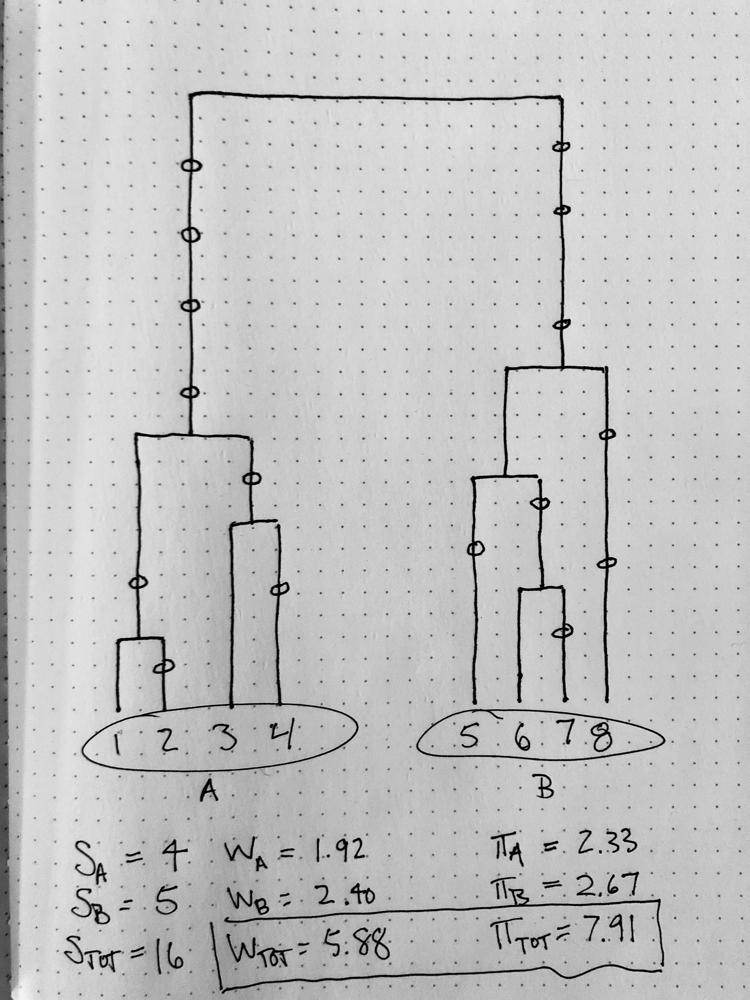
```
**Fig.5-6. what you do when you are working from home... this coalescent gene tree shows the true ("known") genealogical relationship among 8 DNA sequences, and the small ovals represent mutational events on that tree. First of all, recognize that mutational data will not always distinguish all sequences, this is a non-random illustration! Second calculations are given for Watterson's $\theta$ and $\pi$ considering that sequences 1-4 were sampled from location A and sequences 5-8 from location B. As noted in Chapter 3, we expect that (W) and $\pi$ should lead to similar numerical estimates of $\theta$. Within each site, the low sample size means there is high variation expected, so statistically those numbers are perhaps not different, but the deviation overall is much higher when all data are considered together. If the difference ($\pi$ - (W)) >> 1, it may suggest that the diversity comes from demographically independent sites (among other explanations that we will return to in a later chapter).**

So... one way or the other you can calculate an $F_{ST}$ analog (even with the sequence data, where we can calculate as ($\pi$(tot) - $\pi$(average site diversity)/$\pi$(tot), or (7.91-2.5)/7.91 = 0.68) among sample locations. Good job! Now, if there is an *equilibrium* explanation for the diversity overall, meaning that drift towards distinct allele frequencies or distinct diversity is limited by movement among sites, then we expect the influence of movement on genomic diversity to be less for sites that are spatially further apart. Sites that are close to each other would be more homogeneous than sites that are distant, and so there will be a linear relationship between our genomic distance and our spatial distance. 

If this is true, there will be a non-zero positive correlation between pairwise genomic distance measures and pairwise spatial distance (because of non-independence among these many data points, i.e. the distance by railway from Washington DC to San Francisco is not independent of the distance of either of those cities to Chicago, this correlation must be tested permutationally with a Mantel test). The slope of this correlation has been used in some cases to estimate the likely mean dispersal of offspring, e.g. (Kinlan & Gaines).

However, a good fit to a model has to be evaluated carefully. After all, if there is very different diversity on opposite sides of a geographic or environmental boundary, it may appear that nearby sites *in general* have similar diversity and distant sites have dissimilar diversity. An example from the barnacle *Balanus glandula* shows that there are two major mitochondrial lineages, one dominating in the northern part of the range and the other dominating in the southern part of the range (Wares & Skoczen 2019), with a strong transition along the central California coast. If $\phi$st values are calculated among many locations, the overall pattern *looks like* isolation by distance, but if we evaluate an IBD pattern *within* each of those primary lineages, the pattern disappears - showing something more environmentally determined is happening and it is not about dispersal-drift equilibrium (Figure 5-7).

```{r, out.width='90%', fig.align='center', fig.cap='...',echo=FALSE}
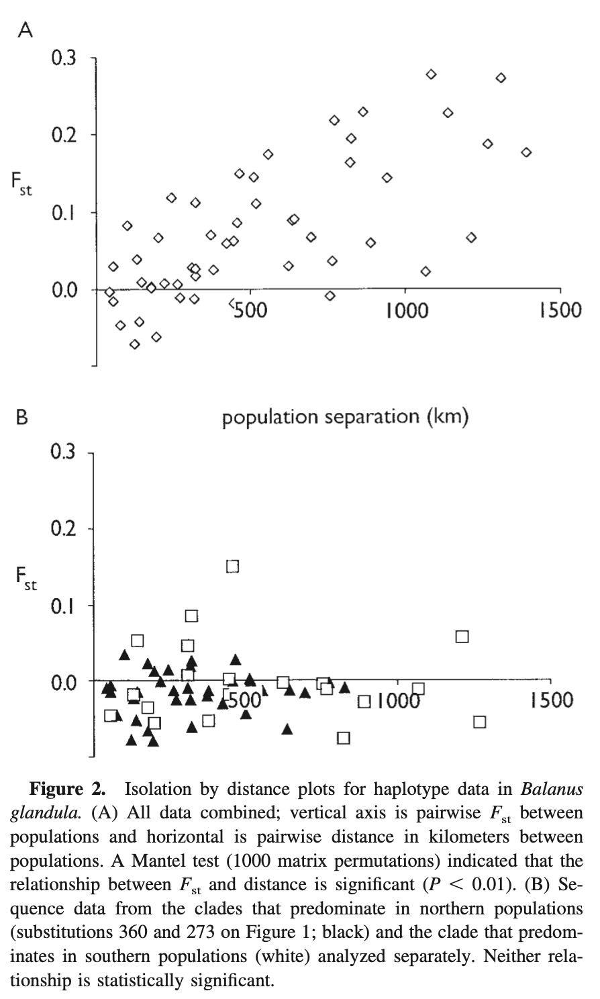
```
**Fig.5-7. First of all, note again how the authors indicate the genetic distance as 'Fst' but it is most certainly $\phi$st, and yes I'm making fun of my own paper. More importantly, the apparent IBD pattern in the top panel should still hold up in the bottom panel IF the overall distribution of genomic diversity is simply an equilibrium between dispersal and drift; because it does not we recognize there is hierarchical structure that appears to be driven by changing marine environment.**

When some element of the external environment imposes some "structure" on the diversity across the range - perhaps a river prevents movement across it, or a mountain range, or an environmental discontinuity of some sort that limits movement or requires different diversity to match the environment (e.g. selection), we consider this *hierarchical* population structure. This literally means that being on one side or the other of that environmental discontinuity allows you to make a prediction about the kind of diversity you find there. Of course, not until you analyze further to diagnose this type of structure!

<style>
div.rose { background-color:#ffc4ef; border-radius: 10px; padding: 40px;}
</style>
<div class = "rose">

A word on sampling...we have indirectly considered the sample size of individuals from a site; you know that more individuals leads to a more accurate estimate of allele frequency and $F_{ST}$-type statistics. We have discussed that each single gene region is like a single quadrat to estimate diversity, and in particular because of genomic recombination there is a strength in inferring the history of individuals from several samples by using multiple loci. So *how many locations should you sample to understand the range of an organism*? It depends on your question of course.

Some questions define their spatial sampling very readily: the plants on serpentine soils *vs.* those on non-serpentine soils (Mo Stanton, Jess Wilcox-Wright, and more); the snapping shrimp on either side of the Isthmus of Panama (Knowlton). But when you are trying to determine something of broader, descriptive value about an organism it is not always clear how to sample. If you sample the eastern and western distributional boundaries, are the northern and southern of equal interest relative to your question? How densely in the middle of the range? How important is it that their habitat is discontinuous, as in rivers or rocky outcrops at the southern end of the Appalachians?

What is important to recognize about the number of sites sampled is that it provides resolution into the nature of hierarchy and dispersal that affect the distribution of genomic diversity and the potential for adaptation. Sampling completely and continuously is not possible and is actually mathematically complicated (Wilkins & Wakeley 2002, but see Prunier et al 2013 doi 10.1111/mec.1499), but recognizing that more spatial samples enable the distinction between equilibrium and hierarchical models in a number of ways means this is another element in determining the cost - in labor and funding - of a project like this.

</div>

When there are enough spatial samples for the statistics to tell us something interesting, we can further consider the spatial hierarchy of our samples. Individuals are sampled at locations (sites, samples, subpopulations, but stick with **s**!) which are within distinct **regions** across the landscape, and all the regional samples together are our **total** sample from an organism. One would think that it would be common to use the subscripts **s**, **r**, and **t** for these levels for $F_{ST}$ type statistics, but for reasons I have not had explained to me - and I've looked, but not hard - the regional level (comprising one or more sampled locations) is often symbolized with a **C**. 

*Collection?*
*Confederacy?*
*Campsite?*
*Concatenation?*

I'm serious. Some programs (e.g. **Arlequin**) will refer to this with the subscript *R*, but in general you will see an $F_{CT}$ statistic reported; when the value $F_{SC}$ is close to zero it means there is little "structure" or inbreeding associated with the samples *within* regions and so those regions do an adequate job of summarizing that there is hierarchical structure; as $F_{SC}$ deviates from zero, it suggests more regions may need to be delimited as there is structure among samples within one or more of the regional collections.

For some organisms, there may be an excess of homozygosity at each locus because of life history strategy like self-fertilization and this is diagnosed in part by a non-zero $F_{IS}$ which refers to inbreeding at the level of the individual relative to the sample. Other hierarchical levels can be defined if sampling is sufficient enough to ask about additional ways in which diversity is partitioned across a system; the key here is that with this approach, your partitions (regions, samples, etc) are in part chosen or defined by the researcher - they are hypotheses to be tested (particularly regional groups of samples).

## 5.3 letting the data tell you how individuals 'belong' to distinct populations

So when we define a spatial model, we are asking about how our genomic data 'fit' that model; if there are two or more regions that have limited movement between them, we expect to see a high value of $F_{CT}$ overall as well as some high values of $F_{ST}$ (for comparisons of sites on either side of those environmental or geographic boundaries) and some low values of $F_{ST}$ (for pairwise comparisons among sites within the same region, for example). These approaches may miss, however, the true pattern of movement and introgression among sites because considerable genomic and genotypic variation may be found within the same spatial or temporal sample.

In recent years, it has been of value to instead ask how individual multi-locus genotypes themselves can be assigned to evolutionarily distinct populations. There are both model-based and non-model based approaches for this. In the first instance, our *model* for a population would be Hardy-Weinberg Equilibrium. We know what to predict about genotype frequencies given the observed allele frequencies; when this doesn't fit our prediction - for example, if there is an excess of homozygous genotypes - one good explanation would be that those genotypes belong to distinct *populations* (here in the evolutionary sense, not the same as the sample location necessarily). 

A simple version of this is called the *Wahlund effect* - imagine two very closely related (so you cannot visually distinguish them, in this example) but not interbreeding snails that have different spatial ranges but a small area of overlap. You know now that because the time they have been diverged from a common ancestor allows allele frequencies to change via drift (as well as other mechanisms), that each snail species would likely have different genotype frequencies when studying the same gene regions. This will tend to lead to higher levels of the homozygous genotypes of high-frequency alleles in each population to appear in the sample location, and thus a $\chi$-square test will reject the Hardy-Weinberg equilibrium and we must ponder why (Fig. 5-8). 

```{r, out.width='90%', fig.align='center', fig.cap='...',echo=FALSE}
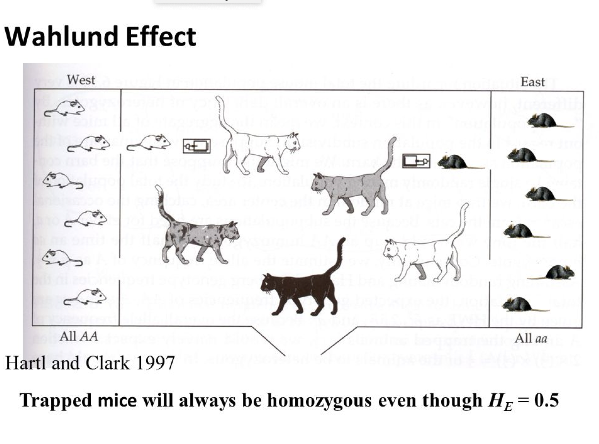
```
**Fig.5-8 from http://courses.washington.edu/gs453/lectures/lec11.pdf. An artificial example of a Wahlund effect - where the mice are captured, they are all either *AA* or *aa* genotypes.**

So we can see that if we just knew which of the two populations to assign each individual into, we would see there are two distinct populations and each of those *does* satisfy our HWE model! This is the logic underlying an approach (and popular software program) called **Structure** (Pritchard et al 2000, *Genetics*) analysis. The biologist studying a sample of genotype data proposes a number of actual evolutionary populations (*K*). The analysis uses a complicated resampling method of the genotypes to attempt to fit each individual multilocus genotype into one of the *K* possible populations. In the snail and mice examples above, *K*=2. Of course, *K*=1 means that your data are a good HWE fit without any additional inferred population structure. A typical analysis using the **Structure** approach would inquire about values of *K* from 1 to the # of sample locations, and would find the optimal value of *K* based on serially improving the fit of the data to HWE in each of the *K* populations; if *K*+1 does not greatly improve that statistical fit, then we can use the *K* with the greatest improvement over *K*-1 as a probable explanation of our data (this is known as the 'Evanno method' from Evanno et al. (200x).)

A great example of this comes from the painted bunting data we already looked at in Chapter 2 (Fig 5-9). The authors collected a large number (1000s) of single-nucleotide polymorphism (SNP) data using reduced-representation genomic sequencing via restriction-assisted digest (RAD) approaches; this means each individual SNP retained (and identified using complex bioinformatics, from many millions of individual DNA sequences recovered) is likely very far from others on the same chromosome, or on different chromosomes, so many of them are unlinked and would be independent bi-allelic assessments of genomic (and genotypic) diversity. Each SNP can be queried for whether it is homozygous or heterozygous within each individual and across all individuals, and the allele frequency calculated - predicting what we *expect* the genotype frequencies to be under HWE. Across many loci, this gives a tremendous amount of information for assessing the deviation from HWE, and how that deviation is reduced by increasing *K* iteratively. 

```{r, out.width='90%', fig.align='center', fig.cap='...',echo=FALSE}

```
**Fig.5-9 figure from Battey et al (2017) with population structure analysis on painted buntings. Here, the best fit to the multilocus SNP data collected by the authors is shown as *K*=3 and ilustrated with the bar plots where each individuals probable assignment to each of the 3 populations is illustrated by distinct colors. This allows for both the uncertainty of assignment because of polymorphisms that are maintained in multiple distinct populations, as well as the potential for recent introgression (successful mating of individuals from distinct populations of origin).**

Of course, some life histories - such as predominant selfing in some plants - mean that we don't expect HWE even in a single evolutionary population! In this case, the *Structure* method will not be an appropriate analysis, and even at best we have to remember that analytical approaches to determining *K* are basically generating a hypothesis, not testing one. Often, a biologist will have their own prior information about distinct populations or regional groupings, and both the intuition of the biologist as well as the outcome of such an analysis must be carefully considered.

A method for assigning genotypes to distinct groupings that does not rely on HWE involves calculating 'principal components' from the data, basically identifying the overall degree to which multilocus genotypes consistently differ from one another. I won't pretend this is mathematically easy (here is a relatively straightforward explanation: https://builtin.com/data-science/step-step-explanation-principal-component-analysis), but the goal is to reduce a high-dimension data set (each locus is its own dimension, eg. the frequency of allele *A* along an axis) to the two or three composite dimensions that explain the most variance among those many data. This is a purely mathematical transformation with no model (like HWE) leading to expectations. There are still decisions to be made about how many groupings of data there are after the principal components analysis, and this is done with what is called 'discriminant analysis' and a popular approach is called DAPC - discriminant analysis of principal components (Jombart et al 2008, Jombart et al 2010). You can see an example of this in the lower left panel of Figure 5-9, and when the two approaches agree - all the better for trusting the outcome!

The details of how *Structure* is run, how to do *DAPC*, [and/or *LEA*, *ConStruct*] and how to feel good about the answers that emerge from these, are beyond our current scope. The Battey et al paper above is an example of how these tools are used very well, and reading the Pritchard (2000) and Jombart et al (2008, 2010) papers are of course an important start in using and interpreting these inference tools. Just remember, they are good at making objective decisions on what the data appear to tell us, but think of this as a hypothesis that needs more thought, more support, and possibly more data.

What is the big picture, the modern view, of all of this? You may have noticed a distinction between isolation-by-distance and hierarchical patterns of genomic diversity, and of course those are not entirely exclusive.Even when using methods like *Structure* or DAPC as above, there are situations in which increasing the number of populations *K* keeps improving the fit of the data to the model -- that starts to suggest *isolation by distance*. And even in situations that suggest *isolation by distance*, you may find that there are hierarchical patterns hidden within, as in Figure 5-7. (That instance in the barnacle *Balanus glandula* appears to be maintained by natural selection as well as larval dispersal; Galindo et al 2010, Wares & Skoczen 2019). So, can we cope with evaluting a more complex model? As with all such cases, a more complex model does require more information to test it, but these are being developed.

In recent years, approaches have combined an understanding that there is both the possibility of evolutionarily divergent lineages (perhaps because of transient allopatry, or adaptation, or other mechanisms) that are *also* distributed across a landscape in a way that is influenced by the drift-dispersal equilibrium. As such, we need to be able to allow for the fact that isolation by distance exists so that we can more clearly recognize the distinct evolutionary lineages within a set of samples, or a species, or whatever the focus may be. New approaches like the program **ConStruct** (Bradburd et al 2018; Fig 5-10) are starting to build this additional realism into our analysis. 

```{r, out.width='90%', fig.align='center', fig.cap='...',echo=FALSE}
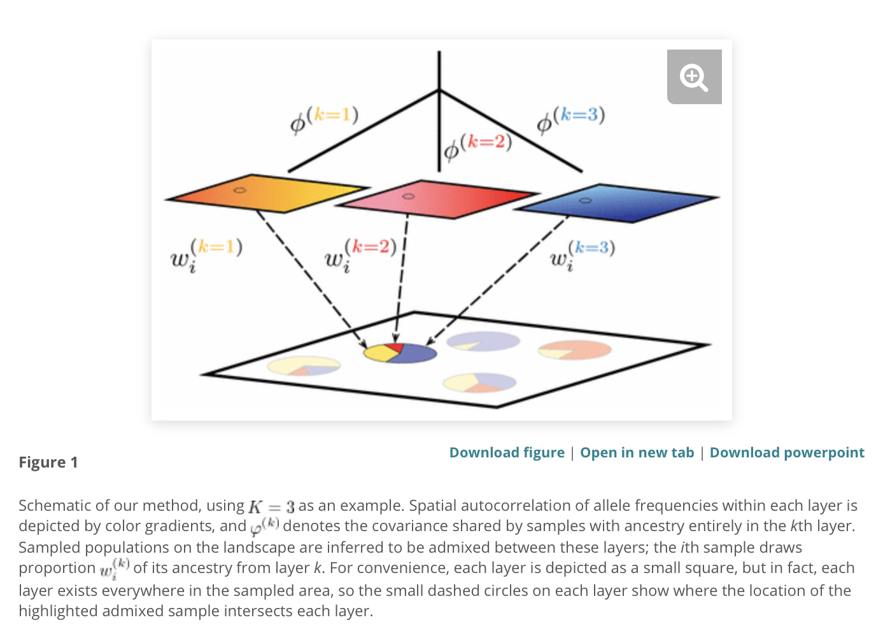
```
**Fig.5-10 figure from Bradburd et al 2018 https://doi.org/10.1534/genetics.118.301333 showing a combined approach to evaluating hierachical genomic structure - caused by a number of evolutionary mechanisms - that still allows for the fact that diversity moves across a landscape at a rate limited by natural history. Here, *K*=3 is shown, and the lineages are distinct but the distributions of allelic and genotypic diversity that those lineages include allow for isolation by distance across samples.**

## Box C.3 Additional work with R

***Experiential*** lets take a look at POPPR tutorial PartII.6-10, through "discriminant analysis of principal components" and the information on particular loci and types of data will be explored in this next chapter. Use the practice data they provide so that you have the ability to run such data, as we start discussing what they mean for our ability to infer demography, movement, and evolution in natural populations. 

## 5.4 Why all this complexity?

We want to understand how genomic diversity is distributed across a landscape because it tells us a lot about how natural history variation - types of dispersal (even polymorphism in dispersal type! Zakas & Wares 2012), mating, competition and conflict, or even disequilibrium patterns caused by responses of populations after glaciation, introduction, or other environmental changes - can be more fully characterized. The better we understand this distribution of diversity because of shifts in available habitat and movement, the better we will be able to understand how different parts of a genome respond to the environment through adaptation (later chapter), and so gain a more complete understanding of why diversity in genomes, in populations, in species, in communities -- is distributed on this planet the way it is (Eo et al 2008).

**before next chapter we will read Bradburd & Ralph 2019 so we can really start thinking about "realistic" reconstruction of historical ecology using molecular markers. THIS IS NECESSARY TO SET UP TRUE LANDSCAPE AND DEME DISCUSSION**

# 6.1 Approaching reality, at least the "neutral" version of it... {#Ch6}

```{r, out.width='90%', fig.align='center', fig.cap='...',echo=FALSE}
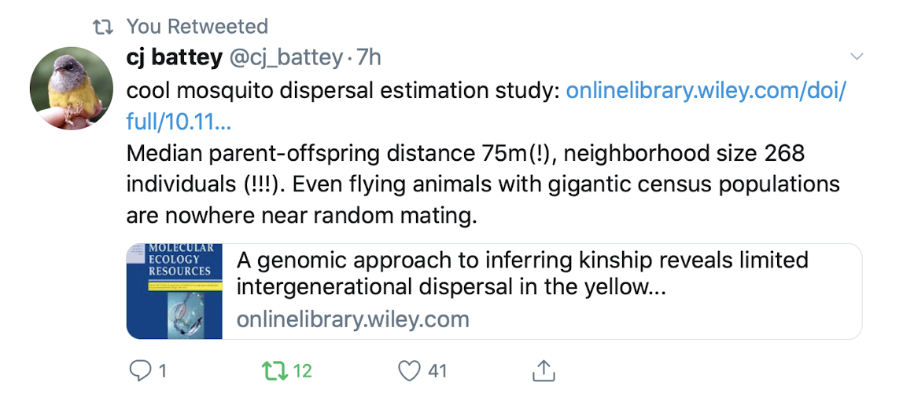
```

One of the most important contributions molecular data have made to ecology is in the interpretation of movement and isolation among populations. Questions about movement and isolation tell us about the potential for metapopulation structure, cryptic diversity, the mechanisms that assist or limit movement for an organism of a given life history, the extent to which movement is symmetric or not, the likelihood of propagule diversity reaching new habitats, and more. 

In the past decade it has become common to discuss this under the term "landscape genetics", though as discussed previously it might be more appropriate to say "landscape genomics" - and of course there are variants for 'seascape', 'riverscape' (Davis et al 2018, doi.org/10.1002/wat2.1269), and more. **How do the structural and directional elements of a studied area influence the movement of diversity?**

As the scale of time gets greater, the same questions tend towards identifying broad divisions on a landscape, and the divergence of populations may become great enough that temporal estimates of divergence can be incorporated - these are the tools of what has been known as 'phylogeography' (Avise 2000), though that field originated in the application of phylogenetic, rather than population genetic, principles to understand hidden patterns of diversity. The approach outlined here, using population genetic approaches, allows a whole range of subtlety and model evaluation that is important for dissecting ecologically relevant movement and isolation.

We might start by revisiting Figure 5-7, illustrating *isolation by distance* in the barnacle *Balanus glandula*. Remember that we are asking, broadly, how organisms disperse across an area. Some organisms can be tagged or tracked, but for many organisms it is more efficient - or only possible - to *infer* patterns of movement from the molecular/mathematical relationships we have worked with so far. A barnacle is a great example for this, because the adults cannot move at all (they cement themselves to the substrate) but their offspring are typically going to spend weeks drifting in the ocean and feeding before they are competent to settle, and so we can ask about how those larvae disperse while recognizing that the ocean itself strongly influences this dispersal. 

**The more data we have, however, the more opportunities there are for some loci to appear to behave as *exceptions.* What does that mean?** 

Organisms are containers for chromosomes, genes, loci. If offspring disperse a certain distance *x* each generation, on average, that has an effect on how readily the diversity at each locus moves through the landscape. So, in the case of *isolation by distance* we can recognize that *x* << the size of the spatial domain, and thus more distant samples of individuals are likely to have distinct allele frequencies - or possibly entirely distinct alleles, period. The example shown in Chapter 5 is based on only a single mitochondrial gene region. We presume that if the genomic diversity we study across spatial samples only varies because of limitations to movement, then if we looked at 10 loci they would all show a similar pattern: geographically distant samples have higher values of $F_{ST}$ than proximal samples, and it is repeated across loci because they are all following the same pattern of genealogical relationships. The same should be true for 100 loci, 1000 loci, and so on - there will be considerable *variance* allowed among these loci because, as we have discussed, each locus has some statistical independence from others because of recombination, *and* there is variance expected even under the standard coalescent model for how long ago sampled diversity has a **most recent common ancestor**.

However, the more loci you sample there is also a growing likelihood that some of that diversity is not selectively neutral. Certainly, some component of the genomes found in an organism are functionally related to the performance of a genotype in a particular environment. There may be variation across a geographic range for thermal tolerance, or spawning or flowering time; some genes are specifically part of the reproductive or metabolic architecture of the organism. 

A basic assumption in working with genomic data, then, is that *all* of the genome is subject to the influences of demography and movement. Only smaller windows of the genome are directly or indirectly affected by natural selection. 

```{r corn, out.width='90%', fig.align='center', fig.cap='...',echo=FALSE}
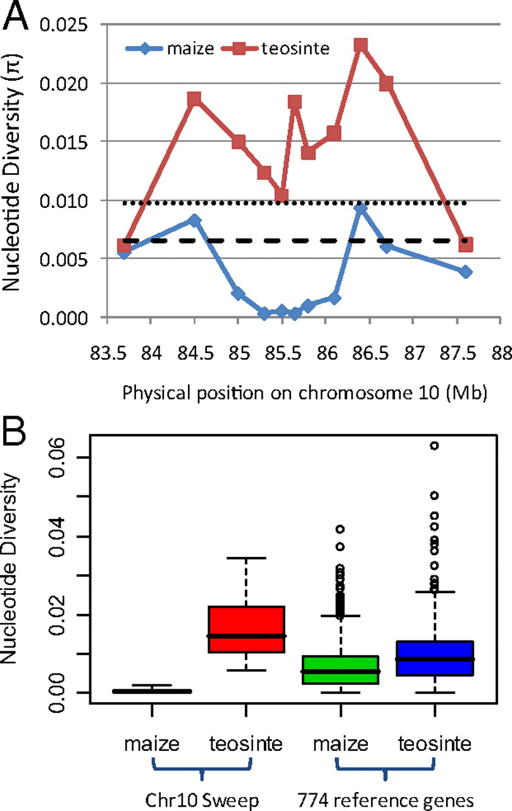
```

So for example in the image above, this is illustrated by looking at the effects of domestication of maize (corn) from its wild progenitor, teosinte (Tian et al 2009 doi.org/10.1073/pnas.090112210). The y-axis is our old friend $\pi$ or nucleotide diversity. Across the portion of chromosome 10, where the genes that control seed 'shattering' in teosinte have been strongly selected for keeping all the kernels together, there is a window of effectively no genomic diversity relative to teosinte or neighboring parts of the chromosome. Selection has made this region very different, and makes this region have a very recent time to most recent common ancestor because of the strong selection imposed upon it.

In other cases, gene regions will exhibit much higher divergence among samples than is typical for the rest of the genome. These 'outlier' loci have to be considered as candidates for evolving under different rules than the "neutral" loci that are primarily affected by demography and movement. Though we will come back to this topic later in Chapter 7, it is important to realize that we have to consider both the inherent statistical variance among loci in generating answers about movement and population size, as well as knowing that a subset of them are simply following different rules! 


Here we will take a step away from this text and explore some data directly, to get a better feel for how the analyses involved in molecular ecology are more often a set of inquiries about how readily different hypotheses can be distinguished. There is no '*push one button and get the answer*' approach because the organisms, their genomic structure and diversity, and the landscapes/seascapes they are found in are unique to every such study.

## Box C.4 Additional work with R

**The document "BalanusPopGen.Rmd" is in the same directory as the textbook markdown file. Your assignment for next class is to work through the first assignment in that file (up through the pink box!).**

A brief discussion on "best practices" and "best principles". Code is being provided in the documents for this class... BY NO MEANS should you assume this to be the best code, it is code that has worked for particular functions, *well enough*. It is easy to mistake an example in a class as the exemplar for the method. The rate that data availability, computation power, code efficiency, and novel analytical and presentation approaches evolve means that I have to remind you now, that the examples I'm providing is not something to follow for your own work, but may help you frame out what you need and what you know is not sufficient.

## 6.2 The first questions

After you have evaluated the data - thinking about the goals of the data as well as expectations under neutrality and random mating - a first question to ask is about how the data fit equilibrium models. In chapter 3 we thought about mutations arising, and genetic drift operating relative to the *effective* population size. In chapter 4 we considered statistics that measure the deviations from what we would expect if all individuals were sampled from a single randomly-mating population. In chapter 5 we thought about the models of movement of individuals across a landscape/seascape/riverscape/etc.

So, a first approach to take with real data is often about exploration of the data in terms of deviating from the simplest model: *panmixia*, or an inability to reject the null hypothesis that *location* provides no additional information about the diversity sampled at that location.

## 6.2.1 GENE FLOW (MOVEMENT) and DRIFT IN EQUILIBRIUM

Now that we are coming back to these topics from our short break, remember that:

* migration is a term better used for seasonal or cyclic movement. *e.g.*, neotropical bird, or whale, migration
* movement is my ***m*** term for dispersal, rather than "migration", we are talking about genes moving, and...
* those genes have to persist through survival or introgression of that diversity for the movement to be picked up as *gene flow*

I'm not sure if I can code this correctly on the fly to appear in the textbook - we will use a more complex drift simulator written by CJ Battey (*https://github.com/cjbattey/driftR*). Though it is a Shiny app, I will provide the code for you to run it by copying the text below into the R Console, and running each line. Actually, if you hit the "play" button at upper right corner of the code chunk below (when viewing this document in RStudio), it will run and work just fine...I will work out how to make this in-line but for now this should be fine :)


```{r driftR, echo=TRUE, eval=FALSE} 

pkgs <- c("plyr","reshape","ggplot2","magrittr","viridis","shiny")
dl_pkgs <- subset(pkgs,!pkgs %in% rownames(installed.packages()))
if(length(dl_pkgs)!=0){
  for(i in dl_pkgs) install.packages(i)
}
library(shiny)
runGitHub(username="cjbattey",repo="driftR")

```

<style>
div.green { background-color:#99ff99; border-radius: 10px; padding: 40px;}
</style>
<div class = "green">

So, here is your exercise to get our heads working again on all these components - drift, movement, and diversity - coming together: **NO DO NOT DO THIS, IT DOES NOT WORK THE WAY I HAD HOPED** (rewrite)

1. Replace the default paired frequencies 0.1, 0.9 with a **single** starting allele *A* frequency.
2. Leave mutation rate at 0 for now. 
3. Set all *fitness* values for each genotype to 1
4. Set the migration rate to 0.
5. Set the number of populations to 2.

Now you have basically the same drift simulation as before, but it is also calculating the Fst between the simulated populations for you. If you now set the number of populations to MORE than 2, assume an *island model* of movement in these simulations. 

NOW, varying population size ($N_e$) and migration rate ***m*** only for 2 populations, what are the conditions under which the resultant $F_{ST}$ is **<0.1** consistently? use the Shiny app above for generating $F_{ST}$ given random population samples for 2 populations with the end allele frequencies in your simulation. How is *time* involved, how is $N_e$ involved?

And, of course, be sure to recognize that if you repeat this pure simulation analysis many times, how often are the answers dependent on which simulation, and what sample size, and so on? Remember: these results are *purely neutral* in terms of how drift is changing diversity over time. That means quite stochastic! *You are of course welcome to start thinking about how selection and other factors alter these findings!*

</div>

How we explore the data to begin with typically depends on the type of data, of course. A study that returns DNA sequence data might explore with basic questions of whether *location* provides information about diversity using a metric like Hudson's Snn or PhiST, in each case there is a prior assumption being made that *location* ("site") has potential to be informative about evolutionary populations. These metrics as declared above are asking about overall deviation from *panmixia*. Snn is asking if the genetic similarity between pairs of sequences is related to the location (same location or not), and has a null expectation of 1/*n* where there are *n* locations sampled. Of course, your sampling scheme may make such an expectation of little value but the goal of such a metric is simply to maximize the value of DNA sequence diversity (many variable sites) given a small sample size. Similarly, Xst metrics overall may tell us if there is deviation from Xst=0 but don't tell us much about patterns in the data that can be explored hierarchically or continuously.

Continuing with sequence data, then, it may make sense to evaluate all pairs of locations sampled to generate a matrix that describes the deviation from null/panmixia in all possible ways. Examining such a matrix often begins to tell us a lot about where there are subtleties or larger patterns that will need to be considered. Of course, data that is allelic - microsatellites, SNPs, or similar - that can be considered with pairwise Xst approaches (the X depends on the model, which often depends on the marker, you will recall) will also apply here. 

Looking again at the **BalanusPopGen.Rmd** assignment, the code chunk following your data assignment generates pairwise **F**st for the SNP data being evaluated. (Why Fst?) Take a look at these results and ask yourself these questions:

1. are all or most values close to zero, indicating panmixia?
2. if 1 is not true (and recognizing the populations are listed in latitudinal order), is the deviation from 0 gradual? Or is there the potential for hierarchical population structure among these data?

So that you take the time to do this, and think about the questions, I'm going to make it harder to scan ahead in the text by adding this photo of a pangolin:

```{r, out.width='90%', fig.align='center', fig.cap='...',echo=FALSE}
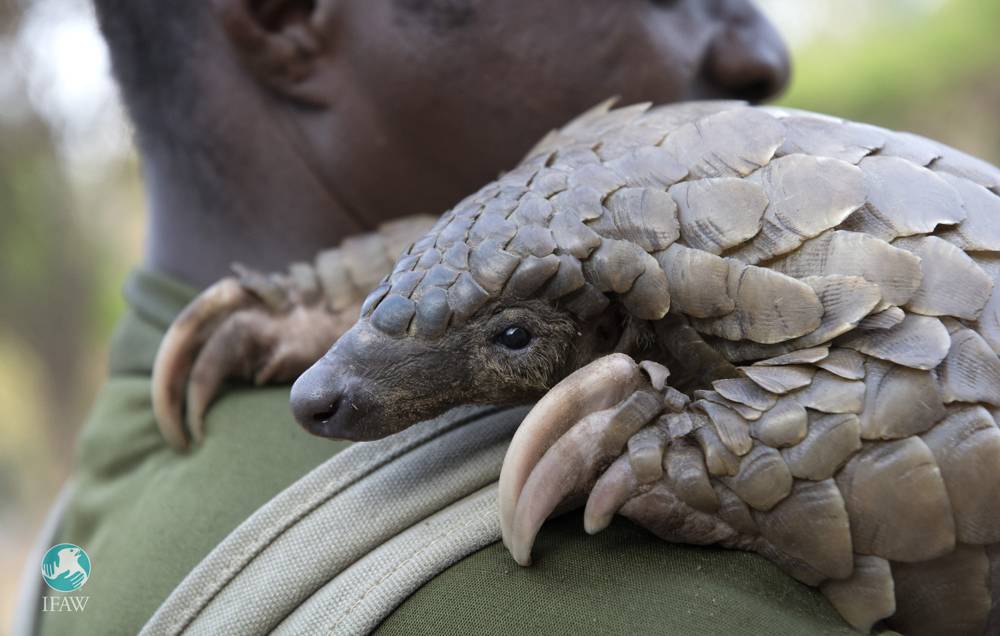
```
**Fig.6-1 a beautiful pangolin. Photo credit: International Fund for Animal Welfare.**

So, you should have thoughts right now about how cool pangolins are and that we should be doing more to protect them, but you may have also recognized that the data we are considering for *Balanus* are pretty clearly rejecting panmixia among all sampled locations, and that there is a pretty obvious jump in Fst values between the top half of the samples and the lower half in the matrix. At this point, you have already recognized something important about landscape and seascape genomics: even when an organism has the potential for very broad dispersal each generation, we are often surprised to learn about the underlying environment from these data because they show that many species exhibit population structure in places that *have no obvious barriers to dispersal* (Palumbi 1992).

Since we have multilocus data, we can also ask whether or not there is a clear hierarchy or structure to the data without using a prior assumption about sample locations being equivalent to populations. Remember that two sample locations could each contain two very different sets of genotypes, and if the two types of organisms are at the same frequency the Xst value would be ZERO! (Which metric would tell you to pay more attention?)

So, to explore these data without making assumptions about the membership of individuals to particular evolutionary populations, we might ask whether the data tell us about their 'fit' to distinct groupings. In Chapter 5, we discussed using the deviation from HWE as a genetic model that allows some types of optimization of data across *K* 'populations'. Specifically, Figure 5-9 illustrates a chart at the bottom using this sort of analysis, often called a "structure plot" generically referring to the program **Structure** (Pritchard et al 2000). To the upper left of that plot is a principal components analysis (PCA) of the same data, showing a concordant result of *K=3* populations that are distinguishable. The PCA approach does not use a genetic model but an approach that separates data points along axes that summarize a tremendous amount of variation in the data...

https://en.wikipedia.org/wiki/Principal_component_analysis

Basically, we use it to reduce the number of dimensions of a data set to try and identify clear patterns from being able to visualize a plot of the data in those reduced dimensions (typically, 2). In recent years, population genomics has taken advantage of combining this approach with discriminant analysis (Jombart et al 2010), which helps us optimize not just the visualization but also the most appropriate numer of groups of data points in that visualization. This is called 'discriminant analysis of principal components' or DAPC.

We aren't going to get deep into the weeds with this method; additional exploration and definitely reading the paper(s) by Jombart are needed to become proficient at this. But in the *BalanusPopGen.Rmd* file, lets now explore the data using this approach to understand what it can tell us and how sensitive the results are to our assumptions. Look in the code chunk called 'dapc1' and what you will need to do is actually get a little bit interactive with the data and this exploration of how many clusters are in the data. It has two steps: choosing how many of the principal components to keep for finding clusters (the more, the more information you have - not sure I'm the right guy to ask about whether it is bad to include more), and then using that information to identify the Bayesian Information Criterion value for how that information fits a large number of data clusters. The lowest BIC value is assumed to be the best fit. Try this now!

*n.b.: obviously not including enough information may make it difficult to adequately distinguish the population structure; why not use all information? https://adegenet.r-forge.r-project.org/files/tutorial-dapc.pdf (section 4.1) explains this in terms of model-fitting, effectively - as with almost all statistical model fitting - we would like to use as few parameters as possible to describe an adequate model. Again, the finer points are beyond the scope of what we are dealing with, but play around with these parameters to start getting a sense of what it means.*

Now that you have done this, how many evolutionarily distinct or effective groups do you think exist in *B. glandula*? You have likely convinced yourself - to the extent you feel comfortable interpreting these data already - that there are 2, perhaps 3 populations in this set of individual genotypes. The code in **BalanusPopGen.Rmd**, chunk *dapc1* then goes on to provide a 2-dimensional way to plot this output for two discriminant axes and then for one, because most of the information is in a single dimension that corresponds (in this case!) with latitude along the coast. When you look at these plots, do you imagine there may be more population hierarchical structure than just "two populations"? That's fair.

I'll just add that we don't want to let statistics take over our field :) Sometimes, you will have biological priors - information you know about phenotype, or behavior, or function, that drive the question and maybe guide you when there is ambiguity between different possible analytical options. Sometimes, you may know that the only useful answer is whether there is any hierarchical structure at all, or none - in the case of limited management for example. The balance of objective analytical outcomes and informed decisions about what to do with those outcomes is a hallmark of becoming a good biologist!

So, lets take one additional look at how the data could be clustered in a non-genetic model. A recently developed approach "sparse non-negative matrix factorization", see http://membres-timc.imag.fr/Olivier.Francois/snmf/index.htm for more details on this, provides very efficient estimation of ancestry coefficients (how much of an individual appears to be derived from population *n* of *K*) for highly multilocus data. Again, the code is in **BalanusPopGen.Rmd** for you to work through, and this is our last exercise for this section. Just for now, run the code in chunk 'snmf' and don't worry too much about the code, lets think about what it tells us about the different results for K=2 or K=3.

(Why not always use the HWE-based model in the program Structure? Well - is your organism tetraploid? Clonal? Selfing? Mixed mating? There are all sorts of biological realities that can make the assumption of HWE itself untenable!)

When you run that code chunk you will get 4 plots. The first is a lot like the BIC plot - where the cross-entropy is minimized is a good idea of the 'best' model of population evolutionary hierarchical structure. When I run it, K=2 is where the cross-entropy is minimized. I also show results for K=3, which may be argued for, and K=5... where you will start to see some chaos in interpretation that, at a minimum, will be hard for you (or me, a barnacle expert) to explain. Play around with that last line, what happens with higher values of K? What does K=4 look like? What do you think makes most sense, given what you have seen from earlier preliminary analyses?

Now, think back to earlier chapters and ask yourself: **"could there be hierarchical structure, *as well as* isolation-by-distance, across a set of individuals collected from diverse locations?"**

```{r, out.width='90%', fig.align='center', fig.cap='...',echo=FALSE}

```
**Fig.6-2 a beautiful pangolin. Photo credit: International Fund for Animal Welfare.**

Because you probably hadn't really given much thought to pangolins before today, but now you think "what other crazy biology might be out there, and how might these data help us understand how they move and interact, breed and grow?"

With this we will conclude this part of working with the *Balanus* data, and will come back to it again in later chapters of this text. You can start to think about additional questions: where do the populations start to separate, and by what process? Is it an ancient pattern reinforced by current environment, or is the species being pulled apart by active adaptation? 

## 6.3 Additional time, additional realism

### 6.3.1 Additional time

It is worth noting that the example data that we worked through during this unit represents a relatively ancient separation of populations (roughly 500kya) that are not re-mixing for reasons we will get into in a later unit. The origins of landscape genomics are rooted in a time when there were fewer data available, and the questions being asked tended to be more about lineage isolation and cryptic diversity originating in geological events. The field of 'phylogeography' (Avise 2000) utilized methods from phylogenetics or molecular evolution to infer ancient isolation events that were profoundly informative about the processes of diversification. With increasing abilities to collect multilocus data, the questions being asked are more subtle questions of movement and behavioral interactions.

Even in deeper divergence scenarios, the lessons of population genetics and coalescent theory are relevant. The signature that one population has diverged into two that do not interact reproductively - over whatever scale they are collected at - will show up as a Wahlund effect, as $\pi$ being greater where they overlap than when they are separated. The lessons we learned earlier about estimation of the mutation rate µ from known divergences of populations are a key insight for interpreting the more subtle patterns that are possible with more diversity being sampled across the genome. In fact, even our interpretations of divergence require knowledge of the population genetic signatures of single populations.

The larger a population is - that would be the census size N - all else being equal, we may expect that the effective population size Ne is larger. There are a variety of reasons that is not as straightforward as we would think, and we will get to that later in the class. But certainly if Ne is larger for one species than another, that is *in part* diagnosed by the additional diversity of that population, and interpreted as diversity that has accrued over a longer number of generations since it all had a Most Recent Common Ancestor. Larger effective populations harbor older diversity than smaller ones!

```{r, out.width='90%', fig.align='center', fig.cap='...',echo=FALSE}
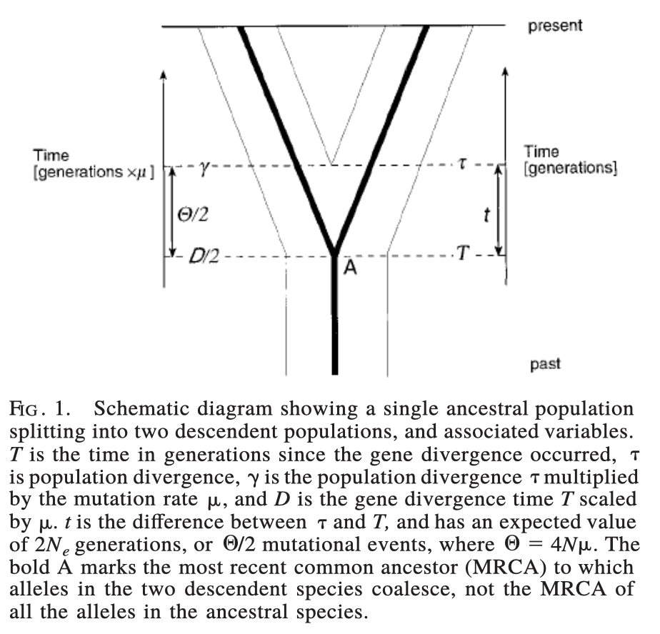
```
**Fig.6-3 is Figure 1 from Scott Edwards & Peter Beerli, Evolution, 54(6), 2000, pp. 1839–1854.**

What does that mean for interpreting the divergence of populations, at any temporal scale? Lets look at a now-classic paper by Scott Edwards and Peter Beerli. In their 2000 *Evolution* paper, (Figure 6-3) they predicated our estimates of when two populations diverged from one another on recognizing that a large ancestral population would have a large theta, and so the TMRCA for that ancestral population has to be accounted for in considering the time of divergence given data from those two populations. 

***But we don't know much about ancestral populations, do we Dr. Wares?***

Well. No. Remember a lot of what we do in the field of molecular ecology is a form of inference - we are extending what we can see with what can be understood from genomic diversity. Try not to go crazy and tell too-detailed a story, and you will be OK. In this case, although there are more computationally intensive ways to get at more complex models for this (later sections), one of the simplest models - and often quite effective - is to assume that the daughter populations (the two populations being evaluated for their divergence time) have similar demographics as their ancestral population. 

How would we investigate this? Remember we aren't working with counts of individuals, but diversity as it is represented from a population of a given (changing) size, with a particular mutation rate, on a locus with a particular ploidy and inheritance mode. SO, $\theta$ (or an estimator, $\pi$) is evaluated from each population, and we make a simplifying assumption and average the two. If your populations are of wildly different sizes, you will probably want to read on to more complicated ways to ask this question. 

What this gives us is a classic equation representing *net nucleotide divergence*,

$d_{A}$=$d_{xy}$-[($d_{x}$+$d_{y}$/2)

What does that tell you? The mean divergence of alleles compared across populations, minus the mean divergence (read: diversity, e.g. $\pi$) within populations (representing a *model* of what the ancestral population looked like demographically). That sets the actual divergence time, $\tau$, at a timepoint a bit more recent than the divergence between populations alone would estimate.

Now, take a hypothetical. Two species of fish live in a large river; erosion and other geologic change in a nearby watershed 'captures' the upstream portion of the first river, moving those upstream populations into the second river and ending gene flow between the (now) two populations. This is not an uncommon process - sometimes it happens very quickly as with the shift of glacial melt rivers, sometimes very slowly as with the Casiquiare River in Venezuela that currently connects the Orinoco and Amazon. But a good example for our hypothetical above would be the 'capture' of the Tallulah and Chattooga Rivers in NE Georgia from the Chattahoochee basin into the Savannah basin which has led to the isolation of distinct aquatic species.

In our case, the two species of fish vary dramatically in $N_{e}$, one quite large, one quite small. The geologic event happens at the same time, which one will exhibit the greater $d_{river1,river2}$? Why? And yet the divergence time $\tau$ is equal, and we will assume the mutation rate $\mu$ at loci we look at is equal, and so you can extent that logic to recognize that for the two very different species, in this case $d_{A}$ will be equal. 

This is what Edwards & Beerli (2000) were focused on, less the esoteric elements of population genetics - though they have both done extraordinary work in this realm - and more asking whether all of the pairs of eastern and western sister species of birds, like yellow-shafted and red-shafted flickers, diverged based on the same prehistoric/geologic event or not. Mike Hickerson and colleagues have extended this population genetics inquiry into being able to ask for multiple pairs of taxa separated by particular boundaries whether or not there was a single, or multiple, events leading to divergence and speciation - relying on our understanding of how populations of a given $\theta$ respond to processes that separate them into multiple daughter populations with limited gene flow.

A large component of what was known as 'phylogeography', then, is now about using multiple species and assumptions of relatively similar values for $\mu$ to reconstruct ancient events of isolation. In this way we learn more about paleoenvironments and their influence on patterns of biodiversity at multiple scales. *We'll next read a good paper on this to get a sense of how population genetics are important in this way!*

## 6.3.2 Additional realism (parameters)

In earlier sections, samples have been seen along a gradient of 'quite similar' (e.g. Xst ~ 0) to 'not similar' (e.g. Xst >> 0, K>1, etc.). Along with these distinctions, there is also the potential that the mechanism by which two or more locations have a given (dis)similarity measure is more complicated than random/stochastic diffusion or distance-based movement.

1. dispersal kernels

Put simply, a *dispersal kernel* is just an expectation of movement. Basically it is the posterior distribution function we presume for an organism's movement from where it was born (or zygote formed). Naïvely we might assume that a red-winged blackbird would have relatively high likelihood of being observed 1km from its nest site a year later; a modest likelihood of being observed 10km from its nest site a year later; a low likelihood of being observed 100km from its nest site. The shape of that distribution is of course hard to determine for most organisms.

Many times the function by which we compare these distributions are really about simple manipulation of the variance of the distribution around the mean. If we think of a "standard normal", Gaussian distribution, the mean displacement/dispersal of an individual is 0 (equal likelihood in any direction), with variance of one unit. The below figure also shows examples where the distribution is much 'narrower' or *leptokurtic* - something that might fit an organism that has poor dispersal in general but may be assisted in movement (algal mats, animal fur, etc.) as well as an example where the dispersal is greater than expected from the origin point.

```{r, out.width='90%', fig.align='center', fig.cap='...',echo=FALSE}
knitr::include_graphics('MEImages/normalpdf.jpg')
```
**Fig.6-4 from the Wikipedia entry for "normal distribution"**

Additionally, the green line in Fig 6-4 represents a case where the distribution is *displaced* from the origin (the 0 point). We have to remember that some organisms are dispersing via wind, rivers, ocean currents, and are more likely to move in some directions than others. What gets really intriguing about this is it starts to indicate where diversity originates, and whether the distributions of organisms include 'sink' populations that are either not demographically viable or that tend to host diversity that originates from another 'source'.

Obviously, gene flow homogenizes diversity. So, asymmetric gene flow works the same way, except that the diversity in the recipient population tends to be replaced by diversity from the source. This not only influences a measure like $X_{st}$ to be lower, but means a smaller portion of the spatial range is effectively contributing diversity to the overall range. Lets think about asymmetric gene flow using the term *advection*. In other words, some force - wind, currents - is displacing offspring in one direction from the mother. If that force is 0, then we return to a more random/diffusion model for how individuals disperse, and if that force is >>0, it will tend to dominate what happens to offspring or propagules. Figure 6-5 illustrates this.

```{r, out.width='90%', fig.align='center', fig.cap='...',echo=FALSE}

```
**Fig.6-5 from Wares & Pringle (2008)**

So in the upper panel of 6-5, offspring disperse equally in either direction a short distance from the previous generation (the "short distance" is mediated by the dispersal kernel). In the lower panel, there is a deterministic force of advection moving offspring, on average, to the right. You can see that what ends up happening is not just homogenization - we might expect diversity from all regions to be represented in that case at the end of the time series - but homogenization and lower diversity, with only the 'upstream' diversity being represented. This was dealt with in Chapter 5, but now we think about it as strongly influencing our measures of diversity *and* divergence.

So, what would this *look like* with molecular data? The example shown above is sort of an idealized situation to consider metapopulation dynamics - where each location/habitat has a certain probability of going extinct and being replaced/recolonized from another location. A classic metapopulation model is of course an oversimplification of this process, which we will deal with more in the next unit, but diversity at one location being regularly replaced by diversity from another is an example of this, and in coastal populations the network of sites is effectively one-dimensional, so it is easy to think about. Overall however the dynamics of metapopulations can be complex (Pannell & Charlesworth 2000; doi 10.1098/rstb.2000.0740); as mentioned above, it means that measures like $F_{st}$ cannot be trusted to accurately reflect the pattern of gene flow and diversity in a system. Overall isolation by distance patterns are flattened (Pringle, TBD), diversity tends to be reduced (Wares & PRingle). 

Thus, some biologists go to the extra effort to find consilience between patterns of divergence and the likely *source* region for that divergence (Ewers-Saucedo et al. 2016), or use parent-offspring analysis (dealt with more later in the text) to note the typical displacement of offspring in the system (Peery et  al 2015, Wethey/Hilbish papers on hindcasting). There are also computational approaches including "Markov Chain Monte Carlo" (MCMC) approaches that allow parameterization of values such as $\theta$ and migration rates from DNA sequence polymorphism data (e.g. Beerli's MIGRATE package); with proper design of such an analysis one can infer whether there are higher likelihoods for models that involve multiple migration parameters (eg different parameters in different parts of the system, or asymmetric migration) than if there is a single parameter explaining all such patterns (Zakas et al 2009). At this point (writing well ahead of teaching this unit), I'm thinking it is a good time to have us read one of these papers rather than me try to re-describe it all, so:

**Paper TBD to read for next week:**

Finally, we can think about additional dimensions or factors separating our sampled locations. In chapter 5 we considered *isolation by distance* where divergence metrics scale with the Euclidean distance between sample locations, typically tested nonparametrically using a Mantel test because, at a minimum, the spatial distances among sites are not independent from one another - they are a function of the landscape itself. That landscape however also has rivers, mountains and elevational gradients, and land use factors that themselves may limit movement/dispersal. 

In recent decades, approaches with the moniker "isolation by resistance" have added some realism to these questions about the mechanisms of isolation among sampled locations. For example, Eo et al (cite) evaluated pairwise population differentiation among southeastern U.S. populations of quail. The Euclidean distance among pairs of sites on the same side of the Appalachians may reflect the ability of quail to disperse, but when contrasts are made between sites on opposite sides of elevational plateus and mountains, the physical distance a quail must fly becomes considerably longer as they choose not to fly above certain elevations. Similar work has been done considering well-characterized marine current patterns near Santa Barbara and how those currents drive the pairwise divergence of populations of marine whelks (White et al 2010, doi: 10.1098/rspb.2009.2214).

## 6.4 Summary

Between chapter 5 and chapter 6 we read the review by Bradburd & Ralph (2019). The idea is that we are trying to see that as data improves, our models can improve. When there are only a handful of markers, we have a certain power to distinguish models of equilibrium or hierarchical, maybe variation in gene flow among sites. As the amount of data - markers, locations, individuals - increases... well, we start getting at movement and how it is integrated across generations in the genomes of propagules and parents. Movement is a really difficult part of ecology. Some of our colleagues use tags, or collars, or remote sensing to learn about organismal movement. We are getting closer to these efforts with molecular data in terms of the resolution and sensitivity. But movement is a really difficult part of ecology, and because of that it is a difficult part of evolutionary biology, and vice-versa.

Here we have gone into just the shallow end of the pool in terms of trying to represent the reality of movement. It requires really understanding the biology - development, dispersal mechanisms, interactions with the abiotic - to formulate good hypotheses and models about movement and see how genomic data help us reconstruct this. Without genomic data it might have been difficult to understand that anoles move, directionally, among Caribbean islands via hurricanes (Calsbeek et al 2003)! And movement is not always effective in terms of gene flow. Remember some models are useful, all are wrong. In the intent to find the *description* or model of movement - like vectors, with directions and magnitudes - our ability to generate complex models can reflect a lot about general patterns in nature through seeing how the environment forces diversity to move in certain ways. Wares et al (2001) recognized that the intraspecific diversity of a species will often reflect the environmental dynamics that lead to broader, community-level transitions. 

## Box C.5 Additional work with R

To practice with having substantial amounts of data - similar to our experience with the *B. glandula* data - we can now finish the exploration of "Part III" of the POPPR tutorial.

https://grunwaldlab.github.io/Population_Genetics_in_R/ 


# 7. The relationship of alleles and inference of the history of populations {#Ch7}

```{r, out.width='90%', fig.align='center', fig.cap='...',echo=FALSE}
knitr::include_graphics('MEImages/humpback.jpg')
```
**Fig.7-1, a humpback whale (Megaptera novaengliae)**

As noted before, a lot of the work done in the field of molecular ecology is inference; indirect evaluation of biological realities using mathematical models that approximate some useful elements of how diversity is inherited. In 2003, Joe Roman and Steve Palumbi published a fascinating - and for some, controversial - paper that used genomic sequence data to estimate the likely number of whales before massive efforts at whale harvest had reduced their numbers so dramatically. The idea is that the overall diversity found in an organism builds up over time, with more mutational diversity arising in large population sizes because there are more mutational events when there are more reproductive events, and larger populations lose less diversity each generation to drift. As well, even if the population decreases in size much of the genomic diversity lost will be rare alleles; the overall coalescent dynamics of the common alleles will stay the same and so measures of heterozygosity, e.g. $\pi$, will not change quickly at all (which is why caution should be used in asking questions about human impacts on natural populations and the diversity they retain when recently impacted, e.g. Millette et al 2020).

So, Roman & Palumbi were able to get tissue samples from 3 species of Atlantic whales and sequence mitochondrial DNA from those specimens, estimating diversity in each species, with $\pi$ serving as an estimator of $\theta$=2${fN_e}$$\mu$ where *f* signifies that, because it is a mitochondrial gene that is haploid and maternally inherited, the diversity only reflects the female effective population size. From this diversity, they used estimates of $\mu$ based on the fossil record and sequence divergence among whales to back-calculate f${N_e}$. This value was moderated by generation time and sex ratio, and the authors estimated possible historical population sizes numbering 240k humpback, 360k fin whales, and 265k minke whales - indicating that current numbers are far below the levels established for whaling guidelines that use historical assumptions as a basis. Of course, these estimates depend on understanding $\mu$ well, and rely on diversity arising and being retained through neutral dynamics. These are some of the factors we will consider in this chapter.

## 7.1 Do the data fit the assumptions?

Of course, there are multiple ways to estimate $\theta$. One might use $\pi$ or Watterson's estimator, or even subsets of the site frequency spectrum such as the number of singleton mutations, ${\eta_1}$. With a normalizing factor, we can evaluate the assumption that the difference between two estimators (each with slightly different model underlying) should be negligible, e.g. [ $\pi$ - ${\theta_W}$ ] ~ 0 suggests that the data come from a population of sequences that are evolving under the assumptions of *neutrality* and *population size stability*.

Why would these assumptions change those estimators? Remember that the assumptions lead to the frequency of an allele being related to its age; an allele (or mutation at a site) cannot be relatively common without also having been around for a while if drift is the only mechanism of frequency change. We might also note that if mutations arise at a certain rate but - because of purifying selection or similar mechanisms - never achieve higher frequencies, then we might find an excess of mutations to be rare and thus contribute less to $\pi$ than to ${\theta_W}$ and thus the difference of these two would be substantially different from zero. A population that is growing, similarly, would have a higher retention rate for new alleles (as there is by definition increasing numbers and increasing opportunities for new mutations to arise) and would again have an excess of rare alleles when sampled.

A key to interpreting these values, however, is understanding the context of the 'natural history' of the marker region itself as well as how it is sampled. A perfect case example of these factors involves a very commonly-studied gene region, mitochondrial cytochrome oxidase I. The reason this region is studied so much is because it is relatively easy to amplify from almost any metazoan (Folmer et al. 1994; Geller et al.), and it tends to harbor a lot of diversity making it ideal for DNA barcoding studies. However, David Rand (2001, *ARES* 32:415-448) has pointed out that it is actually under fairly extraordinary selection, which is in part why it is so reliable for PCR amplification: the amino acid sequence changes very very slowly, and in almost any data set the variant sites will be at the 3rd codon position where those mutations do not affect the structure of the protein. 

Any single study of COI diversity in an organism might suggest that the assumptions of neutrality and/or population stability have been violated; the purifying selection tends towards maintaining a large number of low-frequency polymorphisms relative to the total number of polymorphisms. For a long time, the erroneous assumption (Avise et al 1987) that the mitochondrial genome was largely evolving under neutrality suggested to people that they were observing the effects of population expansion, which would generate a similarly negative value for the statistic "Tajima's D" (which is $\pi$ - ${\theta_W}$, divided by a normalizing correction and thus should be close to zero if assumptions are met). However, Wares (2010, https://doi.org/10.1111/j.1558-5646.2009.00870.x) performed a synthetic analysis of ~1000 such metazoan datasets and found an overall mean across all these individual studies of ${D_T}$ = -0.391, with nearly 1/5th of the individual datasets being significantly different from zero (statistical tests rely on simulations of data of the same size with the same number of segregating sites to establish a null distribution, as the statistic is not distributed according to any particular statistical family). The fact that we know purifying and fluctuating patterns of selection can do this, in particular to a gene region that is important in the oxidative phosphorylation pathway, means that we have to assume a non-zero "null" for such a gene region -- and most of the inferences of population growth based on this gene region should be treated with a lot of caution!

Similarly, the fact that this gene region is used for barcoding and separating closely related taxa from one another means that the dataset being examined should consider the potential for how inadvertent sampling of cryptic species - e.g. diversity arises independently in the populations and mechanisms of drift, selection, etc. operate independently - can affect these statistics. For this, we might go back to thinking about the Wahlund effect. What happens if you were to sample DNA sequence data from two sister species of dragonfly, lets say 10 sequences from each species? For now lets assume that reciprocal monophyly was a criterion involved in asserting that they are two species. Draw a phylogeny of this data set, 10 tips for each species, reciprocally monophyletic clades. Now, haphazardly put 'mutations' (hashmarks, smiley faces, stars, whatever) along the branches of your tree. Don't think too much. Humans are terrible at intentionally being Poisson processes, but that is the assumed model for mutations along branches, e.g. a longer branch means more time has passed and so there should be more mutations.

*a little tree-drawing music, please....*

```{r, out.width='90%', fig.align='center', fig.cap='...',echo=FALSE}
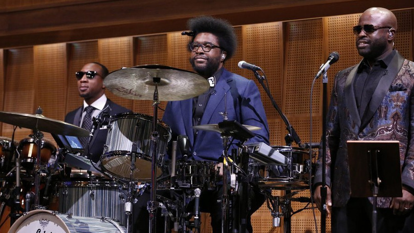
```
**Fig.7-2, The Roots - because understanding reciprocal monophyly means you understand the roots of the tree...**

OK, now under the *infinite alleles model*, we assume that every one of those mutations happened to create a new variant. You'll remember this as Watterson's ${\theta_W}$ (yeah, I subscripted again so we stay consistent.... it is really Watterson's estimator of theta, it gets confusing sometimes). So, you calculate that (look back to Chapter 4) as 
${\theta_W}$ = *K*/${a_n}$ 

where *K* is the number of segregating sites and ${a_n}$ is the sum from *i*=1 to *n* of (1/*i*), in other words it is sample-size dependent. Now, you spend the time to calculate $\pi$ among all of your 20 sequences by counting the differences among *every* pair of sequences, remember? So do that, and take the average within each species of imaginary dragonfly as well as across all 20 sequences. Note that you have to assume the *infinite sites model* now, so you can just count from tip to tip how different each sequence is. This is a pain, right? You think it would be better if an R package just did the calculation for you? **Good.**

Want to think more about Tajima's D? It is super important to understand this stat in molecular ecology, so take a look at https://en.wikipedia.org/wiki/Tajima%27s_D because now you have the values necessary to calculate this statistic, and yes at this point you would really want an automatic program to do the calculation for you... but the *key* is, if you take the difference between your estimate of $\pi$ and your estimate of ${\theta_W}$, what is that value? Is it close to zero? Is it positive, negative? *Think about why it is positive or negative and start to gain a search image for data that are unusual; why are yours unusual (or not)?*

## 7.2 How else to carve up the data?

Now we have a better sense of evaluating how these metrics work basically. Importantly you should see that the gene or gene regions being studied may be important, and how the data are sampled are important. 

```{r, out.width='90%', fig.align='center', fig.cap='...',echo=FALSE}
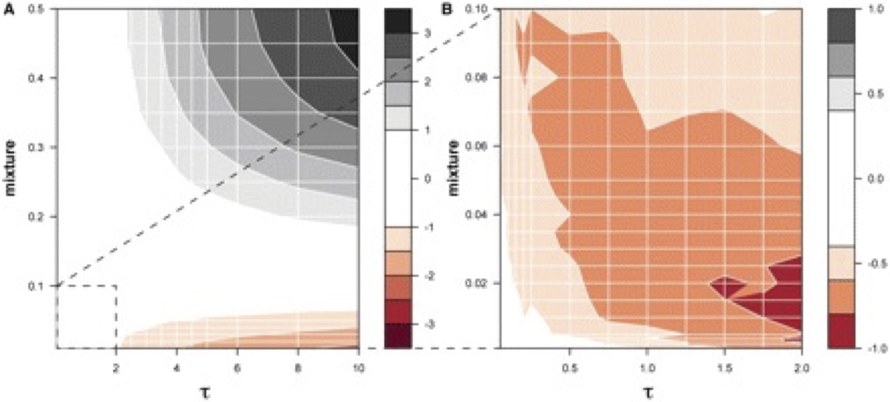
```
**Fig.7-3, from Ewers & Wares 2012. Surfaces of Tajima's D values calculated from coalescent simulation of demographic histories representing an admixture of populations. In each panel, the horizontal axis represents $\tau$, divergence time of two populations measured in coalescent time-units proportional to the effective population size. The vertical axes represent the degree of admixture of the two populations, ranging from 0 (only a single nonstructured population is present) to 0.5 (the two populations are equally represented in a data set). In (A), the complete range of admixture is allowed and $\tau$ ranges from 0 to 10. In (B), admixture up to 10% for populations that have diverged up to $\tau$=2 is represented, with a different scale representing the pattern of Tajima's D. In (B), only negative values are observed.**

Many other similar tests of neutrality (and demographic change) have been proposed, taking advantage of other ways to slice up the data. As an example that may be very useful, imagine that you have SNP data across a gene region that are unphased - you do not know if the A/G polymorphism, and the C/T polymorphism, represent haplotypes of A..C and G..T, or A..T and G..C, right? In which case, $\pi$ is a bit removed from its original calculation! In this case, Fu and Li's D/D* statistics compare ${\theta_W}$ with ${\eta_1}$, the mutations that only happen on a tip branch and are only represented ONCE in the data. The distinction between D and D*, by the way, is if you happen to have an outgroup sequence to root the polarity of the mutation, e.g. which one is ancestral and which one is young.

These diverse tests of neutrality all tend to be correlated, of course, across a data set since many of the underlying stats are not independent from each other (for example, the sum of all ${\eta_i}$) among sequences is ${\theta_W}$ and it is an easy calculation to get to $\pi$). Different stats have different relative statistical power for distinguishing demographic from selective hypotheses (Fu and Li 1997), but at their core they still rely on you understanding what you are calculating, understanding the 'natural history' of the gene region(s), and understanding that there are always alternative explanations. 

The point being to understand your data before you make an inference, and before you make mistaken assumptions. I've been there. Try to avoid it.

## 7.3 how to use these stats in more detailed ways?

One of the reasons for thinking about all of the different ways that a dataset can be represented as *summary statistics* is of course it is difficult to maintain or analyze teh full representation of data when there are 10s or 100s of individuals, and 1000s or millions of nucleotides (or fragment sizes, and so on). 

The other thing that gets important about being able to summarize such complex data is that it allows us to determine what possible hypotheses to *reject* as we consider what genealogical and environmental history created those data. This is why our ability to simulate data assuming diverse population histories, using coalescent theory and related generational models as discussed earlier, becomes so important. What is the *likelihood* of observing a certain pattern given a particular history? For example, Kreitman and Hudson (1991; Genetics 127:565-582) simulate neutral processes with a particular level of $\theta$ across a region in the *D. melanogaster* genome where there is a duplication of the *Adh* gene. Their simulation data clearly show that there is far too much polymorphism in the region around a known amino acid polymorphism to be explained by neutral dynamics; it is better explained in this case by balancing selection.

That is a fairly simple evolutionary question; what about complex evolutionary ecology, how can that be incorporated in a useful way? Well, using more summary statistics and massive computational effort to simulate distinct possible (and sometimes nested) histories to determine whether there is enough information to reject one of those histories as being likely. John Robinson asked about metapopulations; strictly, a Levins model for a metapopulation is that each habitat for a species has a probability of extinction (that is the same across all habitats in the area), and a probability of recolonization from elsewhere in the domain (the same probability for all such sites). Of course that is an overly simplified model, but there are often so many complexities to consider. Robinson et al (2013) were curious whether a documented 'metapopulation' of the cladoceran *Daphnia magna* could be evaluated for whether they fit a strict metapopulation model, or whether there were some sites (e.g. deeper or larger pools of water) that were more likely to persist and thus more likely to seed other habitats with propagules. In other words, more closely fitting a 'source-sink' model as described by Pulliam.

To do this, Robinson collected data from 14 microsatellite loci. So, in this case, the *stepwise mutation model* (have we dealt with that? yes, see chapters 3 and 5 though brief in each case - a previous iteration of this class wrote the initial entry on Wikipedia: https://en.wikipedia.org/wiki/Stepwise_mutation_model ; oddly there was also not yet an entry for the *infinite sites model* at that time and this was in 2016...I can see the initial edits made by my most recent lab graduate, Dr. Karen Bobier!) was used to assume that two alleles of similar length are more likely closely related than two alleles that differ more in length. In other words, an allele with 7 nucleotide motif repeats is perhaps only one mutational event away from an allele with 8 repeats, and more mutational steps away from an allele that has 12 such repeats. Using that model, a variety of summary statistics could be calculated from the observed data - in this case, total number of alleles in the data set (K), mean and range across loci of variance in repeat number ${\sigma^2_A}$, mean and range of pairwise difference in repeat number $\tau$, mean $F_{ST}$ and $F_{IS}$, and locus quantiles for some of these statistics. These were compared to coalescent simulations following the "Approximate Bayesian Computation" approach.

In the "Approximate Bayesian Computation" (ABC) approach, each parameter has a range of possible values used for the simulations. Each simulation generates its own set of summary statistics, and those that are within a certain mathematical/Euclidean distance from the observed *actual* values are kept. In this way, it is Bayesian because the posterior distribution of likely histories is generated from their fit to observed data.

Robinson et al. were able to show that - as may sound reasonable after the fact - there are persistent source populations that tend to drive much of the diversity in the rest of the system, similar to the asymmetric dispersal problems considered earlier in the text. Such work is complex but as multilocus data become easier and less expensive to collect, the detail of discrimination among hypotheses becomes far greater.

```{r, out.width='90%', fig.align='center', fig.cap='...',echo=FALSE}
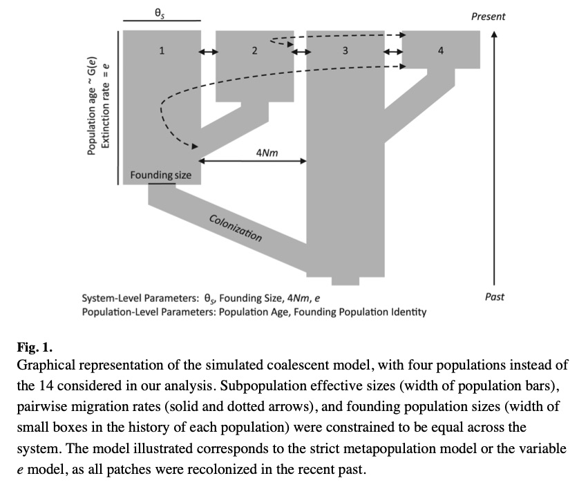
```
**Fig.7-4, from Robinson et al. 2013**

## 7.4 landscape and ecology

Once we really start thinking about the distribution of how individuals are sampled, of course it becomes more and more of a question how their distribution is non-random across the landscape and their movement is non-random across the landscape, regardless of their dispersal potential. Dispersal is also a trait of the individual and may be heritable or sex-determined.

*(Here review Cancellare et al 2021: https://peerj.com/articles/11498/)* and this seems to set up talk about ConStruct which was briefly introduce in Ch5 so now bring it back in terms of understanding isolation can have multiple components...


the fancy places Hickerson has gone to estimate co-divergence and more NOte you dealt w EDWARDS AND BEERLI EARLIER, skyline plots and more, mixed hierarchical/IBD models and more, but really we will get into such things in chapter 9 so this is the wrap-up on ch7... I would think combine CHAPS 8 and 9 into one so you more quickly get to RNA/methylation questions, quant gen, behavioral (combining 2 ideas there)

### note edits in order below could be argued you BRIEFLY deal with what is listed as 8/8contd down there to finish up 7, and take a week to read CURRENT literature so that we start thinking about it in terms of process moving forwards rather than 'what has been done', it is about null hypoth and what exceeds that and how you test that. lets move faster towards the other fun stuff.

### 7.4.1 evaluating selection once you know how things are demographically linked, and how change in pop size is linked
Ch7 evaluating selection ONCE YOU KNOW HOW THINHS MOVE
Lets explore outlier analysis so we really know these methods, including PCAAdapt, Outflank, and Bayescan

the idea being that if most of the genome says X and a subset says Y they might be under different rules, how do we infer this subset - and what is the likelihood we are right without doing an actual linkage study?

you might want to wrap up Balanus here to show that it appears to be demographic and held by environment, rather than outliers driving some type of selection. they are "species-like".

### 7.4.2 contind. Complicated versions of all fo this

Rachael Bay, Gideon Bradford, cool new stuff
Mol ecol text treat invasions and domesticated in a linkage disequilibrium framework
somewhere in here work in my favorite single page of AmNat ever because we have to understand how fitness and randomness and means and variances all work together in homogenizing genomic and phenotypic diversity - thats all of it in a nutshell

expand by reading papers at this point....

```{r, out.width='90%', fig.align='center', fig.cap='...',echo=FALSE}
knitr::include_graphics('MEImages/amnatlangurgillespie.jpg')
```
**Fig.7-5, my favorite single page of The American Naturalist, ever. The article I wanted was John Gillespie thinking about the problem of natural variation in reproductive success, in terms of population mean fitness, and invoking Jensens Inequality and making me learn how to teach that in early versions of this class. But having a cool behavioral article that shows langurs grooming dogs on the streets of India and citing Gene Odum and Peter Klopfer on the leading page, well - it always makes that photocopied article in my files take me back to how much I've learned since I came across it!**

## finish Balanus, and/or POPPR, rest of semester is writing focused, proposal-focused...read some papers to represent finishing this stuff and see the latest/greatest, or have them give 5 minute lightning talks , continue through chap 8, on papers they find of interest

# 8 phenotype. {#Ch8}

HUH what if you put this earlier, and then move current ch8 back because it involves having more prior information and or more data, really... the questions revolve around that. Hell, given your expertise lets deal with phenotypic variation and heritability in one chapter, so that is my quant gen and point vigorously at folks who can do that better than this can do!

I'd say this is good place to bring in the *Thymallus* paper by Koskinen et al - 25 generations of zero migration, all start from same presumably panmictic sample of local grayling diversity. How do traits and alleles change over time, and what does this tell us about selection?

we start getting into students finding papers that influence how they think and their questions and they give 3-5 minute overviews with one key visual. so the semester becomes more student-driven with their data presentations and paper presentations.

## 8.1 RNA and methylation as components of adaptation

Mendelson comes in here as a marker

RNAseq variation as a tool for how orgs respond, take some time with tis...

buyt also note that setting up these experiments has to be VERY careful - which tissues, what time of day or season, and how to deal with variation in environment? 
https://royalsocietypublishing.org/doi/abs/10.1098/rspb.2020.2968 notes that many lab experiments may poorly capture how organisms respond to variation in the environment so think carefully with your experiment!

## 8.2  pop gen x quant gen
Shiny app for this! we ran through the other stuff to set up our understanding of how true quantitative traits will be very difficult to determine from molecular markers alone. That Daphnia paper, Vilas, genome size, whole genomes and quantity of individuals....

```{r firstlookquant} 


shinyAppFile("shiny_popgen-master/Quant-Gen/additive_alleles_app.R",options=list(width="90%",height=500))

```

## 8.3 conservation, phenotype, species, protection, traits vs neutral diversity

good time to include DOI: 10.1111/eva.12687 to discuss
particular loci and their effects on the 'extended phenotype'

*the point of conservation si the phenotype - the chemical products, the appearance, the value we place on simply seeing it. so, that's where i've put this part.* We should be mindful of what we are conserving beyond e.g. unique haplotypes of course.

applications to conservation and climate change, what *decisions* can be made based on these types of data?  The reason I taught OTS course in ConservatioN AND BIODIVERSITY geneticd” is that I feel the idea of conservation is addressing our failures; the biodiversity genetics, the molecular ecology - is about finding there is still more to learn from.... https://link.springer.com/chapter/10.1007/13836_2020_72

come back to the painted bunting - what is special to us? Lets realize that all of these are amazing birds. So what is the value of each lineage - and what is the cost of exploring and documenting this? how do we maximize the ecological value of our work for future generations? hippy-dippy but sure.

maybe the Hoban stuff and how metadiversity is used in conservation at highest levels  https://doi.org/10.1101/2020.08.28.254672.

# 9 kinship, parentage (Hill humbers, discrimination and assignment) {#Ch9}
## 9.1 more behavior and interaction eg voles and mating, diversity and disease

Mendelson and others come in here as behavior and kinship and everything come back together on the species question and altruism and so much more

Mating and behavior - collective as well as individual. I'd imagine talking about Mendelson's work, as well as about the recent work on salmonid errant river returns (communal behaviors) as the last vestiges of occasional gene flow among systems. Also turtle barnacles of course, and more on Hill numbers again.

and how this takes us to the beginning, that the natural history is what is important to know, that we are trying to fill in gaps. don't get a big ego - its mostly just paying close attention to recipes as complicated as toll house cookies, but repeatedly and with attention to detail and purpose of each component. This will be a case-studies section taht includes
 
 Ewers-Saucedo et al
 
 dolphins
 
 seagrasses
 
 whatever

# 10. data never fail to surprise. {#Ch10}

looking for patterns that surprise you is part of the job. Tajima's D in Noto. unexplained dominance of a few libraries in a Balanus RAD run. what i try to train my students to do is recognize the patterns *in absence of analysis* because the analysis is usually only what you are looking for. what happens when your FORFs are different lengths? why did Noto "appear" to have a different north south pattern in the tree? how do you recognize what to do without doing every analysis? of course part of that is about experimental design and knowing what you intend to look for, but again: I wouldn't have looked for that TajD pattern. it struck me because of the many TajD's I'd looked at before for that locus. so we come back to studying the natural history of genomic data, and trying to get a sense for it.

What is key is learning how to recognize patterns that are emergent - that indicate more thought needs to go into understanding the analysis. Taj D work that I did is an example. "Seeing" a pattern in *Echinaster* takes practice and a recognition of how to look for it (quick rundown on Snn and statistical power, as examples of many different things we haven't gotten to yet - and yet all Snn really is a metric of phylogenetic diversity/net divergence for classes within species)

develop skepticism and understanding depth of what is *happening* with your data...

# Extra Help files. Shiny Example 1. {#ShinyEx1}
 

 
**Hey! Are you a little lost trying to figure out what to do for the Genetic Drift and Bottlenecks Exercise? **

Yes? Well that’s okay! I can offer you a helping hand 😊 (thank you, Skye Remko!)

*(Before you go any further, be sure to create an Excel file similar to what is shown in the image below*)

First off we want to figure out how to run an experiment that will allow us to figure out what affects an allele reaching fixation (Remember: *fixation* is just a fancy name for saying that every member of the population has the new “mutant” allele” )

We are going to play with two variables to figure out how they affect the chances of an allele reaching fixation. 

1.	Initial Frequency of the Allele

2.	Population Size (N)

For the first experiment, try varying the starting frequency of the allele, while holding the population size steady. Let’s start with a super small number: 0.05

##help image 1
```{r Ex1.1, out.width='90%', fig.align='center', fig.cap='...',echo=FALSE}
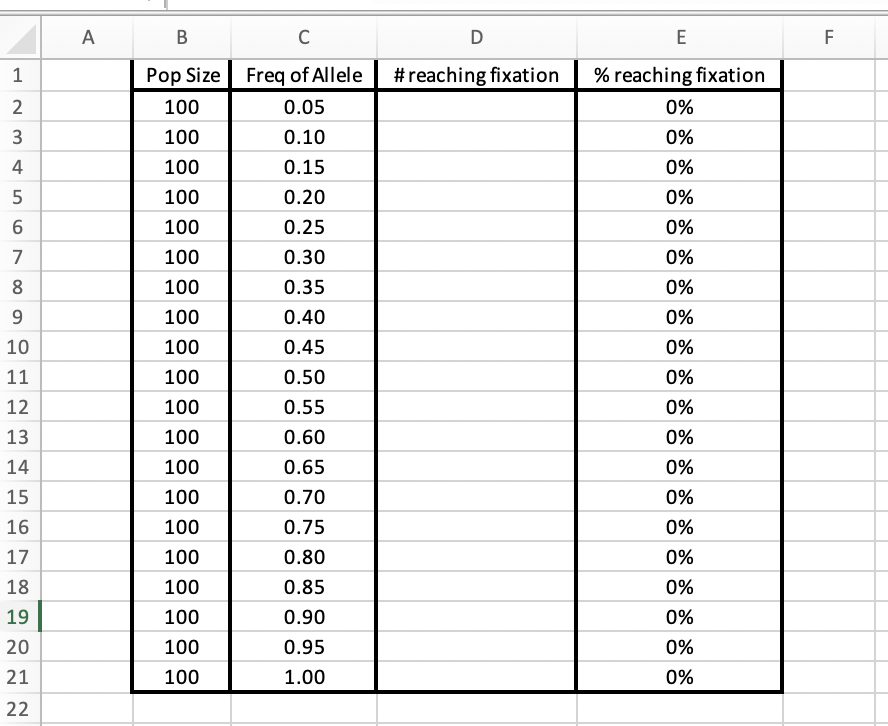
```

Run the simulation using these parameters:* N of 100, allele freq of 0.05, generations 100, bottleneck time 100, bottleneck pop size 100.*

Now look at your resulting graph. Did any of the replicates reach fixation (look at the top of the graph)?

Now, to your Excel file...

Run the Simulation for each of the allele frequencies specified. The “ % reaching fixation” column will calculate the percentages for you. 

Once you have done that. Make a bar graph using the “Allele Frequency” and “ % reaching fixation” columns. 

Note the trend you observe. 


For the second experiment, we are going to see what effect population size has on the percent of replicates reaching fixation, when we hold the frequency of the allele steady. We are going to start with a very small population size , N=10.

##help image 2

```{r Ex 1.2, out.width='90%', fig.align='center', fig.cap='...',echo=FALSE}
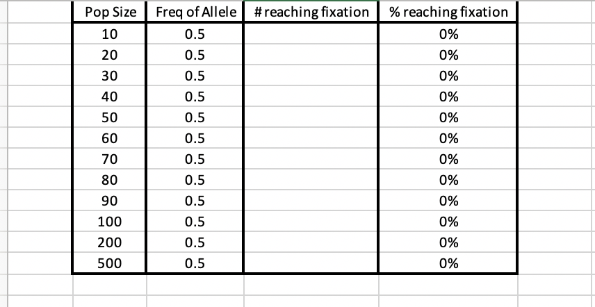
```

Run the simulation according to these parameters. population size 10, allele freq 0.50, everything else the same...

As before, create an Excel file similar to what is shown in the image *above*, and enter the values you obtain by running the simulation into the sheet. 

Once you have done that. Make a bar graph using the “population size” and “ % reaching fixation” columns. 

Note the trend you observe. 


**Questions: **

1.	Describe the trends you observe in the graphs you made for experiments one and two. What affect does population size and allele frequency have on the percentage of replicates that reach fixation?

2.	For experiment two, If you increase N to 1000, does the likelihood of fixation change? Or does the time required for fixation change?

3.	Describe the ideal conditions for an allele to reach fixation in terms of population size and allele frequency. 


<br>

# ACKNOWLEDGEMENTS

Still working on all proper citations but already have much thanks to Silas Tittes for Shiny apps, to Justin Bagley, Mark Scheuerell, and many others for help with R code checking, to my entire lab group in 2019-2022 for their patience, to my entire Molecular Ecology class in 2020 and 2022 for *their* patience, to Natalia Bayona-Vasquez and Todd Pierson for their assistance getting me worked towards the experiential mode of teachign this class, to Paula Pappalardo and Christine Ewers-Saucedo who guided me in many ways as a cautious coder and exploring new pathways of analysis, to Rick Grosberg and Rob Toonen and Alex Wilson and so many others.


# stop reading

# no really

## please stop

# hey all from here on down please ignore because this is a text in construction and all sorts of random notes to myself below


# extra put this into earlier chapter on Ne?? EDGE dynamics and range shift variance in alleles, growth OR THIS IS A CASE STUDY PROBLEM RELEVANT TO EARLIER STUFF and unit 10 is basically 1-2 more paper to read together, fading towards end of a semester after all LOL.

also: ancient DNA, museum specimens, and modern technology ("have your cake and eat it too" paper on using ethanol from preserved specimesn and batch lots!) - to wrap it back to natural history (Travis 2020), using Zokan as an example that you continue to struggle with in terms of how to do it **right**.
12. coda on "molecular ecology" and how understanding nutrient and metabolic flow may be really key (Rand MPI, the theory on how symbiontws remain in corals is the adaptive balance cannot think of name of theory right now but involves metabolism interacting with molecular availability, catching new symbionts like colds, Pespeni/other work on changes in development with pH, and so on)


# dangling notes

**HOLY CROW DO NOT FORGET ABOUT THE 2018 SLIDES YOU HAVE, and 2020 resources as well**

*** don;t forget the experiential stuff *** text: experiential appendix: poppr, barcoding, rad data, etc I think what we have here is Chapter 1 is for first day of class, assign some reading to be discussed in week 2 of class. Chapter 2 easily encompasses some lecture, some Geneious, some reading/discussion time and thus more than just 2 days of the class.

not making a hierarchy of ecology, evolution. so many ways in which deeper evolutionary trajectories have huge impacts on the ecology of organisms, e.g. the loss or reduction of mitochondria in parasitic organisms (Kissinger ref; https://www.pnas.org/content/early/2020/02/18/1909907117) allow for more rapid multicellular replication *when you derive your energy from a host*, and that has obvious implications for the host.

when you explain AMOVA good explainer in POPPR of why you square the matrix of distances and randomization is the permutation test. 

how Structure can be misled by biology e.g. selfing and thus DAPC is a model-free approach to check (painted buntings similar answers, flowers like kudzu perhaps not similar at all because of selfing)

am i really gonna write a book? incorporate (and cite) poppr and learnpopgen and adegenet and ms/figtree and old data and new data, think about pacing and 15 chapters - one a week

Chapter one is about the non-recombining bits of DNA that we can use to identify who it is where nothing more nothing less has its own problems chapter to show them the pies Astor genome if you have the whole thing you have to deal with recombination selection mutation drift everything but then there’s the snaps there’s transcripts there’s alleles there are different from whole haplotypes start simple but don’t worry about whole history of the field 

Book: eDNA and barcoding and community stats all together. Cryptic species, glochidia, community stats that ultimately introduce pop gen stats, recent devs in occupancy models

Bold the refs to discuss: Joe Travis 2020, the fungal molecular ecology/function paper, the mapping of clades in Chtham. Microbial and barcode gap tend to rely on haploid low recombination otherwise complete dna so we start here for comparing. Bray Curtis and better, unifrac etc

Primers are however imperfect nets. The natural history of the target gene region is often an important choice like mesh size or where the holes are in your seine. 

go ahead and build in the 2 papers to discuss in week 1. it is not so much a book as a blueprint for how you want to teach. the class will have weekly quizzes instead of writing, just so students keep up and you see how they get concepts; that doesnt' mean tests, but maybe a midterm and a final that are essay- and evidence-based. lots of practical experiences, simulation and analusis.